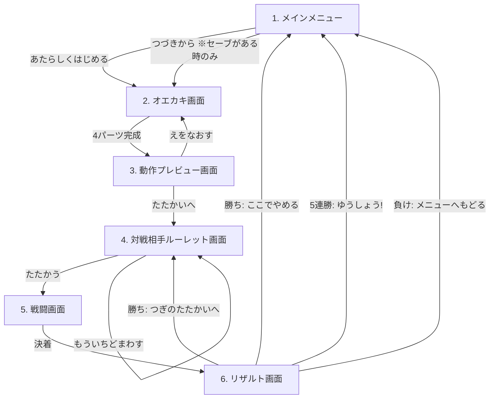

# らくがきバトル 設計書

2Dでお絵かきしたキャラクターが3Dで動き出し、NPCと連戦して5連勝を目指すWebアプリの設計書。
本書は実装を別AIに委託する前提で、実装者が本書のみで開発を完遂できる粒度で記述する。

- 対象リポジトリ: `sakanayuki/cc_rakugaki`
- デプロイ: GitHub Actions 経由で GitHub Pages に自動反映
- 対象ユーザー: 3歳児でも遊べること（ひらがなUI・大きなボタン・タッチ操作）

---

## 0. 確定済みの要件判断（発注者との確認結果）

| 論点 | 決定 |
|---|---|
| 3D表現方式 | **ペーパークラフト風**。描いた各パーツをテクスチャ付き板ポリゴンとしてThree.jsの3D空間に配置し、関節ピボットで回転させて動かす |
| 技術スタック | **Vite + TypeScript + Three.js**（UIフレームワークなし、画面遷移は自前の軽量シーンマシン） |
| 属性判定 | **あたまパーツの形状で判定**（縦横比と塗り密度。§7.3参照） |
| 必殺技 | 3往復で未決着なら**「ひっさつわざ！」ボタンが出現し、押すと演出後に必ず勝利**（一撃必殺） |
| 敵の強さ | **固定ステータス**（連勝によるスケーリングなし。6種に個体差はつける） |
| セーブ | **localStorageに1スロット自動保存**（描画ベクタデータ。連勝状態・倍率は保存しない＝セッション内のみ） |
| デバイス | **PC＋タブレット/スマホ**。Pointer Eventsでマウス・タッチ両対応、レスポンシブUI |
| ルーレット再抽選 | **無制限**（同じ敵との連戦も許容） |
| サウンド | **効果音あり**。Web Audio APIでプログラム生成（音声素材ファイル不要）、ミュートボタン付き |

---

## 1. 全体像

### 1.1 画面フロー

6画面を単一ページ（SPA）内で切り替える。URLルーティングは行わない（Pages配下でのパス問題を回避）。



### 1.2 ゲームサイクル

1. 4ステップ（からだ→あたま→うで→あし）で絵を描く
2. 絵から自動でリグとステータスが生成され、プレビューで動きとパラメータを確認
3. ルーレットで対戦相手（6種のNPCから1体）を決定
4. 自動戦闘。素早さの高い方が先攻。3往復で未決着なら必殺技ボタンで勝利可能
5. 勝利すると全ステータス1.5倍で次戦へ。**5連勝で優勝**。敗北でメインメニューへ

---

## 2. 技術スタックとデプロイ要件

### 2.1 スタック

| 項目 | 採用 | 備考 |
|---|---|---|
| 言語 | TypeScript (strict) | |
| ビルド | Vite | `base: '/cc_rakugaki/'` を必ず設定（Pagesのサブパス対応） |
| 3D描画 | three（npm） | 戦闘・プレビューのキャラクター表示 |
| 2D描画 | Canvas 2D API | オエカキ画面。ライブラリ不使用 |
| 状態管理 | 自前の `SceneManager` + 単一の `GameState` オブジェクト | Redux等は不使用 |
| 音 | Web Audio API | OscillatorNode/GainNodeで効果音を合成。素材ファイルなし |
| 永続化 | localStorage | 1スロット |
| テスト | Vitest | ロジック層（ステータス算出・属性判定・戦闘エンジン）の単体テスト |

依存パッケージは `three` と devDependencies（vite / typescript / vitest / @types/three）のみに抑える。

### 2.2 GitHub Actions → GitHub Pages

`.github/workflows/deploy.yml` を以下の仕様で作成する。

- トリガー: `main` ブランチへの push（＋ `workflow_dispatch`）
- ジョブ構成（公式Pagesデプロイ方式）:
  1. `actions/checkout@v4`
  2. `actions/setup-node@v4`（Node 20、`cache: npm`）
  3. `npm ci`
  4. `npm test`（ロジックの単体テスト。落ちたらデプロイしない）
  5. `npm run build`（`dist/` を生成）
  6. `actions/configure-pages@v5`
  7. `actions/upload-pages-artifact@v3`（`path: dist`）
  8. `actions/deploy-pages@v4`
- `permissions: { contents: read, pages: write, id-token: write }`
- `concurrency: { group: "pages", cancel-in-progress: false }`
- リポジトリ設定は「Pages → Source: GitHub Actions」を前提とする（README に手順を記載すること）

公開URL: `https://sakanayuki.github.io/cc_rakugaki/`

### 2.3 非機能要件

- 60fps目標（Three.jsシーンはキャラ2体＋背景程度なので余裕を持つこと）
- 初回ロード後はネットワーク不要で動作（外部CDN・外部フォント・外部APIを使わない）
- 対応ブラウザ: 最新の Chrome / Edge / Safari / Firefox（PC・iOS・Android）
- 縦横どちらの画面でも操作可能なレスポンシブレイアウト。描画キャンバスは正方形を維持
- タッチ操作時のスクロール・ピンチ誤動作防止（キャンバスに `touch-action: none`）
- `devicePixelRatio` 対応（にじみ防止）

---

## 3. ディレクトリ構成

```
cc_rakugaki/
├── index.html
├── package.json
├── vite.config.ts          # base: '/cc_rakugaki/'
├── tsconfig.json
├── README.md               # 起動方法・Pages設定手順
├── DESIGN.md               # 本書
├── .github/
│   └── workflows/
│       └── deploy.yml
└── src/
    ├── main.ts             # エントリ。SceneManager起動
    ├── app/
    │   ├── SceneManager.ts # 画面切替（enter/exit/updateのライフサイクル）
    │   ├── GameState.ts    # セッション状態（キャラ・倍率・連勝数）
    │   ├── storage.ts      # localStorage入出力・スキーマ版管理
    │   └── audio.ts        # 効果音合成・ミュート管理
    ├── scenes/
    │   ├── MenuScene.ts
    │   ├── DrawScene.ts
    │   ├── PreviewScene.ts
    │   ├── RouletteScene.ts
    │   ├── BattleScene.ts
    │   └── ResultScene.ts
    ├── paint/
    │   ├── PaintEngine.ts  # レイヤー管理・オペレーション記録/リプレイ
    │   ├── floodFill.ts    # スキャンライン塗りつぶし
    │   └── types.ts        # DrawOp等の型定義
    ├── rig/
    │   ├── partAnalyzer.ts # 各パーツ画像の解析（bbox/重心/面積/左右分割）
    │   ├── rigBuilder.ts   # Three.jsのメッシュ階層生成
    │   └── animations.ts   # アクション定義（キーフレームテーブル）
    ├── game/
    │   ├── stats.ts        # 絵→ステータス算出
    │   ├── element.ts      # 属性判定・相性倍率
    │   ├── battleEngine.ts # 戦闘進行ロジック（UI非依存・テスト対象）
    │   └── enemies.ts      # 敵6種の定義（描画データ＋ステータス）
    └── ui/
        ├── components.ts   # 共通ボタン・パネル生成ヘルパ
        └── strings.ts      # 全UI文言（ひらがな）を一元管理
```

**設計原則**: `game/` と `paint/` のロジックはDOM・Three.js非依存に保ち、Vitestで単体テストできるようにする。シーン（`scenes/`）は薄い結合層とする。

---

## 4. データモデル

### 4.1 描画データ（ベクタオペレーション）

絵はビットマップではなく**オペレーション列**として保持する。リプレイすることで任意タイミングの再現・undo・保存/復元がすべて成立する。

```ts
type PartId = 'body' | 'head' | 'arms' | 'legs';

type DrawOp =
  | { seq: number; part: PartId; type: 'stroke';
      color: string;            // パレット色 (hex)
      width: number;            // 論理px
      points: [number, number][] } // 論理座標 (0..1024)
  | { seq: number; part: PartId; type: 'fill';
      color: string; x: number; y: number };

interface CharacterDoc {
  version: 1;
  canvasSize: 1024;             // 論理キャンバスは1024x1024固定
  ops: DrawOp[];                // 全パーツ共通の時系列（seq昇順）
  currentStep: PartId | 'done'; // オエカキの進行位置
  updatedAt: string;            // ISO8601
}
```

- `seq` は全パーツ通しの単調増加番号。**塗りつぶしの境界判定は全レイヤー合成に依存するため、リプレイは必ずseq順に全パーツ横断で行う**（§5.2.4）
- undo は「現在パーツの最後のオペを1つ削除して全リプレイ」で実現する

### 4.2 ステータス

```ts
type Element = 'rock' | 'scissors' | 'paper'; // グー/チョキ/パー

interface Stats {
  maxHp: number;   // 体力（からだ由来）
  atk: number;     // 攻撃力（うで由来）
  spd: number;     // 素早さ（あし由来）
  element: Element;// 属性（あたま由来）
}
```

### 4.3 セッション状態（保存しない）

```ts
interface GameState {
  characterDoc: CharacterDoc | null;
  baseStats: Stats | null;   // 絵から算出した素のステータス
  multiplier: number;        // 勝利ごとに ×1.5（初期値 1.0）
  winStreak: number;         // 0..5
  currentEnemyId: string | null;
}
// 実効ステータス = round(base × multiplier)。elementは倍率の影響を受けない
```

### 4.4 localStorage スキーマ

- キー: `rakugaki.save.v1`
- 値: `CharacterDoc` のJSON文字列
- 保存タイミング: 各パーツの「つぎへ」押下時、およびオエカキ完了時に自動保存
- `version` 不一致・パース失敗時は破棄して「セーブなし」扱い（クラッシュさせない）
- 連勝数・倍率は保存しない（確定仕様）

### 4.5 敵データ

敵はプレイヤーと**同じ `CharacterDoc` 形式の手作りオペレーションデータ**として定義する。これによりリグ生成・アニメーション・描画のパイプラインを完全に共通化できる。

```ts
interface EnemyDef {
  id: string;
  name: string;           // ひらがな表示名
  doc: CharacterDoc;      // 見た目（手作りの描画オペ列）
  stats: Stats;           // 固定ステータス（絵からの自動算出はしない）
}
```

---

## 5. 画面仕様

全画面共通:

- 画面右上に常時ミュートボタン（🔊/🔇）。状態はlocalStorage `rakugaki.mute` に保存
- 文言はすべてひらがな＋絵文字/アイコン。フォントはシステムフォント（丸ゴシック系優先の font-family 指定）
- タップ対象は最小 56×56px

### 5.1 メインメニュー画面（MenuScene）

| 要素 | 仕様 |
|---|---|
| タイトルロゴ | 「らくがきバトル」＋ゆらゆらアニメーション |
| 「あたらしく はじめる」ボタン | `CharacterDoc` を新規作成しオエカキ画面へ。既存セーブがある場合は「まえの えは きえちゃうよ？ いいかな？」の確認ダイアログを出す |
| 「つづきから」ボタン | セーブが存在する時のみ有効（無い時はグレーアウト）。保存された `CharacterDoc` を読み込み、`currentStep` の位置からオエカキ画面を再開。`'done'` の場合は最終ステップ（あし）を修正可能な状態で開く |

遷移時に `multiplier=1.0, winStreak=0` にリセットする。

### 5.2 オエカキ画面（DrawScene）

#### 5.2.1 4ステップ進行

`からだ → あたま → うで（両うで）→ あし（両あし）` の順に1パーツずつ描く。

- 画面上部にステップインジケータ（4つの丸、現在位置ハイライト）と指示文:
  - 「①からだを かこう！」「②あたまを かこう！」「③りょううでを かこう！」「④りょうあしを かこう！」
- 描画済みの前パーツは**そのままの色で表示**され、現在パーツはその上に描き足す
- 各ステップに**うすいガイド枠**（点線シルエット: からだ=中央の楕円、あたま=その上の円、うで=左右、あし=下部左右）を表示する。ガイドはあくまで目安で、枠外に描いても良い
- 「つぎへ」ボタンは現在パーツの塗りピクセルが閾値（キャンバスの0.1%）以上のときのみ有効化（空パーツ防止）
- あし完了時の「つぎへ」で動作プレビュー画面へ遷移
- 「もどる」ボタンで前のステップに戻れる（描いた内容は保持）

#### 5.2.2 レイヤー構造

- 論理キャンバス 1024×1024。パーツごとに独立したオフスクリーンレイヤー（4枚）を持ち、表示は `body → legs → arms → head` の順で合成（頭・腕が体の手前）
- 現在パーツ以外のレイヤーはロック（描き込み不可）

#### 5.2.3 ツール仕様（要件必須の5機能）

| ツール | 仕様 |
|---|---|
| ペン色変更 | 12色パレット（くろ・しろ・あか・オレンジ・きいろ・みどり・みずいろ・あお・むらさき・ピンク・ちゃいろ・はいいろ）。選択中の色を枠で強調 |
| ペン太さ変更 | 3段階「ほそい(6px)・ふつう(14px)・ふとい(28px)」。丸キャップ・丸ジョイントで補間描画 |
| 塗りつぶし | バケツツール。タップ点から**スキャンライン flood fill**。境界判定は「全レイヤー合成画像の不透明ピクセル」、書き込み先は現在パーツレイヤーのみ（からだの輪郭を境界にして腕を塗る、が成立する）。アンチエイリアス縁の塗り残し対策として、塗り後に1pxの膨張処理を行う |
| ひとつもどす（undo） | 現在パーツの最後の `DrawOp` を1つ削除し、全オペをseq順にリプレイ。現在パーツのオペが無いときは無効 |
| このパーツをやりなおす | 確認ダイアログ（「ぜんぶ けしても いい？」）→ 現在パーツのオペを全削除してリプレイ |

- 入力は Pointer Events（`pointerdown/move/up`、`setPointerCapture`）で統一。`pointermove` の `getCoalescedEvents()` があれば使用して線を滑らかに
- ストロークは記録時に点を間引き（距離2px未満はスキップ）してデータ量を抑える

#### 5.2.4 塗りつぶしとリプレイの整合性

flood fill の結果は実行時点の合成状態に依存するため、**リプレイは常に「全レイヤークリア→全オペをseq順に実行」**とする。1024²のfillを含む数百オペ規模でも数十ms想定であり、undo時に都度実行して問題ない。

### 5.3 動作プレビュー画面（PreviewScene）

遷移時に以下を実行する:

1. `partAnalyzer` で各パーツを解析（§6）
2. `rigBuilder` でThree.jsキャラクターを構築
3. `stats.ts` でステータス算出（§7）

#### UI構成

| 要素 | 仕様 |
|---|---|
| 3Dビュー | 画面中央。キャラが地面（丸い影付き）に立ち、待機モーション（ゆらゆら＋呼吸）でループ。カメラはやや見下ろしのパースペクティブ。ドラッグで左右にキャラを回転できる（3D感の演出） |
| アクションボタン4つ | 「こうげき」「いたい！（被ダメージ）」「よける」「ぼうぎょ」。押すと該当モーションを1回再生して待機に戻る（§6.3）。再生中は他ボタン無効 |
| つよさパネル | ❤️たいりょく／💪こうげき／👟はやさ をそれぞれ**5段階の星表示＋数値**で表示。属性は ✊/✌️/🖐 の大アイコン＋「グー（どんき）/チョキ（ざんげき）/パー（とびどうぐ）」表示 |
| ヒント文 | 「おおきく ぬると たいりょくアップ！」「いろを たくさん つかうと ちょっと つよくなるよ！」等、算出ルールを子ども向けに1行で説明（ランダム表示） |
| 「えをなおす」ボタン | オエカキ画面（あしステップ）へ戻る |
| 「たたかいへ すすむ！」ボタン | ルーレット画面へ |

### 5.4 対戦相手ルーレット画面（RouletteScene）

| 要素 | 仕様 |
|---|---|
| ルーレット盤 | 6等分の円盤。各セクターに敵の顔サムネイル（`EnemyDef.doc` をレンダリングした縮小画像）＋名前。中央上に固定の矢印 |
| 「ルーレット スタート！」ボタン | 押すと回転開始。**2.0秒かけて減速して自動停止**（イージング: cubic-out）。停止セクターは押下時に一様乱数で決定し、最終角度から逆算して演出する（結果が演出に依存しない） |
| 停止後 | 選ばれた敵の拡大表示＋名前＋属性アイコン＋つよさ（星3段階の目安表示）。「たたかう！」→戦闘画面へ、「もういちど まわす」→再抽選（**回数無制限**、同じ敵の再選出も許容） |
| 連勝表示 | 画面上部に「○れんしょうちゅう！」（winStreak ≥ 1 のとき） |

### 5.5 戦闘画面（BattleScene）

#### レイアウト

- Three.jsシーン: 左にプレイヤーキャラ、右に敵キャラ（左右反転表示）。背景は単色グラデ＋地面
- 画面上部: 両者のHPバー（残量で緑→黄→赤に変化）＋名前＋属性アイコン
- 画面下部: メッセージ帯（「きみの こうげき！」「こうかは ばつぐんだ！×2」「あいてが よけた！」等）
- 中央: ダメージ数字のポップアップ、じゃんけん相性表示（✊>✌️ のような比較演出）

#### 進行（自動戦闘）

戦闘ロジックは `battleEngine.ts` が**UI非依存のイベント列**（`BattleEvent[]` のジェネレータ）として生成し、BattleSceneはそれを順に演出再生する。乱数はシード可能にして単体テストを成立させる。

```
1. 開始演出（両者登場、"たたかいスタート！"）
2. 先攻決定: spd が高い方が先攻。同値ならプレイヤー先攻
3. ラウンド r = 1..3 を繰り返す:
   a. 先攻の攻撃 → 解決（§8）→ 相手HP0なら決着
   b. 後攻の攻撃 → 解決 → 相手HP0なら決着
4. 3ラウンド（＝両者3回ずつ攻撃）終了時に両者生存なら:
   → 進行を停止し「ひっさつわざ！」大ボタンが点滅出現（プレイヤー唯一の操作）
   → タップで必殺演出（ズーム＋回転攻撃＋ホワイトフラッシュ、約3秒）→ 敵HPを0にして勝利
5. 決着 → 勝敗を GameState に反映してリザルト画面へ
```

- プレイヤーのHPが0になった場合はその時点で敗北（3往復以内の敗北はあり得る）
- 敵は必殺技を使わない
- 各攻撃の演出: 攻撃側 attack モーション、防御側は結果に応じて hit / dodge / guard モーション（§8の判定結果に対応）
- パー（飛び道具）属性の攻撃時は弾スプライト（描いたあたまの縮小画像）が飛ぶ演出

### 5.6 リザルト画面（ResultScene）

| 分岐 | 表示・挙動 |
|---|---|
| 勝利（winStreak < 5） | 「かち！ ○れんしょう！」＋キャラの勝利ポーズ＋紙吹雪。**全ステータス1.5倍**の演出（星が増える・数値がカウントアップ、`multiplier ×= 1.5`、HPは新最大値まで全回復）。ボタン: 「つぎの たたかいへ！」→ルーレット画面／「ここで やめる」→メインメニュー |
| 5連勝 | 「ゆうしょう！！ 5れんしょう たっせい！」＋金トロフィー＋最大演出。ボタン: 「メニューへ もどる」のみ |
| 敗北 | 「まけちゃった… ○れんしょうで おわり」＋キャラのダウンポーズ。ボタン: 「メニューへ もどる」のみ |

メニューへ戻ると倍率・連勝数はリセット（絵のセーブは残る）。

---

## 6. 自動リグ設計（ペーパークラフト風3D）

### 6.1 パーツ解析（partAnalyzer）

各パーツレイヤーのピクセルから以下を計算する:

- **bbox**: 不透明ピクセルの外接矩形
- **面積**: 不透明ピクセル数
- **重心**: 不透明ピクセルの平均座標
- **左右分割**（arms / legs のみ）: からだの重心X `cx` を境界に、レイヤーを左半分・右半分の2枚に分割して独立パーツにする。片側が空（面積が全体の5%未満）の場合は、もう片側をミラー複製して補う（片腕しか描かない子ども対策）

### 6.2 メッシュ階層とピボット

各パーツはbboxでクロップしたテクスチャ（`CanvasTexture`、透過あり）を貼った `PlaneGeometry` とし、ピボット用の `Group` にぶら下げる。1024px = 3Dの3.0ユニットに正規化する。

```
Root (Group)                    … 地面基準。移動・ジャンプはここ
└─ Body (Group, pivot=からだ重心)
   ├─ bodyMesh (z= 0)
   ├─ HeadPivot (Group, pivot=あたまbbox下端中央, z=+0.02) ─ headMesh
   ├─ ArmLPivot (Group, pivot=左うでbboxの「からだ側上端」, z=+0.01) ─ armLMesh
   ├─ ArmRPivot (同上・右, z=-0.01) ─ armRMesh
   ├─ LegLPivot (Group, pivot=左あしbbox上端中央, z=-0.02) ─ legLMesh
   └─ LegRPivot (同上・右, z=-0.02) ─ legRMesh
```

- ピボット位置の原則: **「からだに近い側の端」を回転軸**にする（腕はからだ側の端、脚は上端、頭は下端）。これで回転が関節らしく見える
- z微オフセットでZファイティング回避＋前後関係（頭・左腕が手前、脚が奥）
- マテリアルは `MeshBasicMaterial { map, transparent, alphaTest: 0.05, side: DoubleSide }`（ライティング不要、描いた色がそのまま出る）
- 地面に `CircleGeometry` の疑似影（半透明黒）。キャラのY位置に追従
- 敵キャラは同じビルダーで生成し `scale.x = -1` で左向きに

### 6.3 アニメーション定義（animations.ts）

キーフレームはコード内のデータテーブルで定義する（時間: 秒、回転: ラジアン、位置: ユニット）。補間は easeInOut。全キャラ共通で、リグ構造が同一なのでそのまま適用できる。

| アクション | 長さ | 内容 |
|---|---|---|
| idle | ループ | Root.rotation.y ±0.06 のゆらぎ、Body.scale 1±0.015 の呼吸、腕±0.05rad スイング |
| attack (rock=グー) | 0.8s | 前進0.6ユニット→両腕を大きく振り下ろし（-1.6rad）→戻る |
| attack (scissors=チョキ) | 0.8s | 前進→体を0.4rad回転させつつ片腕を水平に薙ぐ→戻る |
| attack (paper=パー) | 0.9s | 両腕を前へ突き出し（+1.2rad）、弾スプライト発射→戻る |
| hit | 0.6s | 後方ノックバック0.4、Body ±0.15radの揺れ、マテリアルを赤フラッシュ2回 |
| dodge | 0.5s | 側方ホップ0.5＋Body 0.3rad傾け→戻る |
| guard | 0.7s | 両腕を体の前でクロス（∓1.2rad）、半透明シールド円を一瞬表示 |
| special | 3.0s | その場で高速スピン→大ジャンプ→急降下攻撃、カメラズームイン、ホワイトフラッシュ |
| win | ループ | 両腕上げ（バンザイ）＋小ジャンプ繰り返し |
| lose | 1回 | Root.rotation.z を -π/2（倒れる）＋バウンド |
| walk（登場用） | ループ | 脚を交互に±0.5radスイング＋前進 |

プレビュー画面の4ボタンは attack（自属性のもの）/ hit / dodge / guard に対応する。

---

## 7. パラメータ算出ロジック（stats.ts / element.ts）

「3歳児でも分かる」＝**大きく塗るほど強い**を基本原則とする。すべて決定的（同じ絵なら必ず同じ値）。

### 7.1 面積スコア

パーツ面積比 `r = パーツの不透明ピクセル数 / 1024²` を、想定レンジで0..1に正規化する:

```
score(part) = clamp(r / R_max(part), 0, 1)
  R_max: body=0.20, arms=0.10, legs=0.10
```

### 7.2 基本ステータス

| ステータス | 由来 | 式 | レンジ |
|---|---|---|---|
| たいりょく maxHp | からだ面積 | `round(60 + 90 × score(body))` | 60〜150 |
| こうげき atk | 両うで面積合計 | `round(10 + 30 × score(arms))` | 10〜40 |
| はやさ spd | 両あし面積合計 | `round(5 + 20 × score(legs))` | 5〜25 |

**色ボーナス**: 全パーツで使った**パレット色の種類数** n（背景・透明を除く）に応じ、全ステータスに `×(1 + 0.02 × min(n-1, 5))`（最大+10%）を掛けて丸める。「いろんな いろを つかうと ちょっと つよい」という説明可能なルール。

星表示: 各ステータスをレンジ内で5等分し1〜5個の星に変換する。

### 7.3 属性判定（あたまの形状）

あたまレイヤーの bbox から `A = 幅/高さ`（縦横比）、`D = 不透明ピクセル数/bbox面積`（塗り密度）を計算し、**以下の順で**判定する:

```
1. A ≥ 1.5 または A ≤ 0.67  →  チョキ（ざんげき）  … ほそながい あたま
2. D ≥ 0.50                 →  グー（どんき）      … まるくて ぎっしり
3. それ以外                  →  パー（とびどうぐ）  … スカスカ／ひろがってる
```

- 判定結果はプレビュー画面で必ず可視化し、ヒント文で理由も示す（「ほそながい あたまだから チョキ！」）
- 順序評価により必ず一意に決まる（デフォルトはパー）

### 7.4 属性相性（じゃんけん三すくみ）

`multiplier(attacker, defender)`:

| 攻→防 | グー | チョキ | パー |
|---|---|---|---|
| **グー** | ×1.0 | ×2.0 | ×0.5 |
| **チョキ** | ×0.5 | ×1.0 | ×2.0 |
| **パー** | ×2.0 | ×0.5 | ×1.0 |

---

## 8. 戦闘エンジン（battleEngine.ts）

### 8.1 攻撃解決

1回の攻撃は以下の順で解決する（乱数は注入されたシード付きRNG）:

```
1. 回避判定: dodgeChance = clamp(5 + (防御側spd - 攻撃側spd), 5, 25) %
   → 成功: ダメージ0、防御側 dodge モーション、「よけた！」
2. 防御判定（回避失敗時）: 固定 15%
   → 成功: ダメージ半減（小数切り上げ）、guard モーション、「ぼうぎょ！」
3. ダメージ: dmg = round(攻撃側atk × 属性倍率 × U(0.85..1.15))  最低1
   → hit モーション、属性倍率≠1.0なら「こうかは ばつぐん！(×2)」/「いまいち…(×½)」表示
```

### 8.2 イベント駆動設計

```ts
type BattleEvent =
  | { type: 'start'; first: 'player' | 'enemy' }
  | { type: 'attack'; actor: Side; result: 'hit' | 'dodge' | 'guard';
      damage: number; elementMul: 0.5 | 1 | 2; hpAfter: number }
  | { type: 'specialReady' }                    // ここでUI入力待ち
  | { type: 'special'; damage: number }         // 必殺（敵HP→0）
  | { type: 'end'; winner: Side };
```

`battleEngine` は純関数的にイベント列を進め、`specialReady` でのみ外部入力（ボタン押下）を待つ。この分離により戦闘ロジック全体をVitestで検証する（勝敗・必殺発生条件・相性倍率・回避境界値）。

### 8.3 敵6種の定義（enemies.ts）

固定ステータス。属性は各2体。プレイヤー初期値（無強化: HP60-150 / ATK10-40 / SPD5-25）で最初の1〜2戦が接戦になるレンジに設定。

| id | 名前 | 属性 | HP | ATK | SPD | キャラ性 |
|---|---|---|---|---|---|---|
| golem | ゴロン | ✊グー | 180 | 18 | 6 | 岩ゴーレム。硬いが遅い |
| robot | カチカチ | ✊グー | 120 | 25 | 12 | 四角いロボ。バランス型 |
| crab | チョッキン | ✌️チョキ | 100 | 22 | 14 | カニ。ハサミ攻撃 |
| ninja | シュバにゃん | ✌️チョキ | 80 | 20 | 22 | 忍者ねこ。よく避ける |
| bird | パタパタ | 🖐パー | 90 | 16 | 18 | トリ。羽根を飛ばす |
| witch | フワリン | 🖐パー | 140 | 30 | 10 | まほうつかい。最強格 |

見た目は各敵とも `CharacterDoc` 形式の手作りオペデータ（単純な図形の組み合わせで可）として同梱し、プレイヤーと同じリグ・アニメで動かす。

---

## 9. 効果音設計（audio.ts）

Web Audio APIで合成（外部ファイルなし）。初回のユーザー操作で `AudioContext` を resume する（自動再生制限対応）。

| イベント | 音 |
|---|---|
| ボタンタップ | 短いポップ音（矩形波 880Hz, 50ms） |
| ペン描画中 | なし（鳴らさない） |
| 塗りつぶし | 上昇スイープ（200→800Hz, 150ms） |
| ステップ完了/つぎへ | 2音チャイム（ド→ソ） |
| ルーレット回転中 | カチカチ音（回転速度に同期） |
| 攻撃ヒット | ノイズバースト＋低音（属性で音色を変える: グー=ドン、チョキ=シュッ、パー=ピュン） |
| 回避/防御 | ヒュッ（下降スイープ）/ ガキン（金属的短音） |
| 必殺技 | 上昇アルペジオ→爆発ノイズ |
| 勝利/5連勝 | ファンファーレ（3和音アルペジオ／長尺版） |
| 敗北 | 下降3音 |

---

## 10. 実装フェーズ分割と受け入れ基準（委託先AI向け）

推奨実装順。各フェーズ完了ごとにデプロイして動作確認できる構成とする。

| # | フェーズ | 内容 | 受け入れ基準 |
|---|---|---|---|
| 1 | 土台 | Vite+TS雛形、SceneManager、6画面の空実装と遷移、deploy.yml | GitHub Pagesで6画面がボタン遷移できる |
| 2 | オエカキ | PaintEngine（ストローク/塗り/undo/やり直し）、4ステップUI、localStorage保存・復元 | 5機能すべて動作。リロード後「つづきから」で復元できる。タッチで描ける |
| 3 | 解析とリグ | partAnalyzer、rigBuilder、プレビュー画面（4モーション＋パラメータ表示） | どんな絵でも破綻せずキャラが立ち、4アクションが再生される。空/片側パーツでもクラッシュしない |
| 4 | ステータス | stats.ts / element.ts ＋ 単体テスト | §7の式・境界値のテストが通る。プレビューに星とじゃんけん属性が出る |
| 5 | ルーレット | 6敵データ、回転演出（2秒停止）、再抽選 | 敵が正しく抽選・表示され、たたかう/もういちどが機能する |
| 6 | 戦闘 | battleEngine＋単体テスト、BattleScene演出、必殺技 | 先攻判定・相性倍率・3往復後の必殺ボタンがテストで検証済み。演出が同期する |
| 7 | リザルトと周回 | 1.5倍強化、連勝カウント、5連勝優勝、敗北フロー | 勝ち→ルーレット→勝ち…の周回と5連勝優勝、敗北→メニューが通しで動く |
| 8 | 仕上げ | 効果音、レスポンシブ調整、演出磨き込み | スマホ縦・タブレット横・PCで一通りプレイ可能 |

### 実装上の注意（重要）

- `vite.config.ts` の `base: '/cc_rakugaki/'` を忘れるとPagesでアセット404になる
- `game/`・`paint/` のロジックにDOM/Three.js依存を持ち込まない（テスト可能性の担保）
- 乱数を使う箇所（戦闘・ルーレット）はRNGを注入可能にする
- 文言は `ui/strings.ts` に集約し、漢字を使わない

---

## 11. スコープ外（本設計で扱わないこと）

- サーバー・アカウント・ランキング・マルチプレイ
- 絵の画像エクスポート/共有機能
- BGM（効果音のみ）
- 多言語対応（日本語ひらがなのみ）
- 複数セーブスロット
- 連勝状態の永続化（ブラウザを閉じたら連勝はリセット）
