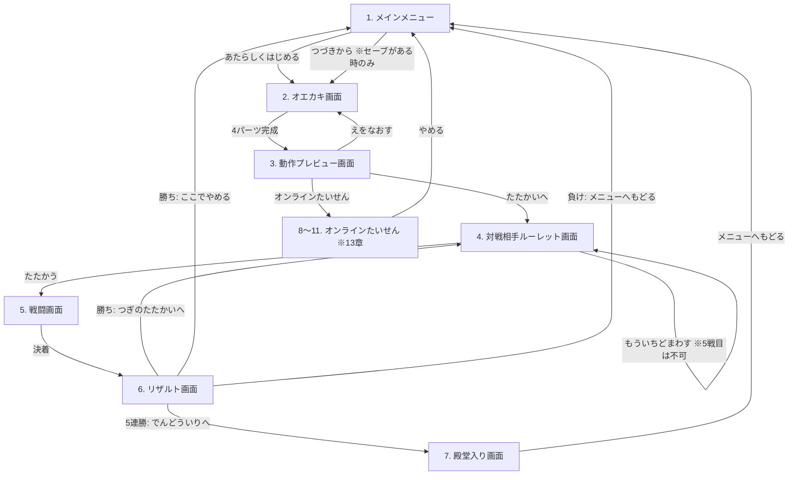
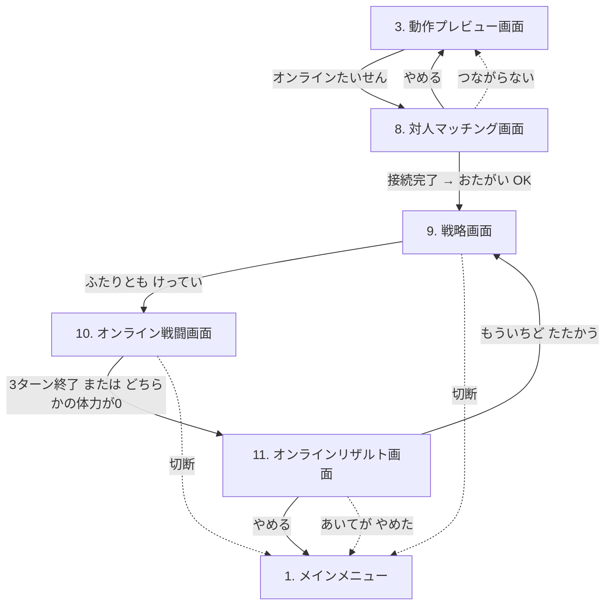
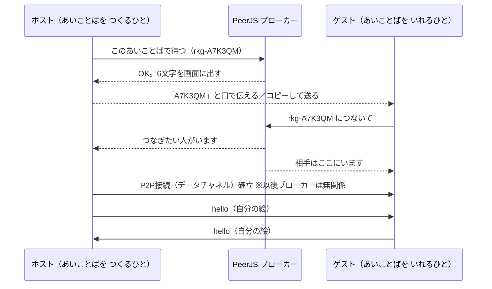

# らくがきバトル 設計書

2Dでお絵かきしたキャラクターが3Dで動き出し、NPCと連戦して5連勝を目指すWebアプリの設計書。
本書は実装を別AIに委託する前提で、実装者が本書のみで開発を完遂できる粒度で記述する。

- 対象リポジトリ: `sakanayuki/cc_rakugaki`
- デプロイ: GitHub Actions 経由で GitHub Pages に自動反映
- 対象ユーザー: 3歳児でも遊べること（ひらがなUI・大きなボタン・タッチ操作）
- **本書は第3版**。改定の一覧は §0.1（第2版）と §0.2（第3版）を参照

---

## 0. 確定済みの要件判断（発注者との確認結果）

| 論点 | 決定 |
|---|---|
| 3D表現方式 | **ペーパークラフト風**。描いた各パーツをテクスチャ付き板ポリゴンとしてThree.jsの3D空間に配置し、関節ピボットで回転させて動かす |
| 技術スタック | **Vite + TypeScript + Three.js**（UIフレームワークなし、画面遷移は自前の軽量シーンマシン） |
| 属性判定 | **あたまパーツの形状で判定**（縦横比と塗り密度。§7.3参照） |
| 必殺技 | 3往復で未決着なら**「ひっさつわざ！」ボタンが出現し、押すと演出後に必ず勝利**（一撃必殺）。**第2版で改定**: 5戦目の不利属性のみ2往復で解禁 |
| 敵の強さ | 第1版では固定。**第2版で改定**: 2戦目以降1.1倍ずつ強くなる（§0.1-10） |
| セーブ | **localStorageに1スロット自動保存**（描画ベクタデータ。連勝状態・倍率は保存しない＝セッション内のみ） |
| デバイス | **PC＋タブレット/スマホ**。Pointer Eventsでマウス・タッチ両対応、レスポンシブUI |
| ルーレット再抽選 | **無制限**（同じ敵との連戦も許容）。**第2版で改定**: 5戦目のみ再抽選不可 |
| サウンド | **効果音あり**。Web Audio APIでプログラム生成（音声素材ファイル不要）、ミュートボタン付き |

---

## 0.1 改定内容（第2版）

第1版の実装完了後に入った機能改定。発注者との確認結果を含めて記録する。
本節と以降の各節が矛盾する場合は、各節の記述（改定反映済み）が正となる。

| # | 改定項目 | 確定した仕様 |
|---|---|---|
| 1 | メニューのプレビュー | セーブがあれば「つづきから」の横に絵のサムネイルを出す |
| 2 | オエカキのレイヤー分離 | **ぬりつぶしは前工程のパーツを侵さない**。ただし前工程の線は「かべ」として境界に使える。前工程は**不透明度50%**で表示する |
| 3 | プレビュー画面の可読性 | 属性表示からオレンジ背景をなくして他のステータスと同じ見た目に統一。アクション4ボタンは色分けをやめ、3Dステージに付随する1つの操作パネルにまとめる |
| 4 | 敵の追加 | 強敵3種（グー/チョキ/パー各1）を追加して**全9種**。強敵のルーレット面積は通常敵の**1/4**。**強敵の強さは1戦目時点のプレイヤーの1.2倍**で、2戦目以降は通常敵と同じく1.1倍ずつ強くなる |
| 5 | 相性の警告 | ルーレットが**プレイヤーに不利な属性**の敵で止まったら警告を出す |
| 6 | 5戦目の特別ルーレット | 最終戦は**強敵3種のみ**。不利な相手が**50%**、残り**25%ずつ**。**再抽選は不可**。この試合で不利属性を引いた場合に限り、**必殺技が2往復で解禁**される |
| 7 | 戦闘表示の重なり | 「こうかはばつぐん」等と「ガード/よけた」が重ならないよう、タグを縦に積む |
| 8 | 会心の一撃 | **10%**の確率で**2倍**ダメージ。カットインを表示する。プレイヤー・NPCの双方に発生。**属性倍率と掛け算で重なる**（最大4倍）。回避されたら発生せず、ぼうぎょされたら半減する |
| 9 | 勝利時の成長 | ×1.5 をやめ、**初期ステータスへの加算方式**に変更。3回以内のKOで**+20%**、必殺技での勝利で**+10%** |
| 10 | 敵の成長 | 2戦目以降、**1.1のべき乗**で強くなる（2戦目1.1倍、5戦目1.4641倍） |
| 11 | 通常敵の再調整 | プレイヤーの成長が緩やかになったため、通常敵6種のステータスを調整（§8.3） |

### 改定にあたって検出した設計上の問題と対処

改定要件をそのまま組むと、**5戦目で不利属性を引いた場合の勝率が4%**（実質敗北確定）になることが
シミュレーションで判明した。それが50%の確率で・再抽選なしで来るため、決勝戦が「戦う前に
コイントスで決まる」形になってしまう。

原因は、属性相性が攻守の両方向に効く（自分の攻撃が0.5倍・相手の攻撃が2倍＝実質4倍の差）ことに、
強敵の1.2倍と5戦目の1.4641倍が重なるため。

対処として **「5戦目で不利属性のときに限り、必殺技を2往復で解禁する」** を採用した。
これにより不利属性の勝率は4%→28%になり、厳しいが戦える勝負になる。
数値根拠は §8.4 を参照。

## 0.2 改定内容（第3版）

第2版の実装完了後に入った機能改修。発注者との確認結果を含めて記録する。

| # | 改定項目 | 確定した仕様 |
|---|---|---|
| 1 | 強敵を倒すメリット | **強敵に勝ったら、勝ち方を問わず初期ステータスの+50%**。1〜5戦目のどこでも同じ。通常敵は従来どおり（3回以内KOで+20%、必殺技で+10%） |
| 2 | 強敵の出現率 | **変更しない**（通常敵の1/4面積のまま。1体あたり約3.7%、合計約11%）。引けたらラッキーという位置づけ |
| 3 | 殿堂入り画面 | 5連勝したときだけ入れる**7画面目**。優勝リザルトの後に「でんどういりへ！」で遷移する |
| 4 | 名前づけ | 最大10文字・**入力は任意**（未入力なら既定名）。文字種の制限なし。おとなが代入力する前提 |
| 5 | 名前の保存 | 絵と一緒に localStorage へ保存し、次回以降メニューのサムネイル横に表示する |
| 6 | 記念写真 | **1080×1080 のJPEG**。中身は 見出し「でんどういり」＋王冠／**2Dのオエカキ**／名前／今日の年月日／戦闘画面の背景／金の二重罫＋四すみ飾り |
| 7 | 写真の保存方法 | 画面に写真を表示（長押し保存可）した上で、「とっておく」ボタンは **Web Share API →（非対応なら）ダウンロード** の順にフォールバックする |

### バランスへの影響

強敵ボーナスを+50%にすると、5連勝クリア率は **おおよそ5ポイント上がる**（§8.4）。
1〜4戦目で強敵に会えるのは1プレイあたり平均0.3回程度なので、
「たまに来る大きなボーナス」として機能し、通常の進行を壊さない。

## 0.3 改定内容（第4版）

第3版の実装完了後に入った機能拡張。**オンライン対人戦（P2P）**の追加。
発注者との確認結果を含めて記録する。

| # | 改定項目 | 確定した仕様 |
|---|---|---|
| 1 | 入口 | 動作プレビュー画面に「オンラインたいせん」ボタンを足す。オンライン対戦へはここからだけ入れる |
| 2 | マッチング | **PeerJS の無料公開ブローカー**を使い、**6文字のあいことば**を発行して相手に直接教える方式。自前のサーバーは作らない |
| 3 | あいことばの渡し方 | 画面に6文字を大きく出す＋コピーボタン。**口頭でも伝えられる長さ**にする。渡す向きは片道1回だけ |
| 4 | 対戦できる範囲 | 同じWi-Fi内も、インターネット越しも対戦できる。**自前のTURN中継は用意しない**が、PeerJSの既定設定に無料のTURNが含まれているので、直接つながらない回線でもそれ経由で繋がる（§13.3.4） |
| 5 | 使うステータス | 絵から決まる**初期値そのまま**。PvEの連勝成長は持ち込まない |
| 6 | ターン数と勝敗 | **3ターン固定**。終了時の**残り体力％（整数）が多いほうが勝ち**。同じなら**ひきわけ**（両方を称賛する） |
| 7 | 途中で体力0 | **その場で終了**。0％のほうが負け |
| 8 | グーチョキパーの役割 | オンライン限定で **攻撃属性＝戦略画面で選んだ手／防御属性＝絵から決まる属性** に分ける |
| 9 | ジャンケンの効果 | 各ターン、勝った側だけ攻撃できる。負けた側は攻撃できない。**あいこは両方攻撃できる** |
| 10 | あいこの順番 | **はやさが高いほうが先に殴る**（同値ならホスト側が先） |
| 11 | 見せる情報 | 相手は**絵だけ**見せる。体力・こうげき・はやさの数値も、防御属性も隠す |
| 12 | 演出 | PvE同様、回避・防御・会心の一撃・属性相性（こうかばつぐん等）は起きる |
| 13 | リザルト | 勝者を称賛。「もういちど たたかう」で戦略画面へ、「やめる」でメインメニューへ |
| 14 | 相手の呼び方 | **「あいて」で統一**。殿堂入りでつけたキャラ名は送らないし、出さない |
| 15 | 一撃死 | **起こりうるままにする**。1回でやられる可能性があるほうがよい、という判断。オンライン用のバランス調整（会心倍率や体力の底上げ）は**入れない** |
| 16 | 2回目以降の手 | 「もういちど」のとき、前回の選択は**残さず毎回まっさら**から選ぶ |
| 17 | 文言 | マッチング画面も含め**すべてひらがな**。おとな向けの漢字表記は使わない |

### 使う外部サービスと、通らないもの（重要）

「6文字のあいことばを教えるだけで繋がる」を成立させるには、
**IDと相手を結びつける係（ブローカー）**がどうしても要る。GitHub Pages では
プログラムを動かせないので、**PeerJS が公開している無料のブローカー**を借りる。

| 種類 | 本設計で | 何をするものか |
|---|---|---|
| PeerJS ブローカー（`0.peerjs.com`） | **借りる** | 「このあいことばの人はここにいる」を取り次ぐ受付。接続が済むまでの**待ち合わせ役**だけ |
| STUN サーバー | **借りる**（PeerJS既定のもの） | 自分のグローバルな居場所を教えてもらう。インターネット越しのときに必要 |
| TURN サーバー | **PeerJSの既定のものを借りる** | 直接つながらない相手同士のデータを丸ごと中継する役。自前では用意しない（有料になるため）が、PeerJSが `turn:eu-0.turn.peerjs.com` などを既定で持っているので、それに乗る |
| 自前のサーバー | **作らない** | アプリは GitHub Pages のまま。運用するものは増えない |

**対戦データ（絵・手・戦闘結果）はブローカーを通らない**。繋がったあとは
端末同士の直接通信（P2P）になる。ブローカーが見えるのは
「あいことば」と「接続時のIPアドレス」まで。

#### 引き受けるリスク

| リスク | 対処 |
|---|---|
| 無料の公開ブローカーなので、**落ちていたり混んでいたりすることがある** | 繋がらないときは「いま オンラインたいせんが つかえないみたい」と出して諦める。PvEは影響を受けない |
| 将来サービスが止まる可能性がある | ブローカーの接続先は**1か所の設定オブジェクトにまとめる**。自前のPeerServerに差し替えるだけで復旧できるようにしておく |
| あいことばを当てずっぽうで入れられると、知らない人が繋がってくる | ①あいことばは**マッチング画面を開いている間だけ**有効 ②繋がっても**相互プレビューで「これで OK」を押すまで対戦は始まらない**ので、知らない相手ならそこで断れる ③31文字×6桁＝約8.8億通りなので総当たりは現実的でない |
| オフラインで動く、という第1版の前提が崩れる | **崩れるのはオンライン対戦だけ**。ライブラリはnpmでバンドルするのでCDNは使わず、PvE（オエカキ〜5連勝チャレンジ）は従来どおりオフラインで動く |

## 1. 全体像

### 1.1 画面フロー

6画面＋殿堂入り画面を単一ページ（SPA）内で切り替える。
URLルーティングは行わない（Pages配下でのパス問題を回避）。



第4版で **オンラインたいせん（P2P対人戦）** の4画面が加わり、全11画面になった。
オンライン側はルールもエンジンも別なので、**13章にまとめて記述する**。

### 1.2 ゲームサイクル

1. 4ステップ（からだ→あたま→うで→あし）で絵を描く
2. 絵から自動でリグとステータスが生成され、プレビューで動きとパラメータを確認
3. ルーレットで対戦相手を決定（1〜4戦目は全9種、5戦目は強敵3種のみ）
4. 自動戦闘。素早さの高い方が先攻。3往復で未決着なら必殺技ボタンで勝利可能
5. 勝ち方に応じて強くなり次戦へ（通常敵は3回以内KOで+20%／必殺技で+10%、**強敵は常に+50%**）
6. **5連勝で優勝 → 殿堂入り**。名前をつけて記念写真を保存できる。敗北でメインメニューへ

## 2. 技術スタックとデプロイ要件

### 2.1 スタック

| 項目 | 採用 | 備考 |
|---|---|---|
| 言語 | TypeScript (strict) | |
| ビルド | Vite | `base: '/cc_rakugaki/'` を必ず設定（Pagesのサブパス対応） |
| 3D描画 | three（npm） | 戦闘・プレビューのキャラクター表示 |
| 2D描画 | Canvas 2D API | オエカキ画面。ライブラリ不使用 |
| 状態管理 | 自前の `SceneManager` + 単一の `GameState` オブジェクト | Redux等は不使用 |
| 音 | Web Audio API | OscillatorNode/GainNodeで効果音を合成。素材ファイルなし |
| 永続化 | localStorage | 1スロット |
| 対人通信 ※第4版 | peerjs（npm） | WebRTCの薄いラッパ。無料の公開ブローカーで短いIDのマッチングを実現（§13.3）。`MatchScene` で遅延importする |
| テスト | Vitest | ロジック層（ステータス算出・属性判定・戦闘エンジン・PvPエンジン・符号化）の単体テスト |

依存パッケージは `three` / `peerjs` と devDependencies（vite / typescript / vitest / @types/three）のみに抑える。
`peerjs` は **オンライン対戦に入ったときだけ読み込む**（実測 106.5KB / gzip 25.7KB）。

### 2.2 GitHub Actions → GitHub Pages

`.github/workflows/deploy.yml` を以下の仕様で作成する。

- トリガー: `main` ブランチへの push（＋ `workflow_dispatch`）
- ジョブ構成（公式Pagesデプロイ方式）:
  1. `actions/checkout@v4`
  2. `actions/setup-node@v4`（Node 20、`cache: npm`）
  3. `npm ci`
  4. `npm test`（ロジックの単体テスト。落ちたらデプロイしない）
  5. `npm run build`（`dist/` を生成）
  6. `actions/configure-pages@v5`
  7. `actions/upload-pages-artifact@v3`（`path: dist`）
  8. `actions/deploy-pages@v4`
- `permissions: { contents: read, pages: write, id-token: write }`
- `concurrency: { group: "pages", cancel-in-progress: false }`
- リポジトリ設定は「Pages → Source: GitHub Actions」を前提とする（README に手順を記載すること）

公開URL: `https://sakanayuki.github.io/cc_rakugaki/`

### 2.3 非機能要件

- 60fps目標（Three.jsシーンはキャラ2体＋背景程度なので余裕を持つこと）
- 外部CDN・外部フォントは使わない（ライブラリはすべてnpmでバンドルする）
- **PvE（オエカキ〜5連勝チャレンジ）は初回ロード後ネットワーク不要**で動作する。
  ネットワークが要るのは第4版のオンライン対戦だけ（§13.3）
- 対応ブラウザ: 最新の Chrome / Edge / Safari / Firefox（PC・iOS・Android）
- 縦横どちらの画面でも操作可能なレスポンシブレイアウト。描画キャンバスは正方形を維持
- タッチ操作時のスクロール・ピンチ誤動作防止（キャンバスに `touch-action: none`）
- `devicePixelRatio` 対応（にじみ防止）

---

## 3. ディレクトリ構成

```
cc_rakugaki/
├── index.html
├── package.json
├── vite.config.ts          # base: '/cc_rakugaki/'
├── tsconfig.json
├── README.md               # 起動方法・Pages設定手順
├── DESIGN.md               # 本書
├── .github/
│   └── workflows/
│       └── deploy.yml
└── src/
    ├── main.ts             # エントリ。SceneManager起動
    ├── app/
    │   ├── SceneManager.ts # 画面切替（enter/exit/updateのライフサイクル）
    │   ├── GameState.ts    # セッション状態（キャラ・成長率・連勝数）
    │   ├── OnlineState.ts  # 対戦中の状態（相手の絵・自分の手・直近の結果）
    │   ├── storage.ts      # localStorage入出力・スキーマ版管理
    │   └── audio.ts        # 効果音合成・ミュート管理
    ├── scenes/
    │   ├── MenuScene.ts
    │   ├── DrawScene.ts
    │   ├── PreviewScene.ts
    │   ├── RouletteScene.ts
    │   ├── BattleScene.ts
    │   ├── ResultScene.ts
    │   ├── HallOfFameScene.ts  # 殿堂入り（名前づけ＋記念写真）
    │   ├── MatchScene.ts       # 対人マッチング（あいことば交換＋相互プレビュー）
    │   ├── StrategyScene.ts    # 3ターン分のグーチョキパーを決める
    │   ├── OnlineBattleScene.ts
    │   └── OnlineResultScene.ts
    ├── paint/
    │   ├── PaintEngine.ts  # レイヤー管理・オペレーション記録/リプレイ
    │   ├── floodFill.ts    # スキャンライン塗りつぶし
    │   ├── thumbnail.ts    # 絵の切り抜きサムネイル生成
    │   └── types.ts        # DrawOp等の型定義
    ├── rig/
    │   ├── partAnalyzer.ts # 各パーツ画像の解析（bbox/重心/面積/左右分割）
    │   ├── rigBuilder.ts   # Three.jsのメッシュ階層生成
    │   └── animations.ts   # アクション定義（キーフレームテーブル）
    ├── game/
    │   ├── stats.ts        # 絵→ステータス算出
    │   ├── element.ts      # 属性判定・相性倍率
    │   ├── battleEngine.ts # PvE戦闘進行＋攻撃解決（UI非依存・テスト対象）
    │   ├── pvpEngine.ts    # オンライン3ターン戦の決定論シミュレーション
    │   └── enemies.ts      # 敵9種の定義（描画データ＋ステータス）
    ├── net/                # オンラインたいせん（P2P）※13章
    │   ├── peerConfig.ts   # ブローカー接続先とICE設定（差し替えはここだけ）
    │   ├── roomCode.ts     # 6文字のあいことばの生成・正規化
    │   ├── codec.ts        # 絵の圧縮・復元（gzip + base64url）
    │   ├── PeerLink.ts     # PeerJSの薄いラッパ。peerjs を触るのはここだけ
    │   ├── protocol.ts     # メッセージ型・受信検証
    │   └── fairness.ts     # コミット&リビール・シード合成・結果照合
    ├── photo/
    │   ├── certificate.ts  # 記念写真（1080x1080 JPEG）の描画
    │   └── saveImage.ts    # 共有シート→ダウンロードのフォールバック保存
    └── ui/
        ├── components.ts   # 共通ボタン・パネル生成ヘルパ
        └── strings.ts      # 全UI文言（ひらがな）を一元管理
```

**設計原則**: `game/` と `paint/` のロジックはDOM・Three.js非依存に保ち、Vitestで単体テストできるようにする。シーン（`scenes/`）は薄い結合層とする。

---

## 4. データモデル

### 4.1 描画データ（ベクタオペレーション）

絵はビットマップではなく**オペレーション列**として保持する。リプレイすることで任意タイミングの再現・undo・保存/復元がすべて成立する。

```ts
type PartId = 'body' | 'head' | 'arms' | 'legs';

type DrawOp =
  | { seq: number; part: PartId; type: 'stroke';
      color: string;            // パレット色 (hex)
      width: number;            // 論理px
      points: [number, number][] } // 論理座標 (0..1024)
  | { seq: number; part: PartId; type: 'fill';
      color: string; x: number; y: number };

interface CharacterDoc {
  version: 1;
  canvasSize: 1024;             // 論理キャンバスは1024x1024固定
  ops: DrawOp[];                // 全パーツ共通の時系列（seq昇順）
  currentStep: PartId | 'done'; // オエカキの進行位置
  updatedAt: string;            // ISO8601
}
```

- `seq` は全パーツ通しの単調増加番号。**塗りつぶしの境界判定は全レイヤー合成に依存するため、リプレイは必ずseq順に全パーツ横断で行う**（§5.2.4）
- undo は「現在パーツの最後のオペを1つ削除して全リプレイ」で実現する

### 4.2 ステータス

```ts
type Element = 'rock' | 'scissors' | 'paper'; // グー/チョキ/パー

interface Stats {
  maxHp: number;   // 体力（からだ由来）
  atk: number;     // 攻撃力（うで由来）
  spd: number;     // 素早さ（あし由来）
  element: Element;// 属性（あたま由来）
}
```

### 4.3 セッション状態（保存しない）

状態は3つに分かれる。**絵と名前だけが localStorage に保存され**、連勝の進行状況はセッション内のみ。

```ts
interface GameState {
  characterDoc: CharacterDoc | null;
  baseStats: Stats | null;   // 絵から算出した素のステータス（不変）
  growthRate: number;        // 成長率。初期値 1.0
  winStreak: number;         // 0..5
  currentEnemyId: string | null;
  lastWinKind: WinKind | null; // リザルト表示用
}

/** 勝ち方。上乗せ量が変わる */
type WinKind = 'ko' | 'special' | 'strong';
```

**実効ステータス** = `round(base × growthRate)`。属性は成長の影響を受けない。

`growthRate` は勝つたびに加算される:

| 勝ち方 | 加算 | 判定 |
|---|---|---|
| **強敵に勝った** | **+0.5** | 相手が強敵なら、必殺技を使ったかどうかに関係なくこれ |
| 通常敵に3回以内の攻撃でKO（＝必殺技を使わずに勝利） | +0.2 | |
| 通常敵に必殺技で勝利 | +0.1 | |

**判定の優先順位**: まず相手が強敵かどうかを見る。強敵なら常に `+0.5`。
通常敵のときだけ、必殺技を使ったかで `+0.2` / `+0.1` に分かれる。

4連勝後の `growthRate` は、通常敵だけなら 1.4〜1.8、強敵を1体倒していれば最大 2.1。

**敵の成長率** は `1.1 ^ (戦目 - 1)`。戦目 = `winStreak + 1`。

### 4.4 localStorage スキーマ

- キー: `rakugaki.save.v1`
- 値: `CharacterDoc` のJSON文字列
- 保存タイミング: 各パーツの「つぎへ」押下時、オエカキ完了時、**殿堂入りで名前をつけた時**
- `version` 不一致・パース失敗時は破棄して「セーブなし」扱い（クラッシュさせない）
- 連勝数・成長率は保存しない（確定仕様）

**名前の保存（第3版で追加）**

`CharacterDoc` に **任意フィールド** `name?: string` を足す。version は 1 のまま据え置く。

```ts
interface CharacterDoc {
  version: 1;
  canvasSize: number;
  ops: DrawOp[];
  currentStep: PartId | 'done';
  updatedAt: string;
  /** 殿堂入りでつけた名前。最大10文字。第3版で追加した任意フィールド */
  name?: string;
}
```

任意フィールドにすることで、**第2版までのセーブもそのまま読める**（name が無いだけ）。
バリデータは「name があれば文字列であること」だけを見て、無くても弾かない。

### 4.5 敵データ

敵は**通常敵6種**と**強敵3種**の全9種。見た目はどちらもプレイヤーと同じ `CharacterDoc` 形式
（描画オペレーション列）で持ち、リグ生成・アニメーション・描画のパイプラインを共通化する。

```ts
type EnemyKind = 'normal' | 'strong';

interface EnemyDef {
  id: string;
  name: string;           // ひらがな表示名
  kind: EnemyKind;
  element: Element;
  themeColor: string;     // ルーレットのセクター色
  flavor: string;         // キャラクター性の一言
  doc: CharacterDoc;      // 見た目
  /** 通常敵のみ。強敵はプレイヤーの素ステータスから生成するので持たない */
  baseStats?: Stats;
}
```

**強敵のステータス生成**（`strongStatsFor`）:

```
強敵の素ステータス = round(プレイヤーの素ステータス × 1.2)   ← 1戦目時点で1.2倍
その試合での実効値   = round(強敵の素ステータス × 1.1 ^ (戦目 - 1))
```

プレイヤーの素ステータス（`baseStats`）は絵から決まる不変値なので、強敵も試合ごとに変動しない
基準を持つ。プレイヤーは勝つたびに growthRate が上がるため、**速く勝てば強敵を追い越せる**という
関係になる（4連勝を全てKOで取れば growthRate 1.8 に対し、5戦目の強敵は 1.2 × 1.4641 ≒ 1.757）。

強敵の属性はキャラクターごとに固定（グー/チョキ/パー 各1体）。

## 5. 画面仕様

本章はPvE側の7画面。第4版で足したオンラインたいせんの4画面（8〜11）は**13章**に書く。

全画面共通:

- 画面右上に常時ミュートボタン（🔊/🔇）。状態はlocalStorage `rakugaki.mute` に保存
- 文言はすべてひらがな＋絵文字/アイコン。フォントはシステムフォント（丸ゴシック系優先の font-family 指定）
- タップ対象は最小 56×56px

### 5.1 メインメニュー画面（MenuScene）

| 要素 | 仕様 |
|---|---|
| タイトルロゴ | 「らくがきバトル」＋ゆらゆらアニメーション |
| 「あたらしく はじめる」ボタン | `CharacterDoc` を新規作成しオエカキ画面へ。既存セーブがある場合は「まえの えは きえちゃうよ？ いいかな？」の確認ダイアログを出す |
| 「つづきから」ボタン | セーブが存在する時のみ有効（無い時はグレーアウト）。保存された `CharacterDoc` を読み込み、`currentStep` の位置からオエカキ画面を再開。`'done'` の場合は最終ステップ（あし）を修正可能な状態で開く |
| **絵のプレビュー（改定）** | セーブがある時、「つづきから」ボタンの**左に72px角のサムネイル**を出す。保存された `CharacterDoc` を `PaintEngine` で再生し、キャラクター全体のbboxで切り抜いて縮小表示する |
| **名前の表示（第3版）** | セーブに `name` があれば、サムネイルの下に小さくその名前を出す。無ければ何も出さない |

遷移時に `growthRate=1.0, winStreak=0` にリセットする。

**プレビュー生成の注意**: サムネイル生成のために起こした `PaintEngine` は 1024×1024 のキャンバスを
5枚（約20MB）持つため、描画後は `release()` で必ず手放す（敵アセットと同じ扱い。§11参照）。
`ops` が空のセーブではサムネイルを出さず、ボタンだけを表示する。

### 5.2 オエカキ画面（DrawScene）

#### 5.2.1 4ステップ進行

`からだ → あたま → うで（両うで）→ あし（両あし）` の順に1パーツずつ描く。

- 画面上部にステップインジケータ（4つの丸、現在位置ハイライト）と指示文:
  - 「①からだを かこう！」「②あたまを かこう！」「③りょううでを かこう！」「④りょうあしを かこう！」
- 各ステップに**うすいガイド枠**（点線シルエット: からだ=中央の楕円、あたま=その上の円、うで=左右、あし=下部左右）を表示する。ガイドはあくまで目安で、枠外に描いても良い
- 「つぎへ」ボタンは現在パーツの塗りピクセルが閾値（キャンバスの0.1%）以上のときのみ有効化（空パーツ防止）
- あし完了時の「つぎへ」で動作プレビュー画面へ遷移
- 「もどる」ボタンで前のステップに戻れる（描いた内容は保持）

#### 5.2.2 レイヤー構造と表示（改定）

- 論理キャンバス 1024×1024。パーツごとに独立したオフスクリーンレイヤー（4枚）を持つ
- **現在パーツ以外のレイヤーはロック**（描き込み不可）
- **表示は「前工程を不透明度50%、現在パーツを不透明度100%で最前面」**とする

```
描画順（表示用）:
  1. 前工程のパーツを COMPOSITE_ORDER（body → legs → arms → head）の順に globalAlpha = 0.5 で描く
  2. 現在パーツを globalAlpha = 1.0 で最前面に描く
  3. まだ描いていない後工程のパーツは表示しない（存在しないので自然にそうなる）
```

現在パーツを常に最前面に描くのは、合成順では後工程が手前に来るため（例: あしを描くとき、
すでに描いたうで・あたまがあしを隠してしまう）。子どもが「いま描いている線」を必ず見えるようにする。

この50%表示は**表示だけの処理**で、保存データ・プレビュー・3D表示には一切影響しない。

#### 5.2.3 ツール仕様（要件必須の5機能）

| ツール | 仕様 |
|---|---|
| ペン色変更 | 12色パレット（くろ・しろ・あか・オレンジ・きいろ・みどり・みずいろ・あお・むらさき・ピンク・ちゃいろ・はいいろ）。選択中の色を枠で強調。せまい画面では6列×2段 |
| ペン太さ変更 | 3段階「ほそい(6px)・ふつう(14px)・ふとい(28px)」。丸キャップ・丸ジョイントで補間描画 |
| 塗りつぶし | バケツツール。§5.2.4 のルールに従う |
| ひとつもどす（undo） | 現在パーツの最後の `DrawOp` を1つ削除し、全オペをseq順にリプレイ。現在パーツのオペが無いときは無効 |
| このパーツをやりなおす | 確認ダイアログ（「ぜんぶ けしても いい？」）→ 現在パーツのオペを全削除してリプレイ |

- ペンの線は前工程の上に自由に重ねられる（うでをからだにつなげて描けるようにするため）
- 入力は Pointer Events（`pointerdown/move/up`、`setPointerCapture`）で統一。`getCoalescedEvents()` があれば使用
- ストロークは記録時に点を間引き（距離2px未満はスキップ）してデータ量を抑える

#### 5.2.4 塗りつぶしのルール（改定の中心）

第1版では、あたまステップで からだ の内側をタップすると からだ を塗りつぶせてしまう不具合があった。
塗りは現在パーツのレイヤーに書かれるが、そのレイヤーが からだ より手前に合成されるため、
見た目上 からだ が塗り替わってしまうため。

改定後のルールは次の3点。

1. **境界判定は全レイヤーの合成画像で行う**（第1版と同じ）。
   これにより、からだ の輪郭を「かべ」にして あたま を塗ることができる。
2. **前工程のパーツが不透明なピクセルは、塗りの対象から除外する**。
   前工程のピクセルは「かべ」であり「塗れる面」ではない、という扱いにする。
3. **種（タップした点）が前工程のピクセルの上だった場合は、塗りを実行せず拒否する**。
   「ダメ音」を鳴らし、必要なら「そこは まえに かいた ところだよ」と短く伝える。

実装は `computeFillMask()` に「前工程マスク」を渡し、`matches()` の判定に
`previousMask[pixel] === 0` を加えるだけで両立できる（境界としては効き、塗り先からは外れる）。

**前工程マスクの定義**: `STEP_ORDER` 上で現在パーツより前にあるパーツのレイヤーの、
不透明ピクセルの論理和。`seq` 順ではなく**ステップ順**で決まるので、リプレイしても決定的。

そのほか第1版から継続するルール:

- 種が透明なら「透明領域を線で囲まれた範囲まで」、現在パーツの線の上なら「同じ色の連続範囲」（塗り直し）
- 塗り後にアンチエイリアスの縁へ1px膨張させて塗り残しを消す
- **キャンバスの60%を超える塗りは拒否**する（囲われていない場所の誤爆防止）

#### 5.2.5 塗りつぶしとリプレイの整合性

flood fill の結果は実行時点の合成状態に依存するため、**リプレイは常に「全レイヤークリア→全オペをseq順に実行」**とする。
前工程マスクもステップ順から毎回再構成するため、同じ `ops` からは必ず同じ絵が再現される。

**注意**: 第1版で保存された絵に「前工程を塗りつぶしてしまった fill オペ」が含まれる場合、
改定後のリプレイではその塗りが適用されなくなる（＝不具合の解消）。
セーブのスキーマは変更しないため、既存セーブはそのまま読み込める。

### 5.3 動作プレビュー画面（PreviewScene）

遷移時に以下を実行する:

1. `partAnalyzer` で各パーツを解析（§6）
2. `rigBuilder` でThree.jsキャラクターを構築
3. `stats.ts` でステータス算出（§7）

#### 5.3.1 UI構成（改定）

第1版は「ステータス表示」「アクション再生ボタン」「画面遷移ボタン」の3種が似た見た目
（角丸・影・カラフル）だったため、**どこが押せるのか分からない**という問題があった。
改定では**役割ごとに見た目を明確に分ける**。

| 区分 | 見た目のルール | 該当要素 |
|---|---|---|
| **情報（押せない）** | 白い平らなパネル。影なし・枠なし・彩度低め | つよさパネル（たいりょく／こうげき／はやさ／ぞくせい）、ヒント文 |
| **アクション（押せる・その場で反応）** | 3Dステージに**付随した1つの操作パネル**。4ボタンとも**同じ色**（青系）で、押下時に沈む影あり | こうげき／いたい！／よける／ぼうぎょ |
| **遷移（押せる・画面が変わる）** | 画面下部に独立配置。大きく、彩度の高い色（もどる=白、すすむ=オレンジ、オンライン=青） | えを なおす／たたかいへ すすむ！／オンラインたいせん |

具体的な変更点:

- **属性表示**: オレンジの枠付きバッジをやめ、`❤️ たいりょく` などと同じ**ステータス1行**にする。
  `✊ ぞくせい　グー（どんき）` の形式で、他のステータス行と同じ書式・同じ色に揃える
- **アクションボタン**: 個別の色分け（赤・青・緑・オレンジ）をやめ、**4つとも同一の青系**にする。
  4ボタンを「うごかして みよう」の見出しを持つ**1枚のパネル**に入れ、そのパネルを
  3Dステージの直下にすき間なく接して配置することで、「この領域の操作である」ことを示す
- **3Dステージ**: 下辺の角丸をなくして操作パネルと連結させ、ひとかたまりに見せる

#### 5.3.2 各要素の内容

| 要素 | 仕様 |
|---|---|
| 3Dビュー | 画面中央。キャラが地面（丸い影付き）に立ち、待機モーションでループ。ドラッグで左右にキャラを回転できる（「ゆびで よこに うごかすと まわるよ」の小さなヒントを重ねる） |
| 操作パネル | 「こうげき」「いたい！」「よける」「ぼうぎょ」。押すと該当モーションを1回再生して待機に戻る（§6.3）。再生中は他ボタン無効 |
| つよさパネル | ❤️たいりょく／💪こうげき／👟はやさ を**5段階の星＋数値**で、⚔️ぞくせい を同じ行形式で表示 |
| ヒント文 | 「おおきく ぬると たいりょくアップ！」等、算出ルールを子ども向けに1行で説明。属性の判定理由も1行出す |
| 「えをなおす」ボタン | オエカキ画面（あしステップ）へ戻る |
| 「たたかいへ すすむ！」ボタン | ルーレット画面へ（PvEの5連勝チャレンジ） |
| 「オンラインたいせん」ボタン ※第4版 | 対人マッチング画面へ（§13.7）。**この画面がオンライン対戦の唯一の入口**。3つ並ぶと狭くなるため、遷移ボタンは「えをなおす／たたかいへ」を1段目、「オンラインたいせん」を2段目に置く |

### 5.4 対戦相手ルーレット画面（RouletteScene）

#### 5.4.1 通常のルーレット（1〜4戦目）

全9種を1つの円盤に載せる。**強敵の面積は通常敵の1/4**。

| 区分 | 体数 | 重み | セクター角 | 1体あたりの確率 |
|---|---|---|---|---|
| 通常敵 | 6 | 1.0 | 53.33° | 14.81% |
| 強敵 | 3 | 0.25 | 13.33° | 3.70% |

合計の重みは `6 × 1 + 3 × 0.25 = 6.75`。セクター角は `360 / 6.75 × 重み` で求める。
**抽選は面積（重み）に比例させる**（等確率で選んでから角度を合わせるのではなく、
重み付き抽選で決めてからその中心角に止める）。

| 要素 | 仕様 |
|---|---|
| ルーレット盤 | 9等分ではなく重み付きの不等分。各セクターに敵の顔サムネイル＋名前。強敵のセクターは金色のふちで区別する |
| 「ルーレット スタート！」ボタン | **2.0秒**かけて減速して自動停止（cubic-out）。止まる位置は押下時に重み付き乱数で決定し、最終角度から逆算する |
| 停止後 | 選ばれた敵の拡大表示＋名前＋属性＋つよさの目安。「たたかう！」→戦闘画面、「もういちど まわす」→再抽選（**回数無制限**） |
| 連勝表示 | 画面上部に「○れんしょうちゅう！」 |

#### 5.4.2 相性の警告（改定）

停止した敵が**プレイヤーにとって不利な属性**（`elementMultiplier(敵, プレイヤー) === 2`）だった場合、
敵カードの上に赤い警告帯を出す。

- 「⚠️ あいしょうが わるいよ！」
- 「きみの こうげきは はんぶん。あいての こうげきは 2ばい！」
- 警告音（`nope` 系の下降音）を鳴らす
- 1〜4戦目では「もういちど まわす」ボタンを強調して、回し直しを促す

じゃんけんの三すくみでは「相手が自分に強い」と「自分が相手に弱い」が必ず同時に成立するので、
この1条件だけで両方向の不利をカバーできる。

#### 5.4.3 5戦目の特別ルーレット（改定）

最終戦は**強敵3種のみ**のルーレットにする。

| セクター | 面積 | 確率 |
|---|---|---|
| プレイヤーに不利な属性の強敵 | 180° | 50% |
| 残り2体（互角／プレイヤー有利） | 90° ずつ | 25% ずつ |

- **再抽選は不可**。「たたかう！」ボタンのみを出す（無制限に回せると50%の重み付けが無意味になるため）
- 盤面上部に「さいごの たたかい！」の見出しを出し、通常のルーレットと違うことを示す
- 不利属性で止まった場合の警告は 5.4.2 と同じものを出す（回し直しは促さない）

この試合で不利属性を引いた場合に限り、戦闘側で**必殺技が2往復で解禁**される（§5.5.4）。

### 5.5 戦闘画面（BattleScene）

#### 5.5.1 レイアウト

- Three.jsシーン: 左にプレイヤーキャラ、右に敵キャラ（左右反転表示）
- 画面上部: 両者のHPバー（残量で緑→黄→赤）＋名前＋属性アイコン
- 画面下部: メッセージ帯
- 中央: ダメージ数字のポップアップ、効果タグ、会心カットイン

#### 5.5.2 効果タグの重なり解消（改定）

第1版では「こうかは ばつぐん！」と「ガード！」が同じ絶対座標に出るため重なっていた。
改定では**タグ用のスタックコンテナ**を1つ用意し、そこへ縦に積む。

```
.tag-stack {
  position: absolute; top: 12%; left: 50%; transform: translateX(-50%);
  display: flex; flex-direction: column; align-items: center; gap: 6px;
}
```

1回の攻撃で出るタグは最大3つ（会心／属性／ガード・回避）。上から
**「会心の一撃」→「属性の効果」→「ガード／よけた」** の順で積み、それぞれ1.1秒で消える。

#### 5.5.3 会心の一撃（改定）

- 発生率 **10%**。プレイヤー・NPCの双方に発生する
- ダメージ **2倍**。属性倍率とは**掛け算**で重なる（最大 2 × 2 = 4倍）
- **回避されたら発生しない**（回避判定が先）。**ぼうぎょされたら半減する**（他のダメージと同じ）
- 演出: 画面を横切る**カットイン**（帯が左右からスライドインし「かいしんの いちげき！」を表示、
  約0.7秒）＋画面フラッシュ＋専用効果音。カットインの後にダメージ数字を出す
- カットイン中は他の演出を止める（メッセージ帯も「かいしんの いちげき！」にする）

#### 5.5.4 進行（自動戦闘）

```
1. 開始演出（両者登場、"たたかいスタート！"）
2. 先攻決定: spd が高い方が先攻。同値ならプレイヤー先攻
3. ラウンド r = 1..N を繰り返す:
   a. 先攻の攻撃 → 解決（§8.1）→ 相手HP0なら決着
   b. 後攻の攻撃 → 解決 → 相手HP0なら決着
4. Nラウンド終了時に両者生存なら:
   → 「ひっさつわざ！」大ボタンが点滅出現（プレイヤー唯一の操作）
   → タップで必殺演出（約3秒）→ 敵HPを0にして勝利
5. 決着 → 勝敗と「勝ち方」を GameState に反映してリザルト画面へ
```

**必殺技が解禁されるラウンド数 N**（改定）:

| 条件 | N |
|---|---|
| 通常 | **3** |
| **5戦目 かつ プレイヤーが不利属性** | **2** |

5戦目の不利属性は、そのままでは3ラウンド持ちこたえられず勝率4%になってしまうため
（§0.1・§8.4）、この試合に限り必殺技を早く解禁して救済する。
解禁が早まったことは「あいしょうが わるいから、はやく ひっさつわざが つかえる！」と
メッセージ帯で明示する。

- プレイヤーのHPが0になった場合はその時点で敗北
- 敵は必殺技を使わない
- 各攻撃の演出: 攻撃側 attack モーション、防御側は結果に応じて hit / dodge / guard モーション
- パー属性の攻撃時は弾スプライト（描いたあたまの縮小画像）が飛ぶ

#### 5.5.5 リザルトへ渡す情報

`{ outcome: 'win' | 'lose', enemyId, winKind: 'ko' | 'special' | null }` を渡す。
`winKind` が成長量を決める（§5.6）。

### 5.6 リザルト画面（ResultScene）

| 分岐 | 表示・挙動 |
|---|---|
| 勝利（winStreak < 5） | 「かち！ ○れんしょう！」＋勝利ポーズ＋紙吹雪。**勝ち方に応じた成長**の演出（星が増える・数値がカウントアップ）。ボタン: 「つぎの たたかいへ！」／「ここで やめる」 |
| 5連勝 | 「ゆうしょう！！ 5れんしょう たっせい！」＋金トロフィー＋最大演出。ボタン: **「👑 でんどういりへ！」**（殿堂入り画面へ） |
| 敗北 | 「まけちゃった… ○れんしょうで おわり」＋ダウンポーズ。ボタン: 「メニューへ もどる」のみ |

**成長の表示**

勝ち方によって上乗せ量が変わるため、**なぜその量なのか**を必ず1行で見せる。

| 勝ち方 | 見出し | 成長 |
|---|---|---|
| 強敵に勝った | 「つよい あいてに かった！」 | 初期ステータスの **+50%** |
| 通常敵に3回以内の攻撃でKO | 「ひっさつわざを つかわずに かった！」 | **+20%** |
| 通常敵に必殺技で勝利 | 「ひっさつわざで かった！」 | **+10%** |

- `growthRate` を加算し、実効ステータス（`round(base × growthRate)`）の before → after を並べて出す
- 強敵に勝ったときは、上乗せが大きいことが伝わるよう見出しを金色にして強調する
- HPは新しい最大値まで全回復する
- 属性は変化しない
- メニューへ戻ると `growthRate` と `winStreak` はリセット（絵と名前のセーブは残る）

### 5.7 殿堂入り画面（HallOfFameScene）※第3版で追加

5連勝したときだけ入れる画面。**キャラクターに名前をつけて、記念写真を持ち帰る**ための画面。

#### 5.7.1 画面構成

```
┌──────────────────────────┐
│  👑 でんどういり！          │  見出し
├──────────────────────────┤
│                          │
│    ［記念写真プレビュー］     │  1080×1080 を画面幅に合わせて縮小表示
│                          │  （長押しでそのまま保存できる ）
│                          │
├──────────────────────────┤
│ なまえを つけてね           │
│ [____________] (10もじまで) │  テキスト入力
├──────────────────────────┤
│  📷 とっておく   🏠 メニューへ │
└──────────────────────────┘
```

- 入力欄に文字を入れると、**200msのデバウンスで記念写真を描き直す**（子どもがその場で反映を見られる）
- 未入力のままでも進める。その場合は既定名（`S.defaultCharacterName` =「なまえなし」）で描く
- 名前が確定したら `doc.name` に入れて localStorage に保存する
- 「とっておく」の挙動は §5.7.3

#### 5.7.2 記念写真の生成（`photo.ts`）

**1080×1080 の JPEG**（品質 0.92）。Canvas 2D で下から順に描く。3Dは使わない。

| # | レイヤー | 内容 |
|---|---|---|
| 1 | 背景 | 戦闘画面と同じ配色。上72%が空のグラデーション（`#bfe9ff` → `#e8f7d4`）、下28%が地面（`#c6e3a0`）。境目に薄い地平線 |
| 2 | 後光 | 中央やや上から広がる白い放射グラデーション（不透明度0.25程度） |
| 3 | キャラクター | **2Dのオエカキをそのまま**。`PaintEngine` で `doc` を再生し、描かれている範囲のbboxで切り抜いて、画像の中央・やや下寄せに配置（高さが画像の約52%になるよう等比拡大） |
| 4 | 影 | キャラクターの足元に楕円のぼかし影 |
| 5 | 見出し | 上部に王冠 👑 と「でんどういり」の大きな文字（金色＋濃い縁取り） |
| 6 | 名前 | キャラクターの下に大きく。10文字でも収まるよう、文字数に応じて自動縮小する |
| 7 | 日付 | 右下に小さく「2026ねん 8がつ 25にち」の形式 |
| 8 | 縁取り | **金の二重罫＋四すみ飾り**（§5.7.4） |

- フォントはアプリ本体と同じ丸ゴシック系のスタックを指定する
- 生成は同期処理（1080²のCanvas描画は数十ms）。デバウンス付きの再描画で十分間に合う
- 生成に使った `PaintEngine` は毎回 `release()` で手放す（約20MB）

#### 5.7.3 保存（`saveImage()`）

タブレット・スマホでも確実に保存できるよう、**3つの手段を用意して順に試す**。

1. **Web Share API**: `navigator.canShare({ files: [file] })` が true なら `navigator.share()` を呼ぶ。
   iOS/Android の共有シートが開き、「画像を保存」で写真アプリに入る。https 必須（Pagesは https なので満たす）
2. **ダウンロード**: 上が使えなければ `<a download>` に blob URL を付けて click する（PC向け）
3. **長押し**: どちらも失敗した場合に備え、**写真は常に `` として画面に出しておく**。
   「ながおしして ほぞんしてね」の案内を出す

- ファイル名: `rakugaki-<名前>-<YYYYMMDD>.jpg`（名前に使えない文字は除去する）
- `navigator.share()` はユーザーがキャンセルすると reject するので、**AbortError は握りつぶす**（エラー表示しない）

#### 5.7.4 縁取りのデザイン

賞状らしさを出しつつ、絵の邪魔をしないこと。

- 外側: 太い金の罫（幅 約22px、`#c9a227` → `#f6e27a` → `#c9a227` のグラデーション）
- 内側: 細い金の罫（幅 約4px）を12pxほど内側に
- 四すみ: 45度に伸びる短い斜線と小さな菱形を組み合わせたロココ風の飾り
- 罫の外側は余白として背景色をそのまま見せる

#### 5.7.5 ボタン

| ボタン | 挙動 |
|---|---|
| 📷 とっておく | §5.7.3 の保存処理 |
| 🏠 メニューへ もどる | メインメニューへ（`growthRate`・`winStreak` はリセット、絵と名前は残る） |

---

## 6. 自動リグ設計（ペーパークラフト風3D）

### 6.1 パーツ解析（partAnalyzer）

各パーツレイヤーのピクセルから以下を計算する:

- **bbox**: 不透明ピクセルの外接矩形
- **面積**: 不透明ピクセル数
- **重心**: 不透明ピクセルの平均座標
- **左右分割**（arms / legs のみ）: からだの重心X `cx` を境界に、レイヤーを左半分・右半分の2枚に分割して独立パーツにする。片側が空（面積が全体の5%未満）の場合は、もう片側をミラー複製して補う（片腕しか描かない子ども対策）

### 6.2 メッシュ階層とピボット

各パーツはbboxでクロップしたテクスチャ（`CanvasTexture`、透過あり）を貼った `PlaneGeometry` とし、ピボット用の `Group` にぶら下げる。1024px = 3Dの3.0ユニットに正規化する。

```
Root (Group)                    … 地面基準。移動・ジャンプはここ
└─ Body (Group, pivot=からだ重心)
   ├─ bodyMesh (z= 0)
   ├─ HeadPivot (Group, pivot=あたまbbox下端中央, z=+0.02) ─ headMesh
   ├─ ArmLPivot (Group, pivot=左うでbboxの「からだ側上端」, z=+0.01) ─ armLMesh
   ├─ ArmRPivot (同上・右, z=-0.01) ─ armRMesh
   ├─ LegLPivot (Group, pivot=左あしbbox上端中央, z=-0.02) ─ legLMesh
   └─ LegRPivot (同上・右, z=-0.02) ─ legRMesh
```

- ピボット位置の原則: **「からだに近い側の端」を回転軸**にする（腕はからだ側の端、脚は上端、頭は下端）。これで回転が関節らしく見える
- z微オフセットでZファイティング回避＋前後関係（頭・左腕が手前、脚が奥）
- マテリアルは `MeshBasicMaterial { map, transparent, alphaTest: 0.05, side: DoubleSide }`（ライティング不要、描いた色がそのまま出る）
- 地面に `CircleGeometry` の疑似影（半透明黒）。キャラのY位置に追従
- 敵キャラは同じビルダーで生成し `scale.x = -1` で左向きに

### 6.3 アニメーション定義（animations.ts）

キーフレームはコード内のデータテーブルで定義する（時間: 秒、回転: ラジアン、位置: ユニット）。補間は easeInOut。全キャラ共通で、リグ構造が同一なのでそのまま適用できる。

| アクション | 長さ | 内容 |
|---|---|---|
| idle | ループ | Root.rotation.y ±0.06 のゆらぎ、Body.scale 1±0.015 の呼吸、腕±0.05rad スイング |
| attack (rock=グー) | 0.8s | 前進0.6ユニット→両腕を大きく振り下ろし（-1.6rad）→戻る |
| attack (scissors=チョキ) | 0.8s | 前進→体を0.4rad回転させつつ片腕を水平に薙ぐ→戻る |
| attack (paper=パー) | 0.9s | 両腕を前へ突き出し（+1.2rad）、弾スプライト発射→戻る |
| hit | 0.6s | 後方ノックバック0.4、Body ±0.15radの揺れ、マテリアルを赤フラッシュ2回 |
| dodge | 0.5s | 側方ホップ0.5＋Body 0.3rad傾け→戻る |
| guard | 0.7s | 両腕を体の前でクロス（∓1.2rad）、半透明シールド円を一瞬表示 |
| special | 3.0s | その場で高速スピン→大ジャンプ→急降下攻撃、カメラズームイン、ホワイトフラッシュ |
| win | ループ | 両腕上げ（バンザイ）＋小ジャンプ繰り返し |
| lose | 1回 | Root.rotation.z を -π/2（倒れる）＋バウンド |
| walk（登場用） | ループ | 脚を交互に±0.5radスイング＋前進 |

プレビュー画面の4ボタンは attack（自属性のもの）/ hit / dodge / guard に対応する。

---

## 7. パラメータ算出ロジック（stats.ts / element.ts）

「3歳児でも分かる」＝**大きく塗るほど強い**を基本原則とする。すべて決定的（同じ絵なら必ず同じ値）。

### 7.1 面積スコア

パーツ面積比 `r = パーツの不透明ピクセル数 / 1024²` を、想定レンジで0..1に正規化する:

```
score(part) = clamp(r / R_max(part), 0, 1)
  R_max: body=0.20, arms=0.10, legs=0.10
```

### 7.2 基本ステータス

| ステータス | 由来 | 式 | レンジ |
|---|---|---|---|
| たいりょく maxHp | からだ面積 | `round(60 + 90 × score(body))` | 60〜150 |
| こうげき atk | 両うで面積合計 | `round(10 + 30 × score(arms))` | 10〜40 |
| はやさ spd | 両あし面積合計 | `round(5 + 20 × score(legs))` | 5〜25 |

**色ボーナス**: 全パーツで使った**パレット色の種類数** n（背景・透明を除く）に応じ、全ステータスに `×(1 + 0.02 × min(n-1, 5))`（最大+10%）を掛けて丸める。「いろんな いろを つかうと ちょっと つよい」という説明可能なルール。

星表示: 各ステータスをレンジ内で5等分し1〜5個の星に変換する。

### 7.3 属性判定（あたまの形状）

あたまレイヤーの bbox から `A = 幅/高さ`（縦横比）、`D = 不透明ピクセル数/bbox面積`（塗り密度）を計算し、**以下の順で**判定する:

```
1. A ≥ 1.5 または A ≤ 0.67  →  チョキ（ざんげき）  … ほそながい あたま
2. D ≥ 0.50                 →  グー（どんき）      … まるくて ぎっしり
3. それ以外                  →  パー（とびどうぐ）  … スカスカ／ひろがってる
```

- 判定結果はプレビュー画面で必ず可視化し、ヒント文で理由も示す（「ほそながい あたまだから チョキ！」）
- 順序評価により必ず一意に決まる（デフォルトはパー）

### 7.4 属性相性（じゃんけん三すくみ）

`multiplier(attacker, defender)`:

| 攻→防 | グー | チョキ | パー |
|---|---|---|---|
| **グー** | ×1.0 | ×2.0 | ×0.5 |
| **チョキ** | ×0.5 | ×1.0 | ×2.0 |
| **パー** | ×2.0 | ×0.5 | ×1.0 |

### 7.5 成長ルール

絵から決まる `baseStats` は**不変**で、勝つたびに `growthRate` だけが増える。

```
実効ステータス = round(baseStats × growthRate)

growthRate は 1.0 から始まり、勝つたびに加算:
  強敵に勝った                          … +0.5   ← 勝ち方は問わない
  通常敵に3回以内の攻撃でKO（必殺技なし） … +0.2
  通常敵に必殺技で勝利                   … +0.1
```

判定は「まず相手が強敵か」を見る。強敵なら必殺技を使っていても `+0.5`。

| 連勝 | growthRate の範囲（通常敵のみ） | 強敵を1体倒した場合 | 敵のスケール |
|---|---|---|---|
| 0（1戦目） | 1.0 | 1.0 | 1.0 |
| 1（2戦目） | 1.1 〜 1.2 | 1.5 | 1.1 |
| 2（3戦目） | 1.2 〜 1.4 | 1.6 〜 1.7 | 1.21 |
| 3（4戦目） | 1.3 〜 1.6 | 1.7 〜 1.9 | 1.331 |
| 4（5戦目） | 1.4 〜 1.8 | 1.8 〜 2.1 | 1.4641 |

**設計意図**: 5戦目の強敵は `1.2 × 1.4641 ≒ 1.757` 倍。
通常敵だけを順当に倒してくると 1.4〜1.8 でほぼ互角の勝負になり、
道中で**強敵を1体でも倒せていれば決勝で明確に有利**になる。
「つよい あいてを たおすと ごほうびが おおきい」というリスクとリターンの関係をここで作っている。

属性は成長の影響を受けない。

## 8. 戦闘エンジン（battleEngine.ts）

### 8.1 攻撃解決

1回の攻撃は以下の順で解決する（乱数は注入されたシード付きRNG）。
**乱数の消費順は 回避 → 防御 → 会心 → ゆらぎ** で固定する（テストの再現性のため）。

```
1. 回避判定: dodgeChance = clamp(5 + (防御側spd - 攻撃側spd), 5, 25) %
   → 成功: ダメージ0、防御側 dodge モーション、「よけた！」。会心もゆらぎも判定しない
2. 防御判定: 固定 15%
   → 成功フラグを立てる（ダメージは最後に半減）
3. 会心判定: 固定 10%      ← 改定で追加
   → 成功: critMul = 2、カットイン演出
4. ダメージ:
   dmg = round(攻撃側atk × 属性倍率 × critMul × U(0.85..1.15))
   防御成功なら dmg = ceil(dmg / 2)
   最低 1
```

属性倍率と会心は掛け算で重なるため、**最大で 2 × 2 = 4倍**になる。

表示は §5.5.2 のタグスタックに、会心 → 属性 → ガード/回避 の順で積む。

### 8.2 イベント駆動設計

```ts
type BattleEvent =
  | { type: 'start'; first: 'player' | 'enemy'; specialUnlockRound: number }
  | { type: 'attack'; actor: Side; target: Side;
      result: 'hit' | 'dodge' | 'guard';
      damage: number; elementMul: 0.5 | 1 | 2;
      critical: boolean;                          // 改定で追加
      hpAfter: number }
  | { type: 'specialReady' }                      // ここでUI入力待ち
  | { type: 'special'; damage: number; hpAfter: number }
  | { type: 'end'; winner: Side };
```

`battleEngine` は純関数的にイベント列を進め、`specialReady` でのみ外部入力（ボタン押下）を待つ。
`Battle` のコンストラクタには **必殺技解禁までのラウンド数**（3、または5戦目の不利属性なら2）を
渡せるようにする。

この分離により戦闘ロジック全体をVitestで検証する（勝敗・必殺発生条件・相性倍率・会心の倍率・
回避境界値・解禁ラウンド数の切り替え）。

### 8.3 敵の定義（enemies.ts）

#### 通常敵6種（改定: 再調整済み）

プレイヤーの成長が「毎回×1.5」から「初期値の+20%ずつ」に緩やかになったため、
第1版の値ではほぼ必殺技頼みになる。§8.4 の試算に基づき下表に調整した。

| id | 名前 | 属性 | HP | ATK | SPD | キャラクター性 | 第1版からの変更 |
|---|---|---|---|---|---|---|---|
| golem | ゴロン | ✊グー | 150 | 17 | 5 | かたいけど おそい | HP 180→150, ATK 18→17, SPD 6→5 |
| robot | カチカチ | ✊グー | 115 | 21 | 12 | バランスがた | HP 120→115, ATK 25→21 |
| crab | チョッキン | ✌️チョキ | 105 | 20 | 14 | ハサミで きりつける | HP 100→105, ATK 22→20 |
| ninja | シュバにゃん | ✌️チョキ | 88 | 19 | 22 | すばやくて よく よける | HP 80→88, ATK 20→19 |
| bird | パタパタ | 🖐パー | 98 | 18 | 18 | はねを とばす | HP 90→98, ATK 16→18 |
| witch | フワリン | 🖐パー | 132 | 22 | 9 | まほうが とても つよい | HP 140→132, ATK 30→22 |

方針としては **HPは概ね据え置き、ATKを下げて事故死を減らした**。
ATKの上限は「不利属性（相手の攻撃が2倍）でも3ラウンド耐えられる」ことを基準に決めている。

#### 強敵3種（改定: 新規追加）

ステータスは固定値を持たず、**プレイヤーの素ステータスから生成**する（§4.5）。
属性は1体ずつグー・チョキ・パーを担当する。

| id | 名前 | 属性 | 見た目の方針 |
|---|---|---|---|
| kingRock | ゴツゴツおう | ✊グー | ゴロンの上位。岩の王冠と太い腕。色は濃い灰＋金 |
| kingScissors | ザクザクおう | ✌️チョキ | 鋭い三日月型の腕を持つ。色は濃い紫＋銀 |
| kingPaper | ヒラヒラおう | 🖐パー | マントを広げた魔王風。色は濃紺＋金 |

- 名前を「〜おう」で統一し、3歳児にも「つよいやつ」だと伝わるようにする
- ルーレットのセクターは金色のふちで区別する
- 描画データは通常敵と同じく `DocBuilder` で組み立てる（§11-9）

### 8.4 バランス試算

確定したルールで5連勝チャレンジを各30,000回シミュレーションした結果。
プレイヤーの絵の大きさを3段階に振っている（絵の大きさでステータスが決まるため）。

#### 第3版（強敵に勝つと +50%）

| 絵の想定 | 素ステータス | 5連勝クリア率 | 1戦目 | 2戦目 | 3戦目 | 4戦目 | 5戦目 |
|---|---|---|---|---|---|---|---|
| ちいさい絵 | HP75 / ATK16 / SPD9 | 17.5% | 66% | 68% | 69% | 70% | 81% |
| ふつうの絵 | HP110 / ATK30 / SPD15 | 32.7% | 81% | 84% | 86% | 87% | 65% |
| おおきい絵 | HP150 / ATK40 / SPD25 | 53.8% | 93% | 94% | 95% | 95% | 68% |

#### 第2版（強敵も +20%/+10% だった頃）との比較

| 絵の想定 | 第2版のクリア率 | 第3版のクリア率 | 差 |
|---|---|---|---|
| ちいさい絵 | 13.7% | 17.5% | +3.8pt |
| ふつうの絵 | 27.3% | 32.7% | +5.4pt |
| おおきい絵 | 47.6% | 53.8% | +6.2pt |

**強敵ボーナスは全体を5ポイントほど押し上げるが、進行を壊すほどではない。**
理由は出会える機会が少ないため。1プレイ（1〜4戦目）あたりの平均で見ると:

| 絵の想定 | 強敵に会った回数 | 強敵を倒した回数 |
|---|---|---|
| ちいさい絵 | 0.27回 | 0.18回 |
| ふつうの絵 | 0.34回 | 0.20回 |
| おおきい絵 | 0.40回 | 0.25回 |

つまり **5回に1回くらいのプレイでしか強敵ボーナスは発生しない**。
「引けたらラッキー、引けたら決勝がぐっと楽になる」という位置づけになり、
発注者の選択（面積は1/4のまま）と整合している。

なお5戦目の勝率が上がっている（ふつうの絵で 57% → 65%）のは、
道中で強敵ボーナスを得たプレイヤーが決勝に強い状態で到達するため。

#### 5戦目の相性別の内訳（ふつうの絵）

必殺技の早期解禁（§5.5.4）を入れる前と後の比較。第3版でも変更していない。

| 5戦目の相手 | 出現率 | 早期解禁なし | 早期解禁あり（採用） |
|---|---|---|---|
| 不利属性の強敵 | 50% | **4%** | **28%** |
| 互角の強敵 | 25% | 80% | 99% |
| 有利属性の強敵 | 25% | 100% | 100% |

#### 実装後の再確認（§10.3 フェーズ6）

実装した `Battle` に `seededRng` を注入し、ルーレットと同じ重み付けで相手を引いて
各30,000回まわした結果。設計時の試算とほぼ一致した。

| 絵の想定 | 設計時のクリア率 | 実装での実測 | 差 |
|---|---|---|---|
| ちいさい絵 | 17.5% | 18.1% | +0.6pt |
| ふつうの絵 | 32.7% | 31.3% | -1.4pt |
| おおきい絵 | 53.8% | 52.6% | -1.2pt |

戦目ごとの勝率（実測）:

| 絵の想定 | 1戦目 | 2戦目 | 3戦目 | 4戦目 | 5戦目 |
|---|---|---|---|---|---|
| ちいさい絵 | 66.2% | 68.1% | 68.9% | 70.9% | 82.0% |
| ふつうの絵 | 80.3% | 83.2% | 84.8% | 86.5% | 63.9% |
| おおきい絵 | 93.3% | 93.7% | 94.5% | 94.6% | 67.3% |

1〜4戦目で強敵に会った回数・倒した回数も設計時の試算どおり（0.27〜0.40回 / 0.18〜0.24回）で、
**強敵ボーナスは「5回に1回くらい発生する大きなごほうび」として意図どおり働いている**。

#### 試算スクリプトについて

この試算は設計判断のために書いた使い捨てのスクリプトであり、リポジトリには含めない。
バランスを再調整する場合は上記のとおり **実装済みのエンジンにシード付きRNGを注入して回す**こと
（二重実装を避ける）。

## 9. 効果音設計（audio.ts）

Web Audio APIで合成（外部ファイルなし）。初回のユーザー操作で `AudioContext` を resume する（自動再生制限対応）。

| イベント | 音 |
|---|---|
| ボタンタップ | 短いポップ音（矩形波 880Hz, 50ms） |
| ペン描画中 | なし（鳴らさない） |
| 塗りつぶし | 上昇スイープ（200→800Hz, 150ms） |
| ステップ完了/つぎへ | 2音チャイム（ド→ソ） |
| ルーレット回転中 | カチカチ音（回転速度に同期） |
| 攻撃ヒット | ノイズバースト＋低音（属性で音色を変える: グー=ドン、チョキ=シュッ、パー=ピュン） |
| 回避/防御 | ヒュッ（下降スイープ）/ ガキン（金属的短音） |
| 必殺技 | 上昇アルペジオ→爆発ノイズ |
| **会心の一撃**（改定） | 鋭い金属音＋低音の一撃（高音の短いスイープ → ノイズバースト → 低音）。通常の命中音より明らかに派手にする |
| **相性の警告**（改定） | 下降する不安げな2音。ルーレット停止時に鳴らす |
| **塗りつぶしの拒否**（改定） | 「ダメ音」。前工程を塗ろうとした時・囲われていない場所を塗ろうとした時に共通で鳴らす |
| 勝利/5連勝 | ファンファーレ（3和音アルペジオ／長尺版） |
| **殿堂入り**（第3版） | 5連勝より更に長い、荘厳なアルペジオ＋きらめき音 |
| **写真ができた**（第3版） | カメラのシャッター音（短いノイズバースト＋高音のクリック） |
| 敗北 | 下降3音 |

---

## 10. 実装フェーズ分割と受け入れ基準（委託先AI向け）

### 10.1 第1版の実装フェーズ（完了済み）

初回実装の記録として残す。各フェーズ完了ごとにデプロイして動作確認できる構成とした。

| # | フェーズ | 内容 | 受け入れ基準 |
|---|---|---|---|
| 1 | 土台 | Vite+TS雛形、SceneManager、6画面の空実装と遷移、deploy.yml | GitHub Pagesで6画面がボタン遷移できる |
| 2 | オエカキ | PaintEngine（ストローク/塗り/undo/やり直し）、4ステップUI、localStorage保存・復元 | 5機能すべて動作。リロード後「つづきから」で復元できる。タッチで描ける |
| 3 | 解析とリグ | partAnalyzer、rigBuilder、プレビュー画面（4モーション＋パラメータ表示） | どんな絵でも破綻せずキャラが立ち、4アクションが再生される。空/片側パーツでもクラッシュしない |
| 4 | ステータス | stats.ts / element.ts ＋ 単体テスト | §7の式・境界値のテストが通る。プレビューに星とじゃんけん属性が出る |
| 5 | ルーレット | 敵データ、回転演出（2秒停止）、再抽選 | 敵が正しく抽選・表示され、たたかう/もういちどが機能する |
| 6 | 戦闘 | battleEngine＋単体テスト、BattleScene演出、必殺技 | 先攻判定・相性倍率・3往復後の必殺ボタンがテストで検証済み。演出が同期する |
| 7 | リザルトと周回 | 勝利時の強化、連勝カウント、5連勝優勝、敗北フロー | 勝ち→ルーレット→勝ち…の周回と5連勝優勝、敗北→メニューが通しで動く |
| 8 | 仕上げ | 効果音、レスポンシブ調整、演出磨き込み | スマホ縦・タブレット横・PCで一通りプレイ可能 |

### 10.2 第2版（改定）の実装フェーズ

改定は独立性の高い項目が多いので、**ロジック層 → 画面 → バランス** の順に進める。
各フェーズは単体で動作確認・デプロイができる。

| # | フェーズ | 内容 | 受け入れ基準 |
|---|---|---|---|
| 1 | 成長ルールの変更 | `GameState` の `multiplier` を `growthRate` に置き換え、勝ち方（`winKind`）で +0.2 / +0.1。リザルト画面の表示更新 | 単体テストで加算量が検証済み。勝ち方によってリザルトの文言と数値が変わる |
| 2 | 会心の一撃 | `battleEngine` に会心判定（10%・2倍・属性と掛け算・回避で不発・ガードで半減）と `critical` イベント。乱数消費順を 回避→防御→会心→ゆらぎ に固定 | 単体テストで倍率の重なりと乱数順序が検証済み。既存の戦闘テストも通る |
| 3 | 必殺技の解禁ラウンド可変化 | `Battle` に解禁ラウンド数を注入可能にする。5戦目かつ不利属性で2 | 解禁ラウンドの切り替えが単体テストで検証済み |
| 4 | 敵の拡張 | 強敵3種の `CharacterDoc` 追加、`strongStatsFor()`、敵の 1.1^(戦目-1) スケーリング、通常敵6種の再調整 | 9種すべてがルーレットとリグで破綻なく表示される |
| 5 | ルーレット改定 | 重み付きセクター（通常1／強敵0.25）、重み付き抽選、5戦目の専用ルーレット（50/25/25・再抽選なし）、相性警告 | 抽選確率が重みどおりであることをテストで確認。5戦目に再抽選ボタンが出ない |
| 6 | オエカキのレイヤー分離 | 前工程マスクを `computeFillMask` に渡す、前工程50%表示、現在パーツを最前面に描画 | あたまステップで からだ の内側をタップしても からだ が塗り替わらない。前工程が半透明で見える |
| 7 | 戦闘表示の整理 | タグスタック、会心カットイン | 「ばつぐん」と「ガード」が同時に出ても重ならない |
| 8 | プレビュー画面の整理 | 属性行の統一、アクション4ボタンの1パネル化・同色化 | 情報／アクション／遷移の3種が見た目で区別できる |
| 9 | メニューのサムネイル | セーブの絵を72px角で表示。生成後は `PaintEngine.release()` | セーブがある時だけ絵が出る。メモリが増え続けない |
| 10 | バランス確認 | 実装済み `battleEngine` にシード付きRNGを注入して5連勝シミュレーションを回す | §8.4 の数値と大きく乖離しないことを確認 |

**注意**: フェーズ2（会心）を入れると乱数の消費順が変わるため、第1版の
「同じシードなら同じ結果になる」テストの期待値は作り直しになる。

### 10.3 第3版（機能改修）の実装フェーズ

| # | フェーズ | 内容 | 受け入れ基準 |
|---|---|---|---|
| 1 | 強敵ボーナス | `WinKind` に `'strong'` を追加。`registerWin` の加算を +0.5 / +0.2 / +0.1 に。戦闘終了時に相手が強敵かで `winKind` を決める。リザルトの文言追加 | 単体テストで3種の加算が検証済み。強敵に必殺技で勝っても+50%になる |
| 2 | 名前の保存 | `CharacterDoc` に任意フィールド `name` を追加。バリデータを更新。メニューのサムネイル下に名前を表示 | 第2版までのセーブ（name なし）がそのまま読める。名前つきセーブがメニューに反映される |
| 3 | 記念写真の描画 | `photo/certificate.ts`。背景・後光・キャラ・影・見出し・名前・日付・縁取りを 1080×1080 に描く | どんな絵・どんな名前（0〜10文字）でもレイアウトが破綻しない |
| 4 | 保存処理 | `photo/saveImage.ts`。Web Share API → ダウンロード → 長押し案内 のフォールバック | PCでダウンロードされる。共有非対応でも例外で落ちない。キャンセル（AbortError）でエラーを出さない |
| 5 | 殿堂入り画面 | `HallOfFameScene`。名前入力（デバウンス再描画）、写真プレビュー、2つのボタン。`SceneManager` に `hall` を追加 | 5連勝→でんどういり→名前入力→写真更新→保存→メニュー が通しで動く |
| 6 | バランス確認 | 実装済み `battleEngine` にシード付きRNGを注入して5連勝シミュレーションを回す | §8.4 の数値と大きく乖離しないことを確認 |

**注意**: 記念写真の生成は `PaintEngine`（約20MB）を使うので、描画のたびに `release()` すること。
デバウンスなしで入力のたびに生成すると、メモリの解放が追いつかない可能性がある。

### 10.4 第4版（オンラインたいせん）の実装フェーズ

オンライン対戦は独立した機能なので、フェーズ表は **§13.15** にまとめてある。
着手前に §13.16 の確認事項に回答をもらうこと（STUNの可否など、答えで作りが変わる）。

### 実装上の注意（重要）

- `vite.config.ts` の `base: '/cc_rakugaki/'` を忘れるとPagesでアセット404になる
- **オンライン対戦では、ダメージ計算とRNG消費順を絶対に2か所に書かない**。
  `battleEngine.resolveAttack()` をPvE・PvPで共有する。ズレると
  「2台の画面で結果が違う」という再現しにくいバグになる
- 相手から届いた `CharacterDoc` は信用しない。§13.4.2 の上限で必ず検証する
- `peerjs` を import してよいのは `net/PeerLink.ts` だけ。他から直接触らない
- `game/`・`paint/` のロジックにDOM/Three.js依存を持ち込まない（テスト可能性の担保）
- 乱数を使う箇所（戦闘・ルーレット）はRNGを注入可能にする
- 文言は `ui/strings.ts` に集約し、漢字を使わない
- 1024×1024 のレイヤーを持つ `PaintEngine` は約20MBを消費する。解析やサムネイル生成のために
  一時的に起こしたものは必ず `release()` で手放す

---

## 11. 実装で確定した補足仕様

実装フェーズで判断が必要になった点と、その結論を記録する。本書の他の節と矛盾する場合は
こちらが優先される。

| # | 論点 | 結論 |
|---|---|---|
| 1 | 囲われていない場所を塗ったとき | キャンバスの**60%を超える塗りは拒否**して「ダメ音」を鳴らす。これがないと背景タップだけで画面全体が1色になり、キャラクターが巨大な四角として解析されてしまう |
| 2 | 縦長・横長画面での描画面 | CSSの `aspect-ratio` は縦長画面で高さが伸びて絵が歪むため使わない。**キャンバス要素の中央に正方形をレターボックス表示**し、入力座標もその正方形基準で変換する |
| 3 | うでの前後関係 | 設計時は片うでを からだ の後ろに置く想定だったが、バンザイ（勝利ポーズ）で腕が からだ に隠れてしまうため、**両うでとも からだ の手前**に配置する。踏み込む側（+X側）の armR を最前面にして攻撃を見やすくする |
| 4 | 勝利ポーズの腕の角度 | 左右で回転の符号を逆にして、あたまの横に開くバンザイにする（同じ向きに上げると大きなあたまの裏に隠れる） |
| 5 | カメラ位置 | 固定値ではなく、**リグの高さと横幅から毎回計算**する（`Stage3D.frame()`）。画面の縦横比が変わっても収まり続けるようリサイズ時に再計算する |
| 6 | 必殺技ボタンの演出 | 拡大縮小させると当たり判定が動いて3歳児には押しにくいため、**大きさは変えず発光だけ**を明滅させる |
| 7 | 必殺技ボタンの重なり | 演出用オーバーレイは `pointer-events: none` なので、ボタン側に `pointer-events: auto` を明示する（これが無いとボタンが押せずゲームが進まなくなる） |
| 8 | パレットの並び | せまい画面で12色を1列に並べると指で押せない大きさになるため、**6列×2段**（620px以上で12列）にする |
| 9 | 敵の描画データ | 手書きのオペレーション列は量が多くなるため、`DocBuilder`（楕円・四角・三角・点のヘルパー）で組み立てる |
| 10 | ファビコン | 外部ファイルを増やさないよう、絵文字のSVGを data URI で埋め込む |
| 11 | CI の Node | Vite 8 の要件に合わせて **Node 22** を使う |
| 12 | 強敵ボーナスの判定場所 | 勝ち方（KO/必殺技）は戦闘中に決まるが、強敵かどうかは相手で決まる。**決着処理（`BattleScene.finish`）でプレイヤー勝利かつ相手が強敵なら `winKind` を `'strong'` で上書き**する。こうすると必殺技で勝った場合も確実に+50%になる |
| 13 | 名前入力の再描画 | 記念写真の生成は `PaintEngine`（約20MB）を起こすため、1文字ごとに描き直すと重い。**200msのデバウンス**でまとめて描き、同時に絵と一緒に名前を保存する |
| 14 | 記念写真の見せ方 | 生成した Canvas は `toDataURL` で `` に出す。これで「とっておく」が使えない環境でも**長押し保存**という逃げ道が残る |
| 15 | 名前が空のとき | 入力は任意なので、空なら写真には既定名「なまえなし」を描き、セーブの `name` は**持たせない**（`delete`）。次に開いたときプレースホルダが出る |
| 16 | ダウンロード名のひらがな | Chromium は `blob:` のダウンロードで `download` 属性にマルチバイト文字が入っていると**名前ごと捨てて拡張子なしの「download」にしてしまう**（実機確認済み）。画像として開けなくなるため、ダウンロード時だけ ASCII に落として `rakugaki-YYYYMMDD.jpg` にする。共有シート経由の `File` 名はひらがなのままでよい |
| 17 | オンライン: 絵の分割送信 | 設計時は自前で16KBずつ割る想定だったが、**gzip で 5〜20KB に収まる**ので分割は不要だった。PeerJS の自動分割にも頼らず、`serialization: 'json'` で1メッセージに載せる（分割の挙動をブラウザ差に委ねない） |
| 18 | オンライン: 相手のリグ | 相手の絵は `PaintEngine` を一度起こして解析し、**すぐ `release()` する**（`fighterFromDoc`）。解析結果は切り抜き済みの小さなキャンバスなので、20MBのレイヤーを抱えたままにしない |
| 19 | オンライン: ping/pong | 回線がいきなり消えると `close` が飛んでこないことがあり、「あいてを まってるよ…」で永遠に待つ。**5秒ごとの ping と15秒の無応答判定**を `PeerLink` に入れた。ping/pong は画面には渡さない |
| 20 | オンライン: 接続の寿命 | `PeerLink` は各シーンではなく `OnlineState` が持つ。`SceneManager` は画面切替のたびに `unmount()` するので、シーンに持たせると戦略→戦闘の遷移で接続が切れる |
| 21 | オンライン: リザルトの説明文 | ％は大きな箱で見せるので、見出しの下は**「なぜ そうなったか」**（たおした／たいりょくが おおく のこった）にする。同じ数字を2回出さない |
| 22 | オンライン: **iceServers を書いてはいけない** | PeerJS の既定 `config` には Google STUN だけでなく**無料のTURN中継**（`turn:eu-0.turn.peerjs.com` など）が入っている。`config` は浅く上書きされるので STUN だけを書くと**TURNが消え**、直接つながらない回線（AP分離・携帯回線・対称NAT）では必ず失敗する。実際にこれで実機の初回テストが両者とも接続失敗になった。**既定値に任せる**のが正解 |
| 23 | オンライン: あいことばの貼り付け | 6つのマスに `maxlength="1"` を付けているため、**ブラウザが貼り付けを1文字に切り詰めてから** `input` イベントが飛ぶ。`input` で拾うと6文字のうち1文字しか入らないので、**`paste` イベントで `clipboardData` から全文を取って**各マスに撒く |
| 24 | オンライン: 既定TURNだけでは足りない | PeerJS の既定TURNは **UDPの3478番だけ**。同じPC上の2ブラウザは host候補で直結するため気づけないが、**別の端末どうし（スマホ↔PC）では経路が作れない**ことがある。`EXTRA_ICE_SERVERS` として **TCP・443番でも中継できる先**を既定値に足した。同じPCでの確認は ICE の検証にならない、という教訓つき |

### 検証済みの動線

実ブラウザ（Chromium + WebGL）での通し確認が済んでいる項目:

- 6画面の遷移すべて、5連勝して優勝、敗北してメニューに戻る
- お絵かき5機能（ペン色・太さ・塗りつぶし・ひとつもどす・パーツやりなおし）
- リロード後の「つづきから」復元、「あたらしく はじめる」の上書き確認
- 片うで・片あししか描かない場合のミラー補完
- 3往復して決着しない場合の必殺技ボタン出現と一撃必殺
- スマホ縦（390×844）・タブレット横（1024×640）でのレイアウト

第3版で追加した確認項目:

- 強敵に勝つと勝ち方に関係なく「つよさ +50%」が出て、実ステータスに反映される
- 5連勝 → でんどういり → 名前入力で記念写真が描き直る → 保存（ダウンロード）→ メニューへもどる
- 名前が絵と一緒に保存され、次にメニューを開くとサムネイルの下に出る

第4版（オンラインたいせん）で追加した確認項目:

- 2つのブラウザを開き、片方が出した6文字をもう片方に打ち込んで**実際につながる**
- おたがいの絵が届き、両方が「これで OK」を押すと戦略画面に進む
- 3つ選ぶまで「けってい」が押せない
- **2台の画面で同じ結果・同じ％**になる（左右は入れ替わる）
- 「もういちど」で戦略画面に戻り、**前回の手が残っていない**
- 片方が「やめる」を押すと、もう片方もメニューに戻る

**ブローカーについて**: 公開サーバーは外部サービスなので、通し確認は
[peerjs-server](https://github.com/peers/peerjs-server) を手元で立て、
`peerConfig.ts` の接続先を一時的にそちらへ向けて行った。
本番の接続先（公開クラウド）に戻したうえでコミットしてある。
この確認は**CIには入れない**（公開サーバーの不調でデプロイが止まるのを避けるため）。

## 12. スコープ外（本設計で扱わないこと）

- 自前のサーバー・アカウント・ランキング（P2P対戦は13章で扱うが、自分で運用するサーバーは持たない）
- 見知らぬ相手との自動マッチング（あいことばを知っている相手とだけ繋がる）
- ブローカーの自前運用（PeerJSの無料公開サーバーを借りる。差し替えられる作りにはしておく）
- 自前のTURN中継の運用（PeerJSの既定に含まれる無料のものに乗る）
- 3人以上の対戦・観戦
- 対戦成績の記録
- BGM（効果音のみ）
- 多言語対応（日本語ひらがなのみ）
- 複数セーブスロット
- 連勝状態の永続化（ブラウザを閉じたら連勝はリセット）
- 敵の必殺技（必殺技はプレイヤー専用）
- 殿堂入りの履歴（複数の記念写真を残す機能。保存されるのは最新の名前だけ）
- 記念写真のSNS直接投稿（共有シートに渡すところまで）
- 戦闘中のプレイヤー操作（必殺技ボタン以外は全自動）
- HPの試合間持ち越し（毎試合、新しい最大値まで全回復する）

---

## 13. オンラインたいせん（P2P対人戦）※第4版で追加

PvEの5連勝チャレンジとは**別のゲーム**として作る。同じ絵・同じリグ・同じ演出を使いまわすが、
勝敗ルールも属性の意味も違うので、**戦闘エンジンは別モジュール**（`game/pvpEngine.ts`）にする。

### 13.1 画面フローと画面番号



既存の1〜7画面はそのまま。オンライン対戦で8〜11の4画面が増えて**全11画面**になる。

### 13.2 ゲームサイクル（PvEとの違い）

| | PvE（5連勝チャレンジ） | PvP（オンラインたいせん） |
|---|---|---|
| 相手 | NPC 9種 | 人間ひとり |
| ステータス | 初期値＋連勝成長 | **初期値そのまま** |
| ターン数 | 最大3往復＋必殺技 | **3ターン固定** |
| 攻撃の可否 | 毎ターン両方が攻撃 | **ジャンケンに勝った側だけ**（あいこは両方） |
| 攻撃属性 | 絵から決まる属性（固定） | **戦略画面で選んだ手**（ターンごとに変えられる） |
| 防御属性 | 絵から決まる属性 | 絵から決まる属性（同じ） |
| 必殺技 | あり | **なし** |
| 勝敗 | 相手を倒したら勝ち | **残り体力％が多いほうが勝ち**（0になったら即負け） |
| ひきわけ | なし | **あり** |
| 成長 | 勝つと強くなる | なし（毎回まっさら） |

---

### 13.3 接続方式（PeerJS のあいことば）

#### 13.3.1 なぜ PeerJS を使うか

GitHub Pages は静的ファイルを配るだけなので、「このIDの人はここにいる」を
取り次ぐ受付を自分では持てない。**PeerJS が公開している無料のブローカー**を借りれば、
その受付だけを外に任せて、**6文字を片道で1回教えるだけ**のマッチングにできる。

繋がったあとは端末同士の直接通信（P2P）になり、対戦データはブローカーを通らない。

#### 13.3.2 接続手順



**渡すのは片道1回だけ**。前案（接続情報を手で往復コピペ）の2往復が消えて、
おとなの手間がぐっと減る。

#### 13.3.3 あいことばの形式

| 項目 | 決めごと |
|---|---|
| 見せる文字数 | **6文字**。`A7K3QM` のように大文字英数だけで表示する |
| 使う文字 | `23456789ABCDEFGHJKMNPQRSTUVWXYZ`（31文字）。**`0`と`O`、`1`と`I`と`L` のような紛らわしい文字を最初から入れない** |
| 組み合わせ | 31^6 ≒ **8.8億通り**。総当たりは現実的でない |
| 実際のPeerJS ID | `rkg-` を頭に付けた `rkg-A7K3QM`。**`rkg-` は内部だけで、画面には出さない** |
| なぜ接頭辞を付けるか | 公開ブローカーは世界中のアプリが共用している。接頭辞が無いと短いIDは他アプリと衝突しうる |
| 入力時のゆるさ | 小文字で打っても、スペースやハイフンが混ざっても受け付ける（大文字化して英数以外を捨てる） |
| 有効期間 | **マッチング画面を開いている間だけ**。画面を出るとIDを手放す |
| 衝突したとき | ブローカーが `unavailable-id` を返したら、別の6文字を作り直して最大5回まで再挑戦する |

```ts
const ID_ALPHABET = '23456789ABCDEFGHJKMNPQRSTUVWXYZ';
const ID_LENGTH = 6;
const ID_PREFIX = 'rkg-';

/** 画面に出す6文字。crypto.getRandomValues を使う（Math.random は使わない） */
export function makeRoomCode(): string;
/** 入力されたものを正規化する。'a7 k3-qm' → 'A7K3QM' */
export function normalizeRoomCode(input: string): string;
```

#### 13.3.4 ブローカーの設定

```ts
// net/peerConfig.ts —— 差し替えるのはこのファイルだけで済むようにする
export const PEER_OPTIONS = {
  // host/port/path を省略すると PeerJS の公開クラウド（0.peerjs.com:443/）に繋がる。
  // 将来 自前の PeerServer に移すときは、ここに host/port/path を書き足すだけ。
  debug: 0,
} as const;
```

**`config`（iceServers）は書かない。** PeerJS の既定値は次のようになっていて、
**無料のTURN中継まで含まれている**。

```ts
{
  iceServers: [
    { urls: 'stun:stun.l.google.com:19302' },
    { urls: ['turn:eu-0.turn.peerjs.com:3478', 'turn:us-0.turn.peerjs.com:3478'],
      username: 'peerjs', credential: 'peerjsp' },
  ],
  sdpSemantics: 'unified-plan',
}
```

PeerJS は `config` を**浅く上書き**する（マージしない）ので、ここに STUN だけを書くと
**TURNが消えてしまう**。実装時に実際これをやってしまい、実機の初回テストで
両者とも「つながらなかったよ」になった（§11-22）。

そのため中継先を足すときは、**既定値を消さずに繋ぎ合わせる**。
`peerjs` は `util` を公開しているので、`PeerLink.create()` で次のように組み立てる。

```ts
const { Peer, util } = await import('peerjs');
const options: PeerOptions = {
  ...PEER_OPTIONS,
  config: {
    ...util.defaultConfig,
    iceServers: [...(util.defaultConfig.iceServers ?? []), ...EXTRA_ICE_SERVERS],
  },
};
```

`EXTRA_ICE_SERVERS`（`peerConfig.ts`）には **TCP と 443番でも中継できる先**を入れてある。
PeerJS の既定TURNは **UDPの3478番だけ**なので、UDPを通さないネットワークや、
既定TURNが混んでいるときに経路が作れないため。443番のTCPはWebの通信と同じ形なので
いちばん塞がれにくい。到達できないものが混じっていても、ICEは黙って捨てるだけで害はない。

つながり方は次のとおり。

- 同じWi-Fi内なら、ローカル候補だけで直接つながる（ブラウザはローカルIPを
  `.local`（mDNS）に隠すが、同一LAN上の2台なら相互に解決できる）
- mDNSが通らない／ルーターが端末どうしを遮っている（AP分離）／携帯回線などで
  直接つながらない場合は、**TURN経由で中継される**

#### 13.3.5 データチャネルの設定

```ts
peer.connect(`${ID_PREFIX}${code}`, {
  reliable: true,
  serialization: 'json',   // 中身が読めて検証しやすい。分割は自前で持たない（§13.4）
});
```

- PeerJS の既定（`binary`）は大きなデータを自動分割してくれるが、
  **絵は自前で圧縮して小さくする**（§13.4）ので、素直な `json` を使う
- `reliable: true` で順序保証あり。ゲームの手を落とすわけにいかない

#### 13.3.6 エラーの扱い

PeerJS が返すエラー種別を、そのまま子ども向けの文言に対応づける。

| PeerJS の種別 | 意味 | 画面表示 |
|---|---|---|
| `peer-unavailable` | そのIDで待っている人がいない | 「その あいことばの おともだちが みつからないよ。もういちど かくにんしてね」 |
| `unavailable-id` | IDが既に使われている | 表示しない。別の6文字で自動リトライ（最大5回） |
| `network` / `server-error` / `socket-error` / `socket-closed` | ブローカーに繋がらない | 「いま オンラインたいせんが つかえないみたい。あとで ためしてね」 |
| `browser-incompatible` | WebRTC非対応 | 「この ブラウザでは オンラインたいせんが できないよ」 |
| `webrtc` / `disconnected` | P2P接続の失敗・切断 | 「あいてと はなれちゃった」→ メインメニューへ |
| （接続後30秒たっても `open` しない） | 直接つながらない回線 | 「つながらなかったよ。おなじ おうちの Wi-Fi で ためしてね」 |

失敗したときは、文言の下に `ice:failed/failed h3 s1 r0` のような**短い印**を小さく出す。
うまくいかない環境を報告してもらうためのもの。読み方は次のとおり。

| 記号 | 意味 | 読みとれること |
|---|---|---|
| `ice:A/B` | `iceConnectionState` / `connectionState` | `failed` なら経路が見つからなかった。`checking` のままなら候補は集まったが疎通しなかった |
| `h` | 自分のLAN内の住所（host候補）の数 | 0なら候補集めが始まっていない |
| `s` | 外から見える住所（srflx候補・STUN由来）の数 | 0ならSTUNに届いていない |
| `r` | **中継（relay候補・TURN由来）の数** | **0ならTURN中継に届いていない**。中継先を変える必要がある |

`r0` が出るかどうかが切り分けの要。TURNさえ届いていれば、どんな回線でも経路は作れる。

- `peer.on('disconnected')` はブローカーとの接続が切れただけで、P2P自体は生きている。
  **対戦中なら何もしない**。マッチング待ち中なら `peer.reconnect()` を1回試す
- ホストは**同時に1人としか繋がない**。対戦相手が決まったあとに来た接続は即座に閉じる

#### 13.3.7 ライブラリの導入

| 項目 | 内容 |
|---|---|
| パッケージ | `peerjs@^1.5.5`（npm。CDNは使わない） |
| 形式 | ESM（`dist/bundler.mjs`）＋型定義同梱。Vite でそのまま扱える |
| 追加サイズ | 実測 **106.5KB（gzip 25.7KB）** |
| 読み込み方 | `MatchScene` に入ったときに `await import('peerjs')` で**遅延読み込み**する。オンライン対戦を使わない子のロード時間を増やさない |

### 13.4 通信プロトコル

データチャネルは1本（`ordered: true`、信頼モード）。JSON1行＝1メッセージ。

| メッセージ | 中身 | 送るタイミング |
|---|---|---|
| `hello` | `{ v, doc }` | 接続直後。`doc` は絵を gzip+base64url にした文字列（§13.4.2） |
| `ready` | `{}` | 相互プレビューで「これで OK」を押したとき |
| `commit` | `{ round, hash }` | 戦略を決定したとき（中身はまだ見せない） |
| `reveal` | `{ round, choices, salt, nonce }` | お互いの `commit` が揃ってから |
| `verify` | `{ round, digest }` | 戦闘計算後。結果が一致しているかの確認用 |
| `rematch` | `{ round }` | 「もういちど たたかう」を押したとき |
| `bye` | `{}` | 「やめる」を押したとき |
| `ping` / `pong` | `{ t }` | 待機中に5秒ごと |

- `v` はプロトコル版。違えば「バージョンが ちがうみたい」で切断（片方だけ更新された場合の保険）

#### 13.4.1 絵を1メッセージで送るための圧縮

手描き1体の `CharacterDoc` は JSON で 30〜150KB あり、データチャネルの
1メッセージ上限（実装により64KB前後）を超えうる。PeerJS の既定シリアライザは
自動で分割してくれるが、**分割の挙動をブラウザ差に委ねたくない**ので自前で小さくする。

```
doc文字列 = base64url( gzip( JSON.stringify(CharacterDoc) ) )
```

- ストロークの座標は数字の羅列で圧縮がよく効き、**5〜20KB程度**に収まる
- これなら分割不要で1メッセージに載る
- `CompressionStream` が無い環境では無圧縮 base64url にフォールバックし、
  それでも上限（§13.4.2）を超える場合だけ「あいての えが おおきすぎたよ」で切断する
- 符号化は `net/codec.ts` に置く（第4版の前案でSDP用に置いていた枠をそのまま使う）

#### 13.4.2 受け取った絵の安全な扱い

相手から届く `CharacterDoc` は**信用できない入力**として扱う。`storage.ts` の
`isValidDoc` に加えて、オンライン専用の上限を掛ける。

**名前（`doc.name`）は送る前に落とす**。相手は「あいて」で統一するので使い道がなく、
子どもがつけた名前を他人の端末に渡す理由もない。

| 検査 | 上限 |
|---|---|
| `canvasSize` | `CANVAS_SIZE` と完全一致 |
| `ops.length` | 4,000 まで |
| 全ストロークの点数合計 | 60,000 まで |
| 座標 | `0 <= x,y <= canvasSize` |
| `color` | `#rrggbb` 形式のみ |
| `width` | 1〜64 |
| 展開後のバイト数 | 2MB まで（gzip爆弾よけ。展開しながら打ち切る） |

- 超えたら「あいての えが うまく よめなかったよ」を出して切断する
- **受け取った絵は localStorage に保存しない**。セッション中だけメモリに持ち、画面を出たら捨てる

---

### 13.5 PvP戦闘ルール（`game/pvpEngine.ts`）

#### 13.5.1 ターンの流れ

3ターン、各ターンは次の順で解決する。

1. お互いの手（グー/チョキ/パー）を公開する
2. ジャンケンの勝敗を決める
3. 攻撃できる側が攻撃する
   - ジャンケンに勝った側 → その側だけが1回攻撃
   - あいこ → **両方が1回ずつ攻撃**。順番は**はやさが高いほう**が先（同値ならホストが先）
4. どちらかの体力が0になったら、**そこで全部を打ち切って終了**

#### 13.5.2 ジャンケンの判定

三すくみは既存の `elementMultiplier` をそのまま使う（グー→チョキ が ×2 ＝ グーの勝ち）。

```ts
export function jankenWinner(host: Element, guest: Element): PvpSide | 'draw' {
  if (host === guest) return 'draw';
  return elementMultiplier(host, guest) === 2 ? 'host' : 'guest';
}
```

#### 13.5.3 ダメージ計算

PvEと**まったく同じ式**を使う。違うのは「攻撃属性に何を渡すか」だけ。

```
ダメージ = max(1, round( こうげき × 属性倍率 × 会心倍率 × ゆらぎ ))
  属性倍率 = elementMultiplier(攻撃側が選んだ手, 守備側の絵から決まる属性)
  会心倍率 = 会心なら2、そうでなければ1（確率10%）
  ゆらぎ   = 0.85〜1.15
防御されたら ceil(ダメージ / 2)（確率15%）
回避されたらダメージ0（確率は はやさの差で 5〜25%）
```

**重要な実装方針**: この式とRNGの消費順（回避→防御→会心→ゆらぎ）は
`battleEngine.ts` に `resolveAttack()` として切り出し、**PvEとPvPで共有**する。
2か所に書くとどちらかを直したときにズレて、P2Pでは
「片方の画面だけ結果が違う」という直しにくいバグになる。

```ts
// battleEngine.ts に新設（PvE / PvP 共通）
export function resolveAttack(
  rng: RNG,
  attacker: Stats,
  defender: Stats,
  attackElement: Element,   // PvE: attacker.element / PvP: 選んだ手
  defenderHp: number,
): { result: AttackResult; damage: number; elementMul: 0.5 | 1 | 2; critical: boolean; hpAfter: number };
```

#### 13.5.4 勝敗の決め方

```
のこり％ = round(のこり体力 / さいだい体力 × 100)
```

| 状況 | 結果 |
|---|---|
| どちらかの体力が0になった | その時点で終了。0％のほうが負け（`reason: 'ko'`） |
| 3ターン終わった | ％が大きいほうの勝ち（`reason: 'turns'`） |
| 3ターン終わって％が同じ | **ひきわけ** |

- 勝敗は**表示している整数％で比較する**。内部の小数で比べると
  「同じ数字なのに負けた」という3歳児に説明できない事態になるため
- 体力が最大値より多くなることはない（回復はない）ので、％は必ず 0〜100

#### 13.5.5 エンジンの形（UI非依存・テスト対象）

```ts
export const PVP_TURNS = 3;
export type PvpSide = 'host' | 'guest';

export interface PvpInput {
  host: { stats: Stats; choices: Element[] };   // choices は必ず3つ
  guest: { stats: Stats; choices: Element[] };
  seed: number;
}

export type PvpEvent =
  | { type: 'turnStart'; turn: number; hostChoice: Element; guestChoice: Element; janken: PvpSide | 'draw' }
  | { type: 'attack'; actor: PvpSide; target: PvpSide; result: AttackResult;
      damage: number; elementMul: 0.5 | 1 | 2; critical: boolean; hpAfter: number }
  | { type: 'turnEnd'; turn: number; hostHp: number; guestHp: number }
  | { type: 'end'; winner: PvpSide | 'draw'; hostPercent: number; guestPercent: number;
      reason: 'ko' | 'turns' };

/** 同じ入力からは必ず同じイベント列が出る（2台で同じ結果になることの根拠） */
export function simulatePvp(input: PvpInput): PvpEvent[];
```

- 画面はこのイベント列を**再生するだけ**。PvEの `BattleScene` と同じ作りにする
- `host` / `guest` はどちらの端末でも同じ意味。画面上は
  **自分が必ず左（＋X向き）、相手が右**に立つので、描画時だけ読み替える

---

### 13.6 ズレと不正への備え

P2Pには審判役のサーバーがいない。両方の端末が同じ計算をして同じ結果になることが
前提なので、次の3点を設計に入れる。

#### 13.6.1 ステータスは送らない、絵から作り直す

`hello` で送るのは**絵（`CharacterDoc`）だけ**。体力・こうげき・はやさ・防御属性は
**受け取った側が `analyzeCharacter` + `computeStats` で自分で計算する**。

- 送信側が数値をいじっても効かない（絵を大きく描くしかない ＝ 正規の手段と同じ）
- 両端末で必ず同じ数値になることが保証される

#### 13.6.2 手はコミット＆リビール方式で同時公開

先に相手の手を見てから自分の手を決められると、ジャンケンが成立しない。

1. 各自 `choices`（3つの手）・`salt`（16バイト乱数）・`nonce`（32bit乱数）を用意
2. `commit` に `SHA-256(salt ‖ nonce ‖ choices)` だけを送る
3. **両方の commit が揃ってから** `reveal` で中身を送る
4. 受け取った中身からハッシュを作り直し、`commit` と一致するか検証する
   - 合わなければ「つうしんが おかしいよ」で切断

`crypto.subtle.digest` を使う。GitHub Pages は https なので secure context の条件を満たす
（開発時の `localhost` も同様）。

#### 13.6.3 乱数の種は両者で作る

片方だけが種を決められると、会心が出る展開を選べてしまう。

```
seed = SHA-256(hostNonce ‖ guestNonce) の先頭4バイト
```

`nonce` は `commit` に含めてハッシュで封じてあるので、後から選び直せない。

#### 13.6.4 結果のズレ検出

戦闘計算のあと、イベント列のダイジェストを `verify` で交換する。
食い違ったら「うまく つながらなかったよ」を出して切断する（無言でズレたまま進めない）。

---

### 13.7 対人マッチング画面（MatchScene）※画面8

ひとつの画面の中を段階で切り替える。**渡すのは6文字を片道1回だけ**なので、
前案（接続情報を2往復コピペ）より段階が減っている。

| 段階 | 表示するもの |
|---|---|
| `role` | 「あいことばを つくる」「あいことばを いれる」の2つの大きなボタン、「やめる」 |
| `hostWaiting` | **6文字を画面いっぱいに大きく**＋コピーボタン＋「おともだちに おしえてね」＋「あいてを まってるよ…」 |
| `guestInput` | 6マスの入力欄＋「つなぐ」ボタン（6文字そろうまで押せない） |
| `connecting` | 「つないでいるよ…」＋30秒でタイムアウト |
| `exchanging` | 「あいての えを もらっているよ…」 |
| `preview` | **両者の絵を3Dで並べて表示**＋「これで OK」ボタン＋相手の承認状態 |

#### あいことばの見せ方（ホスト側）

```
┌──────────────────────────────┐
│   あいことばを おしえてね        │
│                              │
│      A 7 K 3 Q M             │  ← 1文字ずつ間を空けて特大表示
│                              │
│        [ 📋 コピー ]           │
│                              │
│   あいてを まってるよ…          │
│   （この がめんを とじると       │
│     つかえなく なるよ）         │
│              [ やめる ]        │
└──────────────────────────────┘
```

- 文字は**1文字ずつ枠に入れて等幅で特大表示**する。口頭で読み上げやすくするため
- 紛らわしい文字（`0` `O` `1` `I` `L`）はそもそも生成されない（§13.3.3）

#### あいことばの入れ方（ゲスト側）

- **6つの独立した入力マス**にする。1文字打つと自動で次のマスへ移る
- ペーストされたら6マスに撒く。小文字・スペース・ハイフンは自動で整える
- キーボードは英数のみ（`inputmode="latin"` `autocapitalize="characters"`）

#### 相互プレビューの仕様

- ステージに2体のリグを立てる（`BattleScene` と同じ2体配置を再利用）
- **自分は左、相手は右**。どちらも `idle` を再生
- 相手について出すのは**絵だけ**。星もステータス数値も属性バッジも名前も出さない
- ラベルは自分が「きみ」、相手が「あいて」で固定
- 「これで OK」を押すと `ready` を送り、ボタンは「あいてを まってるよ…」に変わる
- **両方の `ready` が揃ったら**戦略画面へ

#### 知らない相手が来たときの逃げ道

あいことばを当てられて知らない人が繋がってくる可能性はゼロではない。
**この相互プレビューが承認ゲート**になる。

- 「やめる」を押すとその接続だけを閉じ、**ホストは `hostWaiting` に戻る**
  （あいことばは同じものを使い続ける）
- ゲスト側で「やめる」を押した場合は `role` に戻る
- 対戦相手が確定したあとに来た接続は、開いた瞬間に閉じる（同時に1人だけ）

### 13.8 戦略画面（StrategyScene）※画面9

```
┌──────────────────────────────┐
│  どの てで たたかう？          │
├──────────────────────────────┤
│  1かいめ   [✊] [✌️] [🖐]        │
│  2かいめ   [✊] [✌️] [🖐]        │
│  3かいめ   [✊] [✌️] [🖐]        │
├──────────────────────────────┤
│  あいての まもりは わからないよ   │
│           [ けってい！ ]        │
└──────────────────────────────┘
```

| 項目 | 決めごと |
|---|---|
| 選び方 | 3行×3ボタン。選んだものが大きく光る。何度でも選び直せる |
| 「けってい」 | 3つとも選ぶまで押せない（`disabled`） |
| 押したあと | 選択をロックし、「あいてを まってるよ…」に変わる。**取り消せない** |
| 待ち時間 | **制限時間は設けない**。3歳児が考える時間を奪わないため。「やめる」ボタンは常に出す |
| 相手の絵 | 画面のすみに小さく出す（誰と戦っているか分かるように） |
| 2回目以降 | 前回の選択は**残さない**（毎回まっさらから選ぶ）※確定 |

**手の二重の意味**を画面でも説明する（1行のひらがなヒント）:

> えらんだ ては、ジャンケンにも なるし、こうげきの ちからにも なるよ

---

### 13.9 オンライン戦闘画面（OnlineBattleScene）※画面10

PvEの `BattleScene` の演出資産（ダメージポップ・タグ・会心カットイン・効果音）を
そのまま使う。違いは次の通り。

| 項目 | 仕様 |
|---|---|
| 体力表示 | **％のみ**（数値は出さない）。バーの下に `86%` のように大きく出す |
| ターン頭 | 両者の手を並べて出すカットイン（`✊ VS ✌️` → 「グーの かち！」/「あいこ！」） |
| 攻撃 | ジャンケンに勝った側だけ、あいこは はやさ順に両方 |
| 属性相性 | PvE同様「こうかばつぐん！」「いまひとつ…」タグを出す（→ここで相手の防御属性が推測できる） |
| 会心・回避・防御 | PvEと同じ確率・同じ演出 |
| 進行 | 全自動。プレイヤー操作なし（必殺技ボタンは無い） |
| 決着 | 体力0で即終了、または3ターン終了 |
| 通信 | この画面では**通信しない**。戦闘前に両者のデータが揃っているので、各自が同じ計算を再生するだけ |

**この画面で通信しないのが大事**: 途中で切れても両者とも最後まで見られるし、
演出の速度差でズレることもない。

---

### 13.10 オンラインリザルト画面（OnlineResultScene）※画面11

| 結果 | 表示 |
|---|---|
| 自分の勝ち | 「かった！」＋自分のキャラが `win` ポーズ＋紙吹雪 |
| 相手の勝ち | 「まけちゃった…」＋自分のキャラが `lose` ポーズ |
| ひきわけ | 「ひきわけ！ どっちも つよい！」＋**両方が `win` ポーズ**＋紙吹雪 |

- 相手の呼び方は**「あいて」で固定**。キャラ名は使わない
- 両者の残り体力％を並べて出す（`きみ 62% / あいて 55%`）
- **一撃で決着した場合**（§13.12）は戦闘が数秒で終わってしまうので、
  リザルトで「1かいで きめた！」「1かいで やられちゃった…」の1行を足して
  何が起きたのか分かるようにする
- ボタン: 「🔄 もういちど たたかう」／「🏠 やめる」
- **もういちど**: `rematch` を送り、両方が押したら戦略画面へ。体力は満タンに戻る
  - 相手を待っている間は「あいてを まってるよ…」
- **やめる**: `bye` を送って接続を閉じ、メインメニューへ
- 相手が先に `bye` を送ってきたら「あいてが かえっちゃった」→ メインメニューへ

---

### 13.11 モジュール構成

```
src/
├── net/
│   ├── peerConfig.ts   # ブローカー接続先とICE設定（差し替えはここだけ）
│   ├── roomCode.ts     # 6文字のあいことばの生成・正規化
│   ├── codec.ts        # 絵の圧縮・復元（gzip + base64url、無圧縮フォールバック）
│   ├── PeerLink.ts     # PeerJS の薄いラッパ（遅延import・状態通知・エラー翻訳）
│   ├── protocol.ts     # メッセージ型・受信バリデーション
│   └── fairness.ts     # コミット&リビール、シード合成、結果ダイジェスト
├── game/
│   └── pvpEngine.ts    # 3ターンの決定論シミュレーション（DOM非依存・テスト対象）
├── app/
│   └── OnlineState.ts  # 対戦中の状態（相手の絵/ステータス、自分の手、直近の結果）
└── scenes/
    ├── MatchScene.ts
    ├── StrategyScene.ts
    ├── OnlineBattleScene.ts
    └── OnlineResultScene.ts
```

**接続はシーンより長生きさせる**。`SceneManager` は画面を切り替えるたびに
`unmount()` を呼ぶので、`PeerLink` は `gameState` と同じくモジュールレベルの
シングルトンとして持ち、画面をまたいで生き残らせる。メインメニューに戻ったときに閉じる。

**PeerJS は `PeerLink` の中だけに閉じ込める**。他のモジュールは `peerjs` を直接
importしない。こうしておけば、将来ブローカーを自前に移すときも、
別の接続方式（例: 接続情報の手動コピペ）を足すときも、差し替えは1ファイルで済む。

```ts
// net/PeerLink.ts —— 外に見せるのはこれだけ
export type LinkState = 'idle' | 'waiting' | 'connecting' | 'open' | 'closed' | 'error';

export interface PeerLink {
  readonly state: LinkState;
  readonly isHost: boolean;
  /** ホストとして待つ。画面に出す6文字を返す */
  host(): Promise<string>;
  /** ゲストとして繋ぐ */
  join(code: string): Promise<void>;
  send(message: NetMessage): void;
  on(event: 'message' | 'state' | 'error', handler: (payload: unknown) => void): () => void;
  close(): void;
}

/** peerjs はここで初めて読み込まれる（オンライン対戦を使わなければロードされない） */
export async function createPeerLink(): Promise<PeerLink>;
```

`SceneManager` への追加:

```ts
export type SceneName =
  | 'menu' | 'draw' | 'preview' | 'roulette' | 'battle' | 'result' | 'hall'
  | 'match' | 'strategy' | 'onlineBattle' | 'onlineResult';

export interface SceneParamMap {
  // ...既存...
  match: void;
  strategy: void;
  onlineBattle: void;
  onlineResult: { events: PvpEvent[] };
}
```

### 13.12 一撃死について（確定仕様）

3ターンしかないので、PvEより**1発の重みが大きい**。

| 起きること | 数字 |
|---|---|
| 一撃で終わることがある | こうげき最大40 × 属性2倍 × 会心2倍 × ゆらぎ1.15 = **最大184ダメージ**。体力最小60のキャラは**1発で沈む** |
| 絵の大小がそのまま出る | 体力60/こうげき10 と 体力150/こうげき40 では、％勝負でも一方的になりうる |
| 運の比率が高い | 相手の防御属性が見えないので、属性倍率は 1/3ずつで ×2 / ×1 / ×0.5。ジャンケンも1/3ずつ |

**発注者の判断: このままにする。** 1回でやられる可能性がある緊張感を残したい、という意図。
したがって**オンライン専用のバランス調整は入れない**。

- 会心倍率も属性倍率も**PvEと同じ値**を使う（`battleEngine.ts` の定数をそのまま参照）
- 体力の底上げもしない。絵から決まる素の値のまま戦う
- 「おおきく ぬると つよい」というPvEの学びが、対人戦でもそのまま効く

#### 実測（実装済みエンジンで各30,000回）

手も絵の属性も見えないので、どちらもランダムに選ぶ前提で回した結果。

| 組み合わせ | さきの勝ち | ひきわけ | たおして決着 | **1発で決着** |
|---|---|---|---|---|
| ちいさい絵 どうし | 49.5% | 1.5% | 13.2% | **0.0%** |
| ふつうの絵 どうし | 50.2% | 0.9% | 31.5% | **2.2%** |
| おおきい絵 どうし | 50.1% | 0.8% | 29.6% | **2.0%** |
| ちいさい絵 vs おおきい絵 | 9.2% | 0.4% | 57.1% | **14.7%** |
| ふつうの絵 vs おおきい絵 | 26.5% | 0.6% | 36.2% | **1.8%** |
| ちいさい絵 vs ふつうの絵 | 18.3% | 0.6% | 39.9% | **1.8%** |

読みとれること:

- **同じくらいの絵どうしなら 50:50**。ホスト/ゲストの有利不利は出ていない
  （あいこで先に殴れるぶんホストが少し有利になる懸念があったが、実測では出ていない）
- **1発で決着するのは、同じくらいの絵なら2%前後**。ほとんどは3ターン戦える
- **絵の大きさが離れると一方的になる**。ちいさい絵 vs おおきい絵は 9.2% で、
  そのうち 14.7% は1発で終わる。ここは「おおきく ぬると つよい」という
  PvEの学びがそのまま出ている形なので、確定仕様どおり調整しない
- **ひきわけは1%前後**とめずらしい。「めったに出ないけど、出たら特別」な位置づけになる

**一撃で終わったときのUX**: 戦闘が数秒で終わるので、リザルトで
「1かいで きめた！」の一行を出して何が起きたか分かるようにする（§13.10）。

### 13.13 運の比率について（設計上の注記）

「相手の情報は絵だけ見せる」という確定仕様の帰結として、**初戦はほぼ運**になる。
ただし1戦終えると、こうかばつぐん／いまひとつのタグから
**相手の防御属性が推測できる**ので、「もういちど たたかう」では読み合いになる。

> 1戦目: 運だめし → リザルト → 2戦目: 相手の弱点を突きにいく

この「リターンマッチほど面白くなる」構造は、リザルトから戦略画面に戻る
という確定仕様とよく噛み合っている。仕様どおりで問題ない。

### 13.14 追加する文言（ひらがな）

`ui/strings.ts` に追加する主なもの。

| キー | 文言 |
|---|---|
| `toOnline` | `🌐 オンラインたいせん` |
| `matchTitle` | `おともだちと たいせん` |
| `matchHost` | `あいことばを つくる` |
| `matchGuest` | `あいことばを いれる` |
| `matchTellFriend` | `おともだちに おしえてね` |
| `matchCopy` | `📋 コピー` |
| `matchCopied` | `コピーしたよ！` |
| `matchCodeExpires` | `この がめんを とじると つかえなく なるよ` |
| `matchEnterPrompt` | `きいた あいことばを いれてね` |
| `matchConnect` | `つなぐ` |
| `matchMaking` | `あいことばを つくってるよ…` |
| `matchConnecting` | `つないでいるよ…` |
| `matchExchanging` | `あいての えを もらっているよ…` |
| `matchNotFound` | `その あいことばの おともだちが みつからないよ` |
| `matchOffline` | `いま オンラインたいせんが つかえないみたい。あとで ためしてね` |
| `matchNoWebrtc` | `この ブラウザでは オンラインたいせんが できないよ` |
| `matchTimeout` | `つながらなかったよ。おなじ おうちの Wi-Fi で ためしてね` |
| `matchLost` | `あいてと はなれちゃった` |
| `matchTooBig` | `あいての えが うまく よめなかったよ` |
| `matchOk` | `これで OK！` |
| `waitingOpponent` | `あいてを まってるよ…` |
| `strategyTitle` | `どの てで たたかう？` |
| `strategyHint` | `えらんだ ては ジャンケンにも なるし こうげきの ちからにも なるよ` |
| `strategyUnknown` | `あいての まもりは わからないよ` |
| `strategyDecide` | `けってい！` |
| `turnLabel` | `1かいめ` / `2かいめ` / `3かいめ` |
| `jankenWin` | `きみの かち！ こうげき できる！` / `あいての かち！` |
| `sideYou` | `きみ` |
| `sideOpponent` | `あいて` |
| `oneShotWin` | `1かいで きめた！` |
| `oneShotLose` | `1かいで やられちゃった…` |
| `jankenDraw` | `あいこ！ どっちも こうげき！` |
| `drawTitle` | `ひきわけ！ どっちも つよい！` |
| `rematch` | `🔄 もういちど たたかう` |
| `quitOnline` | `🏠 やめる` |
| `opponentLeft` | `あいてが かえっちゃった` |

あいことばが6文字になったので、前案（1000文字前後のコピペを2往復）と違って
**子どもでも「6つの もじを よむ／うつ」だけ**になった。
おとなの補助は要るが、漢字の説明文なしで成立する見込み。

### 13.15 実装フェーズと受け入れ基準

| # | フェーズ | 内容 | 受け入れ基準 |
|---|---|---|---|
| 1 | あいことばと符号化 | `net/roomCode.ts`（6文字の生成・正規化）と `net/codec.ts`（絵の圧縮・復元） | 紛らわしい文字が絶対に出ない。`normalize('a7 k3-qm') === 'A7K3QM'`。圧縮の往復で元に戻る。単体テストで担保 |
| 2 | P2P接続 | `net/PeerLink.ts`。`peerjs` の遅延import、ホスト/ゲスト、状態通知、エラー翻訳 | 同一PCの2タブ間で、片方が出した6文字をもう片方に入れると繋がる。`peerjs` を使わない画面ではバンドルが読まれない |
| 3 | プロトコル | `net/protocol.ts`。メッセージ型・受信バリデーション | 上限を超える絵を送りつけても落ちずに切断する |
| 4 | PvPエンジン | `game/pvpEngine.ts` と `battleEngine.resolveAttack()` の切り出し | 同じ入力から必ず同じイベント列。PvEの既存テストが全部通ったまま |
| 5 | 公平性 | `net/fairness.ts`。コミット&リビール、シード合成、ダイジェスト | ハッシュを偽装した `reveal` を検出して切断する単体テストが通る |
| 6 | マッチング画面 | `MatchScene`。役割えらび〜相互プレビュー | 2ブラウザで「6文字を渡す→接続→両者OK」が通る。知らない相手を断ると、ホストは同じあいことばで待ち直せる |
| 7 | 戦略画面 | `StrategyScene` | 3つ選ぶまで決定できない。決定後は変更できない |
| 8 | 戦闘・リザルト | `OnlineBattleScene` / `OnlineResultScene` | **2台の画面で同じ結果・同じ％**になる。もういちど／やめるが動く |
| 9 | 切断とエラー | 全画面での切断・タイムアウト処理 | どの画面で相手のタブを閉じても、固まらずメニューに戻れる |
| 10 | バランス計測 | §13.12 の試算 | 一撃で決着する確率と勝率の偏りを数字で出し、設計書に記録する。**調整は入れない**（確定仕様）。想定外の数字が出た場合のみ発注者へ報告 |

**テストのしやすさ**: E2Eでは Playwright の2つのブラウザコンテキストを開き、
**ホスト側の画面から6文字を読んで、ゲスト側に打ち込む**だけで通しテストができる。

ただし**ブローカーは外部サービス**なので、E2Eは実ネットワークに依存する。
- `net/` 以外（`pvpEngine` / `codec` / `roomCode` / `fairness` / `protocol` の検証）は
  **ネットワーク無しで単体テストできる**ように保つ。CI で落ちる要因を持ち込まない
- ブローカーを使う通し確認は**手元での確認に留め、CI には入れない**
  （公開サーバーの不調でデプロイが止まるのを避ける）

### 13.16 確認済みの論点と結論

実装前に洗い出した論点と、発注者の回答。**すべて結論が出ている**。

| # | 論点 | 結論 |
|---|---|---|
| 1 | マッチング方式 | **PeerJS の無料公開ブローカー**を借りて、6文字のあいことばを片道1回渡す（§13.3） |
| 2 | 画面の文言 | マッチング画面も含め**すべてひらがな**。おとな向けの漢字表記は使わない |
| 3 | 相手の呼び方 | **「あいて」で統一**。キャラ名は送らないし出さない。`doc.name` は送信前に落とす |
| 4 | 必殺技 | **入れない**。3ターン固定なので「3往復して決着しない」という発動条件が作れない |
| 5 | 2回目以降の手 | 前回の選択は**残さず毎回まっさら** |
| 6 | 決定後のやり直し | **できない**。`commit` を送った後に変えられると、コミット&リビールが意味を失う |
| 7 | ひきわけの連続 | そのまま「もういちど」で続ける。決着がつくまで自動で続ける仕組みは作らない |
| 8 | オンライン中のセーブ | 相手からもらった絵は**保存しない**（メモリのみ）。自分の絵は普段どおり保存済み |
| 9 | 入口の位置 | **動作プレビュー画面のボタンだけ**。メインメニューからは入れない（要件どおり） |
| 10 | 一撃死とバランス調整 | **一撃死は起こりうるままにする**。オンライン専用の調整は入れない（§13.12） |
| 11 | 対戦の記録 | 何勝何敗などは**残さない**。毎回まっさら |
| 12 | 人数 | **2人のみ**。観戦・3人以上は作らない |
| 13 | 外部サービスへの接続 | オンライン対戦のときだけ PeerJS のブローカーに接続する。ブローカーに見えるのは**あいことばとIPアドレス**まで。**絵や対戦データは通らない** |
| 14 | あいことばの文字数 | **6文字**（約8.8億通り）。紛らわしい文字は生成しない |
| 15 | ブローカーが落ちていたとき | **代替手段は作らない**。「いま オンラインたいせんが つかえないみたい」と出して諦める。接続先は `peerConfig.ts` 1か所にまとめてあるので、必要になったら自前の PeerServer に差し替えられる |

### 13.17 実装に進む前の最終確認事項

**なし。** 上記ですべての論点に結論が出ているので、
§13.15 のフェーズ1から着手できる。

実装中に判断が必要になった点は、第1〜3版と同じく §11「実装で確定した補足仕様」に追記する。
