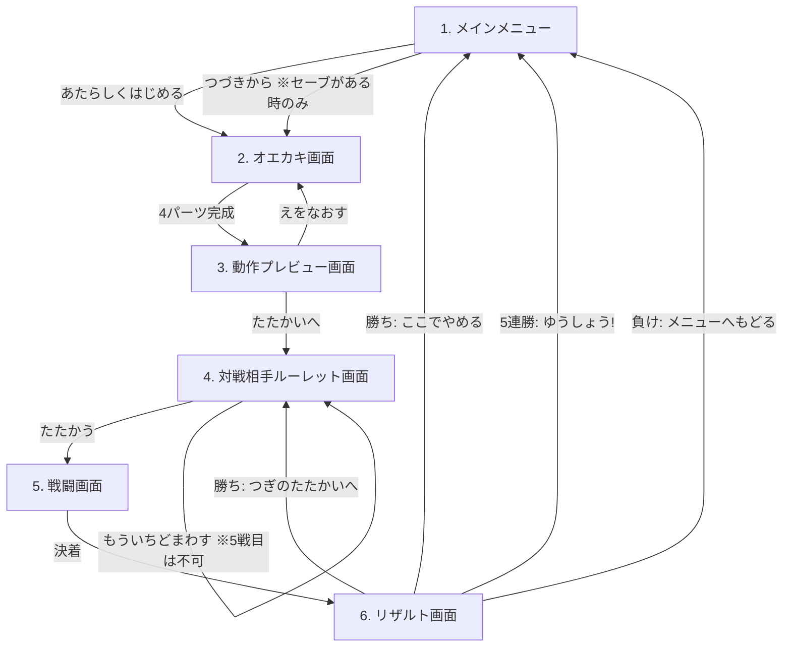

# らくがきバトル 設計書

2Dでお絵かきしたキャラクターが3Dで動き出し、NPCと連戦して5連勝を目指すWebアプリの設計書。
本書は実装を別AIに委託する前提で、実装者が本書のみで開発を完遂できる粒度で記述する。

- 対象リポジトリ: `sakanayuki/cc_rakugaki`
- デプロイ: GitHub Actions 経由で GitHub Pages に自動反映
- 対象ユーザー: 3歳児でも遊べること（ひらがなUI・大きなボタン・タッチ操作）
- **本書は第2版**。第1版の実装完了後に入った機能改定を反映済み。改定の一覧は §0.1 を参照

---

## 0. 確定済みの要件判断（発注者との確認結果）

| 論点 | 決定 |
|---|---|
| 3D表現方式 | **ペーパークラフト風**。描いた各パーツをテクスチャ付き板ポリゴンとしてThree.jsの3D空間に配置し、関節ピボットで回転させて動かす |
| 技術スタック | **Vite + TypeScript + Three.js**（UIフレームワークなし、画面遷移は自前の軽量シーンマシン） |
| 属性判定 | **あたまパーツの形状で判定**（縦横比と塗り密度。§7.3参照） |
| 必殺技 | 3往復で未決着なら**「ひっさつわざ！」ボタンが出現し、押すと演出後に必ず勝利**（一撃必殺）。**第2版で改定**: 5戦目の不利属性のみ2往復で解禁 |
| 敵の強さ | 第1版では固定。**第2版で改定**: 2戦目以降1.1倍ずつ強くなる（§0.1-10） |
| セーブ | **localStorageに1スロット自動保存**（描画ベクタデータ。連勝状態・倍率は保存しない＝セッション内のみ） |
| デバイス | **PC＋タブレット/スマホ**。Pointer Eventsでマウス・タッチ両対応、レスポンシブUI |
| ルーレット再抽選 | **無制限**（同じ敵との連戦も許容）。**第2版で改定**: 5戦目のみ再抽選不可 |
| サウンド | **効果音あり**。Web Audio APIでプログラム生成（音声素材ファイル不要）、ミュートボタン付き |

---

## 0.1 改定内容（第2版）

第1版の実装完了後に入った機能改定。発注者との確認結果を含めて記録する。
本節と以降の各節が矛盾する場合は、各節の記述（改定反映済み）が正となる。

| # | 改定項目 | 確定した仕様 |
|---|---|---|
| 1 | メニューのプレビュー | セーブがあれば「つづきから」の横に絵のサムネイルを出す |
| 2 | オエカキのレイヤー分離 | **ぬりつぶしは前工程のパーツを侵さない**。ただし前工程の線は「かべ」として境界に使える。前工程は**不透明度50%**で表示する |
| 3 | プレビュー画面の可読性 | 属性表示からオレンジ背景をなくして他のステータスと同じ見た目に統一。アクション4ボタンは色分けをやめ、3Dステージに付随する1つの操作パネルにまとめる |
| 4 | 敵の追加 | 強敵3種（グー/チョキ/パー各1）を追加して**全9種**。強敵のルーレット面積は通常敵の**1/4**。**強敵の強さは1戦目時点のプレイヤーの1.2倍**で、2戦目以降は通常敵と同じく1.1倍ずつ強くなる |
| 5 | 相性の警告 | ルーレットが**プレイヤーに不利な属性**の敵で止まったら警告を出す |
| 6 | 5戦目の特別ルーレット | 最終戦は**強敵3種のみ**。不利な相手が**50%**、残り**25%ずつ**。**再抽選は不可**。この試合で不利属性を引いた場合に限り、**必殺技が2往復で解禁**される |
| 7 | 戦闘表示の重なり | 「こうかはばつぐん」等と「ガード/よけた」が重ならないよう、タグを縦に積む |
| 8 | 会心の一撃 | **10%**の確率で**2倍**ダメージ。カットインを表示する。プレイヤー・NPCの双方に発生。**属性倍率と掛け算で重なる**（最大4倍）。回避されたら発生せず、ぼうぎょされたら半減する |
| 9 | 勝利時の成長 | ×1.5 をやめ、**初期ステータスへの加算方式**に変更。3回以内のKOで**+20%**、必殺技での勝利で**+10%** |
| 10 | 敵の成長 | 2戦目以降、**1.1のべき乗**で強くなる（2戦目1.1倍、5戦目1.4641倍） |
| 11 | 通常敵の再調整 | プレイヤーの成長が緩やかになったため、通常敵6種のステータスを調整（§8.3） |

### 改定にあたって検出した設計上の問題と対処

改定要件をそのまま組むと、**5戦目で不利属性を引いた場合の勝率が4%**（実質敗北確定）になることが
シミュレーションで判明した。それが50%の確率で・再抽選なしで来るため、決勝戦が「戦う前に
コイントスで決まる」形になってしまう。

原因は、属性相性が攻守の両方向に効く（自分の攻撃が0.5倍・相手の攻撃が2倍＝実質4倍の差）ことに、
強敵の1.2倍と5戦目の1.4641倍が重なるため。

対処として **「5戦目で不利属性のときに限り、必殺技を2往復で解禁する」** を採用した。
これにより不利属性の勝率は4%→28%になり、厳しいが戦える勝負になる。
数値根拠は §8.4 を参照。

## 1. 全体像

### 1.1 画面フロー

6画面を単一ページ（SPA）内で切り替える。URLルーティングは行わない（Pages配下でのパス問題を回避）。



### 1.2 ゲームサイクル

1. 4ステップ（からだ→あたま→うで→あし）で絵を描く
2. 絵から自動でリグとステータスが生成され、プレビューで動きとパラメータを確認
3. ルーレットで対戦相手を決定（1〜4戦目は全9種、5戦目は強敵3種のみ）
4. 自動戦闘。素早さの高い方が先攻。3往復で未決着なら必殺技ボタンで勝利可能
5. 勝ち方に応じて強くなり次戦へ（3回以内KOで+20%、必殺技で+10%）。**5連勝で優勝**。敗北でメインメニューへ

## 2. 技術スタックとデプロイ要件

### 2.1 スタック

| 項目 | 採用 | 備考 |
|---|---|---|
| 言語 | TypeScript (strict) | |
| ビルド | Vite | `base: '/cc_rakugaki/'` を必ず設定（Pagesのサブパス対応） |
| 3D描画 | three（npm） | 戦闘・プレビューのキャラクター表示 |
| 2D描画 | Canvas 2D API | オエカキ画面。ライブラリ不使用 |
| 状態管理 | 自前の `SceneManager` + 単一の `GameState` オブジェクト | Redux等は不使用 |
| 音 | Web Audio API | OscillatorNode/GainNodeで効果音を合成。素材ファイルなし |
| 永続化 | localStorage | 1スロット |
| テスト | Vitest | ロジック層（ステータス算出・属性判定・戦闘エンジン）の単体テスト |

依存パッケージは `three` と devDependencies（vite / typescript / vitest / @types/three）のみに抑える。

### 2.2 GitHub Actions → GitHub Pages

`.github/workflows/deploy.yml` を以下の仕様で作成する。

- トリガー: `main` ブランチへの push（＋ `workflow_dispatch`）
- ジョブ構成（公式Pagesデプロイ方式）:
  1. `actions/checkout@v4`
  2. `actions/setup-node@v4`（Node 20、`cache: npm`）
  3. `npm ci`
  4. `npm test`（ロジックの単体テスト。落ちたらデプロイしない）
  5. `npm run build`（`dist/` を生成）
  6. `actions/configure-pages@v5`
  7. `actions/upload-pages-artifact@v3`（`path: dist`）
  8. `actions/deploy-pages@v4`
- `permissions: { contents: read, pages: write, id-token: write }`
- `concurrency: { group: "pages", cancel-in-progress: false }`
- リポジトリ設定は「Pages → Source: GitHub Actions」を前提とする（README に手順を記載すること）

公開URL: `https://sakanayuki.github.io/cc_rakugaki/`

### 2.3 非機能要件

- 60fps目標（Three.jsシーンはキャラ2体＋背景程度なので余裕を持つこと）
- 初回ロード後はネットワーク不要で動作（外部CDN・外部フォント・外部APIを使わない）
- 対応ブラウザ: 最新の Chrome / Edge / Safari / Firefox（PC・iOS・Android）
- 縦横どちらの画面でも操作可能なレスポンシブレイアウト。描画キャンバスは正方形を維持
- タッチ操作時のスクロール・ピンチ誤動作防止（キャンバスに `touch-action: none`）
- `devicePixelRatio` 対応（にじみ防止）

---

## 3. ディレクトリ構成

```
cc_rakugaki/
├── index.html
├── package.json
├── vite.config.ts          # base: '/cc_rakugaki/'
├── tsconfig.json
├── README.md               # 起動方法・Pages設定手順
├── DESIGN.md               # 本書
├── .github/
│   └── workflows/
│       └── deploy.yml
└── src/
    ├── main.ts             # エントリ。SceneManager起動
    ├── app/
    │   ├── SceneManager.ts # 画面切替（enter/exit/updateのライフサイクル）
    │   ├── GameState.ts    # セッション状態（キャラ・成長率・連勝数）
    │   ├── storage.ts      # localStorage入出力・スキーマ版管理
    │   └── audio.ts        # 効果音合成・ミュート管理
    ├── scenes/
    │   ├── MenuScene.ts
    │   ├── DrawScene.ts
    │   ├── PreviewScene.ts
    │   ├── RouletteScene.ts
    │   ├── BattleScene.ts
    │   └── ResultScene.ts
    ├── paint/
    │   ├── PaintEngine.ts  # レイヤー管理・オペレーション記録/リプレイ
    │   ├── floodFill.ts    # スキャンライン塗りつぶし
    │   └── types.ts        # DrawOp等の型定義
    ├── rig/
    │   ├── partAnalyzer.ts # 各パーツ画像の解析（bbox/重心/面積/左右分割）
    │   ├── rigBuilder.ts   # Three.jsのメッシュ階層生成
    │   └── animations.ts   # アクション定義（キーフレームテーブル）
    ├── game/
    │   ├── stats.ts        # 絵→ステータス算出
    │   ├── element.ts      # 属性判定・相性倍率
    │   ├── battleEngine.ts # 戦闘進行ロジック（UI非依存・テスト対象）
    │   └── enemies.ts      # 敵9種の定義（描画データ＋ステータス）
    └── ui/
        ├── components.ts   # 共通ボタン・パネル生成ヘルパ
        └── strings.ts      # 全UI文言（ひらがな）を一元管理
```

**設計原則**: `game/` と `paint/` のロジックはDOM・Three.js非依存に保ち、Vitestで単体テストできるようにする。シーン（`scenes/`）は薄い結合層とする。

---

## 4. データモデル

### 4.1 描画データ（ベクタオペレーション）

絵はビットマップではなく**オペレーション列**として保持する。リプレイすることで任意タイミングの再現・undo・保存/復元がすべて成立する。

```ts
type PartId = 'body' | 'head' | 'arms' | 'legs';

type DrawOp =
  | { seq: number; part: PartId; type: 'stroke';
      color: string;            // パレット色 (hex)
      width: number;            // 論理px
      points: [number, number][] } // 論理座標 (0..1024)
  | { seq: number; part: PartId; type: 'fill';
      color: string; x: number; y: number };

interface CharacterDoc {
  version: 1;
  canvasSize: 1024;             // 論理キャンバスは1024x1024固定
  ops: DrawOp[];                // 全パーツ共通の時系列（seq昇順）
  currentStep: PartId | 'done'; // オエカキの進行位置
  updatedAt: string;            // ISO8601
}
```

- `seq` は全パーツ通しの単調増加番号。**塗りつぶしの境界判定は全レイヤー合成に依存するため、リプレイは必ずseq順に全パーツ横断で行う**（§5.2.4）
- undo は「現在パーツの最後のオペを1つ削除して全リプレイ」で実現する

### 4.2 ステータス

```ts
type Element = 'rock' | 'scissors' | 'paper'; // グー/チョキ/パー

interface Stats {
  maxHp: number;   // 体力（からだ由来）
  atk: number;     // 攻撃力（うで由来）
  spd: number;     // 素早さ（あし由来）
  element: Element;// 属性（あたま由来）
}
```

### 4.3 セッション状態（保存しない）

状態は3つに分かれる。**絵だけが localStorage に保存され**、連勝の進行状況はセッション内のみ。

```ts
interface GameState {
  characterDoc: CharacterDoc | null;
  baseStats: Stats | null;   // 絵から算出した素のステータス（不変）
  growthRate: number;        // 成長率。初期値 1.0
  winStreak: number;         // 0..5
  currentEnemyId: string | null;
  lastWinKind: 'ko' | 'special' | null; // リザルト表示用
}
```

**実効ステータス** = `round(base × growthRate)`。属性は成長の影響を受けない。

`growthRate` は勝つたびに加算される（第1版の ×1.5 から変更）:

| 勝ち方 | 加算 |
|---|---|
| 3回以内の攻撃でKO（＝必殺技を使わずに勝利） | **+0.2** |
| 必殺技で勝利 | **+0.1** |

現仕様では互いに3回攻撃した時点で必殺技に移行するため、この2つは排他かつ網羅的になる。
4連勝後の `growthRate` は最良で 1.8、最悪で 1.4。

**敵の成長率** は `1.1 ^ (戦目 - 1)`。戦目 = `winStreak + 1`。

### 4.4 localStorage スキーマ

- キー: `rakugaki.save.v1`
- 値: `CharacterDoc` のJSON文字列
- 保存タイミング: 各パーツの「つぎへ」押下時、およびオエカキ完了時に自動保存
- `version` 不一致・パース失敗時は破棄して「セーブなし」扱い（クラッシュさせない）
- 連勝数・倍率は保存しない（確定仕様）

### 4.5 敵データ

敵は**通常敵6種**と**強敵3種**の全9種。見た目はどちらもプレイヤーと同じ `CharacterDoc` 形式
（描画オペレーション列）で持ち、リグ生成・アニメーション・描画のパイプラインを共通化する。

```ts
type EnemyKind = 'normal' | 'strong';

interface EnemyDef {
  id: string;
  name: string;           // ひらがな表示名
  kind: EnemyKind;
  element: Element;
  themeColor: string;     // ルーレットのセクター色
  flavor: string;         // キャラクター性の一言
  doc: CharacterDoc;      // 見た目
  /** 通常敵のみ。強敵はプレイヤーの素ステータスから生成するので持たない */
  baseStats?: Stats;
}
```

**強敵のステータス生成**（`strongStatsFor`）:

```
強敵の素ステータス = round(プレイヤーの素ステータス × 1.2)   ← 1戦目時点で1.2倍
その試合での実効値   = round(強敵の素ステータス × 1.1 ^ (戦目 - 1))
```

プレイヤーの素ステータス（`baseStats`）は絵から決まる不変値なので、強敵も試合ごとに変動しない
基準を持つ。プレイヤーは勝つたびに growthRate が上がるため、**速く勝てば強敵を追い越せる**という
関係になる（4連勝を全てKOで取れば growthRate 1.8 に対し、5戦目の強敵は 1.2 × 1.4641 ≒ 1.757）。

強敵の属性はキャラクターごとに固定（グー/チョキ/パー 各1体）。

## 5. 画面仕様

全画面共通:

- 画面右上に常時ミュートボタン（🔊/🔇）。状態はlocalStorage `rakugaki.mute` に保存
- 文言はすべてひらがな＋絵文字/アイコン。フォントはシステムフォント（丸ゴシック系優先の font-family 指定）
- タップ対象は最小 56×56px

### 5.1 メインメニュー画面（MenuScene）

| 要素 | 仕様 |
|---|---|
| タイトルロゴ | 「らくがきバトル」＋ゆらゆらアニメーション |
| 「あたらしく はじめる」ボタン | `CharacterDoc` を新規作成しオエカキ画面へ。既存セーブがある場合は「まえの えは きえちゃうよ？ いいかな？」の確認ダイアログを出す |
| 「つづきから」ボタン | セーブが存在する時のみ有効（無い時はグレーアウト）。保存された `CharacterDoc` を読み込み、`currentStep` の位置からオエカキ画面を再開。`'done'` の場合は最終ステップ（あし）を修正可能な状態で開く |
| **絵のプレビュー（改定）** | セーブがある時、「つづきから」ボタンの**左に72px角のサムネイル**を出す。保存された `CharacterDoc` を `PaintEngine` で再生し、キャラクター全体のbboxで切り抜いて縮小表示する |

遷移時に `growthRate=1.0, winStreak=0` にリセットする。

**プレビュー生成の注意**: サムネイル生成のために起こした `PaintEngine` は 1024×1024 のキャンバスを
5枚（約20MB）持つため、描画後は `release()` で必ず手放す（敵アセットと同じ扱い。§11参照）。
`ops` が空のセーブではサムネイルを出さず、ボタンだけを表示する。

### 5.2 オエカキ画面（DrawScene）

#### 5.2.1 4ステップ進行

`からだ → あたま → うで（両うで）→ あし（両あし）` の順に1パーツずつ描く。

- 画面上部にステップインジケータ（4つの丸、現在位置ハイライト）と指示文:
  - 「①からだを かこう！」「②あたまを かこう！」「③りょううでを かこう！」「④りょうあしを かこう！」
- 各ステップに**うすいガイド枠**（点線シルエット: からだ=中央の楕円、あたま=その上の円、うで=左右、あし=下部左右）を表示する。ガイドはあくまで目安で、枠外に描いても良い
- 「つぎへ」ボタンは現在パーツの塗りピクセルが閾値（キャンバスの0.1%）以上のときのみ有効化（空パーツ防止）
- あし完了時の「つぎへ」で動作プレビュー画面へ遷移
- 「もどる」ボタンで前のステップに戻れる（描いた内容は保持）

#### 5.2.2 レイヤー構造と表示（改定）

- 論理キャンバス 1024×1024。パーツごとに独立したオフスクリーンレイヤー（4枚）を持つ
- **現在パーツ以外のレイヤーはロック**（描き込み不可）
- **表示は「前工程を不透明度50%、現在パーツを不透明度100%で最前面」**とする

```
描画順（表示用）:
  1. 前工程のパーツを COMPOSITE_ORDER（body → legs → arms → head）の順に globalAlpha = 0.5 で描く
  2. 現在パーツを globalAlpha = 1.0 で最前面に描く
  3. まだ描いていない後工程のパーツは表示しない（存在しないので自然にそうなる）
```

現在パーツを常に最前面に描くのは、合成順では後工程が手前に来るため（例: あしを描くとき、
すでに描いたうで・あたまがあしを隠してしまう）。子どもが「いま描いている線」を必ず見えるようにする。

この50%表示は**表示だけの処理**で、保存データ・プレビュー・3D表示には一切影響しない。

#### 5.2.3 ツール仕様（要件必須の5機能）

| ツール | 仕様 |
|---|---|
| ペン色変更 | 12色パレット（くろ・しろ・あか・オレンジ・きいろ・みどり・みずいろ・あお・むらさき・ピンク・ちゃいろ・はいいろ）。選択中の色を枠で強調。せまい画面では6列×2段 |
| ペン太さ変更 | 3段階「ほそい(6px)・ふつう(14px)・ふとい(28px)」。丸キャップ・丸ジョイントで補間描画 |
| 塗りつぶし | バケツツール。§5.2.4 のルールに従う |
| ひとつもどす（undo） | 現在パーツの最後の `DrawOp` を1つ削除し、全オペをseq順にリプレイ。現在パーツのオペが無いときは無効 |
| このパーツをやりなおす | 確認ダイアログ（「ぜんぶ けしても いい？」）→ 現在パーツのオペを全削除してリプレイ |

- ペンの線は前工程の上に自由に重ねられる（うでをからだにつなげて描けるようにするため）
- 入力は Pointer Events（`pointerdown/move/up`、`setPointerCapture`）で統一。`getCoalescedEvents()` があれば使用
- ストロークは記録時に点を間引き（距離2px未満はスキップ）してデータ量を抑える

#### 5.2.4 塗りつぶしのルール（改定の中心）

第1版では、あたまステップで からだ の内側をタップすると からだ を塗りつぶせてしまう不具合があった。
塗りは現在パーツのレイヤーに書かれるが、そのレイヤーが からだ より手前に合成されるため、
見た目上 からだ が塗り替わってしまうため。

改定後のルールは次の3点。

1. **境界判定は全レイヤーの合成画像で行う**（第1版と同じ）。
   これにより、からだ の輪郭を「かべ」にして あたま を塗ることができる。
2. **前工程のパーツが不透明なピクセルは、塗りの対象から除外する**。
   前工程のピクセルは「かべ」であり「塗れる面」ではない、という扱いにする。
3. **種（タップした点）が前工程のピクセルの上だった場合は、塗りを実行せず拒否する**。
   「ダメ音」を鳴らし、必要なら「そこは まえに かいた ところだよ」と短く伝える。

実装は `computeFillMask()` に「前工程マスク」を渡し、`matches()` の判定に
`previousMask[pixel] === 0` を加えるだけで両立できる（境界としては効き、塗り先からは外れる）。

**前工程マスクの定義**: `STEP_ORDER` 上で現在パーツより前にあるパーツのレイヤーの、
不透明ピクセルの論理和。`seq` 順ではなく**ステップ順**で決まるので、リプレイしても決定的。

そのほか第1版から継続するルール:

- 種が透明なら「透明領域を線で囲まれた範囲まで」、現在パーツの線の上なら「同じ色の連続範囲」（塗り直し）
- 塗り後にアンチエイリアスの縁へ1px膨張させて塗り残しを消す
- **キャンバスの60%を超える塗りは拒否**する（囲われていない場所の誤爆防止）

#### 5.2.5 塗りつぶしとリプレイの整合性

flood fill の結果は実行時点の合成状態に依存するため、**リプレイは常に「全レイヤークリア→全オペをseq順に実行」**とする。
前工程マスクもステップ順から毎回再構成するため、同じ `ops` からは必ず同じ絵が再現される。

**注意**: 第1版で保存された絵に「前工程を塗りつぶしてしまった fill オペ」が含まれる場合、
改定後のリプレイではその塗りが適用されなくなる（＝不具合の解消）。
セーブのスキーマは変更しないため、既存セーブはそのまま読み込める。

### 5.3 動作プレビュー画面（PreviewScene）

遷移時に以下を実行する:

1. `partAnalyzer` で各パーツを解析（§6）
2. `rigBuilder` でThree.jsキャラクターを構築
3. `stats.ts` でステータス算出（§7）

#### 5.3.1 UI構成（改定）

第1版は「ステータス表示」「アクション再生ボタン」「画面遷移ボタン」の3種が似た見た目
（角丸・影・カラフル）だったため、**どこが押せるのか分からない**という問題があった。
改定では**役割ごとに見た目を明確に分ける**。

| 区分 | 見た目のルール | 該当要素 |
|---|---|---|
| **情報（押せない）** | 白い平らなパネル。影なし・枠なし・彩度低め | つよさパネル（たいりょく／こうげき／はやさ／ぞくせい）、ヒント文 |
| **アクション（押せる・その場で反応）** | 3Dステージに**付随した1つの操作パネル**。4ボタンとも**同じ色**（青系）で、押下時に沈む影あり | こうげき／いたい！／よける／ぼうぎょ |
| **遷移（押せる・画面が変わる）** | 画面下部に独立配置。大きく、彩度の高い色（もどる=白、すすむ=オレンジ） | えを なおす／たたかいへ すすむ！ |

具体的な変更点:

- **属性表示**: オレンジの枠付きバッジをやめ、`❤️ たいりょく` などと同じ**ステータス1行**にする。
  `✊ ぞくせい　グー（どんき）` の形式で、他のステータス行と同じ書式・同じ色に揃える
- **アクションボタン**: 個別の色分け（赤・青・緑・オレンジ）をやめ、**4つとも同一の青系**にする。
  4ボタンを「うごかして みよう」の見出しを持つ**1枚のパネル**に入れ、そのパネルを
  3Dステージの直下にすき間なく接して配置することで、「この領域の操作である」ことを示す
- **3Dステージ**: 下辺の角丸をなくして操作パネルと連結させ、ひとかたまりに見せる

#### 5.3.2 各要素の内容

| 要素 | 仕様 |
|---|---|
| 3Dビュー | 画面中央。キャラが地面（丸い影付き）に立ち、待機モーションでループ。ドラッグで左右にキャラを回転できる（「ゆびで よこに うごかすと まわるよ」の小さなヒントを重ねる） |
| 操作パネル | 「こうげき」「いたい！」「よける」「ぼうぎょ」。押すと該当モーションを1回再生して待機に戻る（§6.3）。再生中は他ボタン無効 |
| つよさパネル | ❤️たいりょく／💪こうげき／👟はやさ を**5段階の星＋数値**で、⚔️ぞくせい を同じ行形式で表示 |
| ヒント文 | 「おおきく ぬると たいりょくアップ！」等、算出ルールを子ども向けに1行で説明。属性の判定理由も1行出す |
| 「えをなおす」ボタン | オエカキ画面（あしステップ）へ戻る |
| 「たたかいへ すすむ！」ボタン | ルーレット画面へ |

### 5.4 対戦相手ルーレット画面（RouletteScene）

#### 5.4.1 通常のルーレット（1〜4戦目）

全9種を1つの円盤に載せる。**強敵の面積は通常敵の1/4**。

| 区分 | 体数 | 重み | セクター角 | 1体あたりの確率 |
|---|---|---|---|---|
| 通常敵 | 6 | 1.0 | 53.33° | 14.81% |
| 強敵 | 3 | 0.25 | 13.33° | 3.70% |

合計の重みは `6 × 1 + 3 × 0.25 = 6.75`。セクター角は `360 / 6.75 × 重み` で求める。
**抽選は面積（重み）に比例させる**（等確率で選んでから角度を合わせるのではなく、
重み付き抽選で決めてからその中心角に止める）。

| 要素 | 仕様 |
|---|---|
| ルーレット盤 | 9等分ではなく重み付きの不等分。各セクターに敵の顔サムネイル＋名前。強敵のセクターは金色のふちで区別する |
| 「ルーレット スタート！」ボタン | **2.0秒**かけて減速して自動停止（cubic-out）。止まる位置は押下時に重み付き乱数で決定し、最終角度から逆算する |
| 停止後 | 選ばれた敵の拡大表示＋名前＋属性＋つよさの目安。「たたかう！」→戦闘画面、「もういちど まわす」→再抽選（**回数無制限**） |
| 連勝表示 | 画面上部に「○れんしょうちゅう！」 |

#### 5.4.2 相性の警告（改定）

停止した敵が**プレイヤーにとって不利な属性**（`elementMultiplier(敵, プレイヤー) === 2`）だった場合、
敵カードの上に赤い警告帯を出す。

- 「⚠️ あいしょうが わるいよ！」
- 「きみの こうげきは はんぶん。あいての こうげきは 2ばい！」
- 警告音（`nope` 系の下降音）を鳴らす
- 1〜4戦目では「もういちど まわす」ボタンを強調して、回し直しを促す

じゃんけんの三すくみでは「相手が自分に強い」と「自分が相手に弱い」が必ず同時に成立するので、
この1条件だけで両方向の不利をカバーできる。

#### 5.4.3 5戦目の特別ルーレット（改定）

最終戦は**強敵3種のみ**のルーレットにする。

| セクター | 面積 | 確率 |
|---|---|---|
| プレイヤーに不利な属性の強敵 | 180° | 50% |
| 残り2体（互角／プレイヤー有利） | 90° ずつ | 25% ずつ |

- **再抽選は不可**。「たたかう！」ボタンのみを出す（無制限に回せると50%の重み付けが無意味になるため）
- 盤面上部に「さいごの たたかい！」の見出しを出し、通常のルーレットと違うことを示す
- 不利属性で止まった場合の警告は 5.4.2 と同じものを出す（回し直しは促さない）

この試合で不利属性を引いた場合に限り、戦闘側で**必殺技が2往復で解禁**される（§5.5.4）。

### 5.5 戦闘画面（BattleScene）

#### 5.5.1 レイアウト

- Three.jsシーン: 左にプレイヤーキャラ、右に敵キャラ（左右反転表示）
- 画面上部: 両者のHPバー（残量で緑→黄→赤）＋名前＋属性アイコン
- 画面下部: メッセージ帯
- 中央: ダメージ数字のポップアップ、効果タグ、会心カットイン

#### 5.5.2 効果タグの重なり解消（改定）

第1版では「こうかは ばつぐん！」と「ガード！」が同じ絶対座標に出るため重なっていた。
改定では**タグ用のスタックコンテナ**を1つ用意し、そこへ縦に積む。

```
.tag-stack {
  position: absolute; top: 12%; left: 50%; transform: translateX(-50%);
  display: flex; flex-direction: column; align-items: center; gap: 6px;
}
```

1回の攻撃で出るタグは最大3つ（会心／属性／ガード・回避）。上から
**「会心の一撃」→「属性の効果」→「ガード／よけた」** の順で積み、それぞれ1.1秒で消える。

#### 5.5.3 会心の一撃（改定）

- 発生率 **10%**。プレイヤー・NPCの双方に発生する
- ダメージ **2倍**。属性倍率とは**掛け算**で重なる（最大 2 × 2 = 4倍）
- **回避されたら発生しない**（回避判定が先）。**ぼうぎょされたら半減する**（他のダメージと同じ）
- 演出: 画面を横切る**カットイン**（帯が左右からスライドインし「かいしんの いちげき！」を表示、
  約0.7秒）＋画面フラッシュ＋専用効果音。カットインの後にダメージ数字を出す
- カットイン中は他の演出を止める（メッセージ帯も「かいしんの いちげき！」にする）

#### 5.5.4 進行（自動戦闘）

```
1. 開始演出（両者登場、"たたかいスタート！"）
2. 先攻決定: spd が高い方が先攻。同値ならプレイヤー先攻
3. ラウンド r = 1..N を繰り返す:
   a. 先攻の攻撃 → 解決（§8.1）→ 相手HP0なら決着
   b. 後攻の攻撃 → 解決 → 相手HP0なら決着
4. Nラウンド終了時に両者生存なら:
   → 「ひっさつわざ！」大ボタンが点滅出現（プレイヤー唯一の操作）
   → タップで必殺演出（約3秒）→ 敵HPを0にして勝利
5. 決着 → 勝敗と「勝ち方」を GameState に反映してリザルト画面へ
```

**必殺技が解禁されるラウンド数 N**（改定）:

| 条件 | N |
|---|---|
| 通常 | **3** |
| **5戦目 かつ プレイヤーが不利属性** | **2** |

5戦目の不利属性は、そのままでは3ラウンド持ちこたえられず勝率4%になってしまうため
（§0.1・§8.4）、この試合に限り必殺技を早く解禁して救済する。
解禁が早まったことは「あいしょうが わるいから、はやく ひっさつわざが つかえる！」と
メッセージ帯で明示する。

- プレイヤーのHPが0になった場合はその時点で敗北
- 敵は必殺技を使わない
- 各攻撃の演出: 攻撃側 attack モーション、防御側は結果に応じて hit / dodge / guard モーション
- パー属性の攻撃時は弾スプライト（描いたあたまの縮小画像）が飛ぶ

#### 5.5.5 リザルトへ渡す情報

`{ outcome: 'win' | 'lose', enemyId, winKind: 'ko' | 'special' | null }` を渡す。
`winKind` が成長量を決める（§5.6）。

### 5.6 リザルト画面（ResultScene）

| 分岐 | 表示・挙動 |
|---|---|
| 勝利（winStreak < 5） | 「かち！ ○れんしょう！」＋勝利ポーズ＋紙吹雪。**勝ち方に応じた成長**の演出（星が増える・数値がカウントアップ）。ボタン: 「つぎの たたかいへ！」／「ここで やめる」 |
| 5連勝 | 「ゆうしょう！！ 5れんしょう たっせい！」＋金トロフィー＋最大演出。ボタン: 「メニューへ もどる」のみ |
| 敗北 | 「まけちゃった… ○れんしょうで おわり」＋ダウンポーズ。ボタン: 「メニューへ もどる」のみ |

**成長の表示（改定）**

勝ち方によって上乗せ量が変わるため、**なぜその量なのか**を必ず1行で見せる。

| 勝ち方 | 見出し | 成長 |
|---|---|---|
| 3回以内の攻撃でKO | 「ひっさつわざを つかわずに かった！」 | 初期ステータスの **+20%** |
| 必殺技で勝利 | 「ひっさつわざで かった！」 | 初期ステータスの **+10%** |

- `growthRate += 0.2 or 0.1` し、実効ステータス（`round(base × growthRate)`）の before → after を並べて出す
- HPは新しい最大値まで全回復する
- 属性は変化しない
- メニューへ戻ると `growthRate` と `winStreak` はリセット（絵のセーブは残る）

## 6. 自動リグ設計（ペーパークラフト風3D）

### 6.1 パーツ解析（partAnalyzer）

各パーツレイヤーのピクセルから以下を計算する:

- **bbox**: 不透明ピクセルの外接矩形
- **面積**: 不透明ピクセル数
- **重心**: 不透明ピクセルの平均座標
- **左右分割**（arms / legs のみ）: からだの重心X `cx` を境界に、レイヤーを左半分・右半分の2枚に分割して独立パーツにする。片側が空（面積が全体の5%未満）の場合は、もう片側をミラー複製して補う（片腕しか描かない子ども対策）

### 6.2 メッシュ階層とピボット

各パーツはbboxでクロップしたテクスチャ（`CanvasTexture`、透過あり）を貼った `PlaneGeometry` とし、ピボット用の `Group` にぶら下げる。1024px = 3Dの3.0ユニットに正規化する。

```
Root (Group)                    … 地面基準。移動・ジャンプはここ
└─ Body (Group, pivot=からだ重心)
   ├─ bodyMesh (z= 0)
   ├─ HeadPivot (Group, pivot=あたまbbox下端中央, z=+0.02) ─ headMesh
   ├─ ArmLPivot (Group, pivot=左うでbboxの「からだ側上端」, z=+0.01) ─ armLMesh
   ├─ ArmRPivot (同上・右, z=-0.01) ─ armRMesh
   ├─ LegLPivot (Group, pivot=左あしbbox上端中央, z=-0.02) ─ legLMesh
   └─ LegRPivot (同上・右, z=-0.02) ─ legRMesh
```

- ピボット位置の原則: **「からだに近い側の端」を回転軸**にする（腕はからだ側の端、脚は上端、頭は下端）。これで回転が関節らしく見える
- z微オフセットでZファイティング回避＋前後関係（頭・左腕が手前、脚が奥）
- マテリアルは `MeshBasicMaterial { map, transparent, alphaTest: 0.05, side: DoubleSide }`（ライティング不要、描いた色がそのまま出る）
- 地面に `CircleGeometry` の疑似影（半透明黒）。キャラのY位置に追従
- 敵キャラは同じビルダーで生成し `scale.x = -1` で左向きに

### 6.3 アニメーション定義（animations.ts）

キーフレームはコード内のデータテーブルで定義する（時間: 秒、回転: ラジアン、位置: ユニット）。補間は easeInOut。全キャラ共通で、リグ構造が同一なのでそのまま適用できる。

| アクション | 長さ | 内容 |
|---|---|---|
| idle | ループ | Root.rotation.y ±0.06 のゆらぎ、Body.scale 1±0.015 の呼吸、腕±0.05rad スイング |
| attack (rock=グー) | 0.8s | 前進0.6ユニット→両腕を大きく振り下ろし（-1.6rad）→戻る |
| attack (scissors=チョキ) | 0.8s | 前進→体を0.4rad回転させつつ片腕を水平に薙ぐ→戻る |
| attack (paper=パー) | 0.9s | 両腕を前へ突き出し（+1.2rad）、弾スプライト発射→戻る |
| hit | 0.6s | 後方ノックバック0.4、Body ±0.15radの揺れ、マテリアルを赤フラッシュ2回 |
| dodge | 0.5s | 側方ホップ0.5＋Body 0.3rad傾け→戻る |
| guard | 0.7s | 両腕を体の前でクロス（∓1.2rad）、半透明シールド円を一瞬表示 |
| special | 3.0s | その場で高速スピン→大ジャンプ→急降下攻撃、カメラズームイン、ホワイトフラッシュ |
| win | ループ | 両腕上げ（バンザイ）＋小ジャンプ繰り返し |
| lose | 1回 | Root.rotation.z を -π/2（倒れる）＋バウンド |
| walk（登場用） | ループ | 脚を交互に±0.5radスイング＋前進 |

プレビュー画面の4ボタンは attack（自属性のもの）/ hit / dodge / guard に対応する。

---

## 7. パラメータ算出ロジック（stats.ts / element.ts）

「3歳児でも分かる」＝**大きく塗るほど強い**を基本原則とする。すべて決定的（同じ絵なら必ず同じ値）。

### 7.1 面積スコア

パーツ面積比 `r = パーツの不透明ピクセル数 / 1024²` を、想定レンジで0..1に正規化する:

```
score(part) = clamp(r / R_max(part), 0, 1)
  R_max: body=0.20, arms=0.10, legs=0.10
```

### 7.2 基本ステータス

| ステータス | 由来 | 式 | レンジ |
|---|---|---|---|
| たいりょく maxHp | からだ面積 | `round(60 + 90 × score(body))` | 60〜150 |
| こうげき atk | 両うで面積合計 | `round(10 + 30 × score(arms))` | 10〜40 |
| はやさ spd | 両あし面積合計 | `round(5 + 20 × score(legs))` | 5〜25 |

**色ボーナス**: 全パーツで使った**パレット色の種類数** n（背景・透明を除く）に応じ、全ステータスに `×(1 + 0.02 × min(n-1, 5))`（最大+10%）を掛けて丸める。「いろんな いろを つかうと ちょっと つよい」という説明可能なルール。

星表示: 各ステータスをレンジ内で5等分し1〜5個の星に変換する。

### 7.3 属性判定（あたまの形状）

あたまレイヤーの bbox から `A = 幅/高さ`（縦横比）、`D = 不透明ピクセル数/bbox面積`（塗り密度）を計算し、**以下の順で**判定する:

```
1. A ≥ 1.5 または A ≤ 0.67  →  チョキ（ざんげき）  … ほそながい あたま
2. D ≥ 0.50                 →  グー（どんき）      … まるくて ぎっしり
3. それ以外                  →  パー（とびどうぐ）  … スカスカ／ひろがってる
```

- 判定結果はプレビュー画面で必ず可視化し、ヒント文で理由も示す（「ほそながい あたまだから チョキ！」）
- 順序評価により必ず一意に決まる（デフォルトはパー）

### 7.4 属性相性（じゃんけん三すくみ）

`multiplier(attacker, defender)`:

| 攻→防 | グー | チョキ | パー |
|---|---|---|---|
| **グー** | ×1.0 | ×2.0 | ×0.5 |
| **チョキ** | ×0.5 | ×1.0 | ×2.0 |
| **パー** | ×2.0 | ×0.5 | ×1.0 |

### 7.5 成長ルール（改定）

絵から決まる `baseStats` は**不変**で、勝つたびに `growthRate` だけが増える。

```
実効ステータス = round(baseStats × growthRate)
growthRate は 1.0 から始まり、勝つたびに加算:
  3回以内の攻撃でKO（必殺技なし）… +0.2
  必殺技で勝利                  … +0.1
```

| 連勝 | growthRate の範囲 | 敵のスケール |
|---|---|---|
| 0（1戦目） | 1.0 | 1.0 |
| 1（2戦目） | 1.1 〜 1.2 | 1.1 |
| 2（3戦目） | 1.2 〜 1.4 | 1.21 |
| 3（4戦目） | 1.3 〜 1.6 | 1.331 |
| 4（5戦目） | 1.4 〜 1.8 | 1.4641 |

**設計意図**: 5戦目の強敵は `1.2 × 1.4641 ≒ 1.757` 倍。プレイヤーが4連勝すべてを
3回以内のKOで取れば `1.8` 倍となり強敵を上回るが、必殺技に頼るほど差をつけられる。
「速く勝てば決勝で有利」という関係をここで作っている。

属性は成長の影響を受けない。

---

## 8. 戦闘エンジン（battleEngine.ts）

### 8.1 攻撃解決

1回の攻撃は以下の順で解決する（乱数は注入されたシード付きRNG）。
**乱数の消費順は 回避 → 防御 → 会心 → ゆらぎ** で固定する（テストの再現性のため）。

```
1. 回避判定: dodgeChance = clamp(5 + (防御側spd - 攻撃側spd), 5, 25) %
   → 成功: ダメージ0、防御側 dodge モーション、「よけた！」。会心もゆらぎも判定しない
2. 防御判定: 固定 15%
   → 成功フラグを立てる（ダメージは最後に半減）
3. 会心判定: 固定 10%      ← 改定で追加
   → 成功: critMul = 2、カットイン演出
4. ダメージ:
   dmg = round(攻撃側atk × 属性倍率 × critMul × U(0.85..1.15))
   防御成功なら dmg = ceil(dmg / 2)
   最低 1
```

属性倍率と会心は掛け算で重なるため、**最大で 2 × 2 = 4倍**になる。

表示は §5.5.2 のタグスタックに、会心 → 属性 → ガード/回避 の順で積む。

### 8.2 イベント駆動設計

```ts
type BattleEvent =
  | { type: 'start'; first: 'player' | 'enemy'; specialUnlockRound: number }
  | { type: 'attack'; actor: Side; target: Side;
      result: 'hit' | 'dodge' | 'guard';
      damage: number; elementMul: 0.5 | 1 | 2;
      critical: boolean;                          // 改定で追加
      hpAfter: number }
  | { type: 'specialReady' }                      // ここでUI入力待ち
  | { type: 'special'; damage: number; hpAfter: number }
  | { type: 'end'; winner: Side };
```

`battleEngine` は純関数的にイベント列を進め、`specialReady` でのみ外部入力（ボタン押下）を待つ。
`Battle` のコンストラクタには **必殺技解禁までのラウンド数**（3、または5戦目の不利属性なら2）を
渡せるようにする。

この分離により戦闘ロジック全体をVitestで検証する（勝敗・必殺発生条件・相性倍率・会心の倍率・
回避境界値・解禁ラウンド数の切り替え）。

### 8.3 敵の定義（enemies.ts）

#### 通常敵6種（改定: 再調整済み）

プレイヤーの成長が「毎回×1.5」から「初期値の+20%ずつ」に緩やかになったため、
第1版の値ではほぼ必殺技頼みになる。§8.4 の試算に基づき下表に調整した。

| id | 名前 | 属性 | HP | ATK | SPD | キャラクター性 | 第1版からの変更 |
|---|---|---|---|---|---|---|---|
| golem | ゴロン | ✊グー | 150 | 17 | 5 | かたいけど おそい | HP 180→150, ATK 18→17, SPD 6→5 |
| robot | カチカチ | ✊グー | 115 | 21 | 12 | バランスがた | HP 120→115, ATK 25→21 |
| crab | チョッキン | ✌️チョキ | 105 | 20 | 14 | ハサミで きりつける | HP 100→105, ATK 22→20 |
| ninja | シュバにゃん | ✌️チョキ | 88 | 19 | 22 | すばやくて よく よける | HP 80→88, ATK 20→19 |
| bird | パタパタ | 🖐パー | 98 | 18 | 18 | はねを とばす | HP 90→98, ATK 16→18 |
| witch | フワリン | 🖐パー | 132 | 22 | 9 | まほうが とても つよい | HP 140→132, ATK 30→22 |

方針としては **HPは概ね据え置き、ATKを下げて事故死を減らした**。
ATKの上限は「不利属性（相手の攻撃が2倍）でも3ラウンド耐えられる」ことを基準に決めている。

#### 強敵3種（改定: 新規追加）

ステータスは固定値を持たず、**プレイヤーの素ステータスから生成**する（§4.5）。
属性は1体ずつグー・チョキ・パーを担当する。

| id | 名前 | 属性 | 見た目の方針 |
|---|---|---|---|
| kingRock | ゴツゴツおう | ✊グー | ゴロンの上位。岩の王冠と太い腕。色は濃い灰＋金 |
| kingScissors | ザクザクおう | ✌️チョキ | 鋭い三日月型の腕を持つ。色は濃い紫＋銀 |
| kingPaper | ヒラヒラおう | 🖐パー | マントを広げた魔王風。色は濃紺＋金 |

- 名前を「〜おう」で統一し、3歳児にも「つよいやつ」だと伝わるようにする
- ルーレットのセクターは金色のふちで区別する
- 描画データは通常敵と同じく `DocBuilder` で組み立てる（§11-9）

### 8.4 バランス試算

改定後のルールで5連勝チャレンジを各30,000回シミュレーションした結果。
プレイヤーの絵の大きさを3段階に振っている（絵の大きさでステータスが決まるため）。

| 絵の想定 | 素ステータス | 5連勝クリア率 | 1戦目 | 2戦目 | 3戦目 | 4戦目 | 5戦目 |
|---|---|---|---|---|---|---|---|
| ちいさい絵 | HP75 / ATK16 / SPD9 | 14.0% | 66% | 66% | 67% | 67% | 72% |
| ふつうの絵 | HP110 / ATK30 / SPD15 | 27.4% | 80% | 83% | 84% | 85% | 57% |
| おおきい絵 | HP150 / ATK40 / SPD25 | 47.4% | 93% | 94% | 94% | 95% | 61% |

ふつうの絵の1戦目の内訳は「3回KO 34% / 必殺技 46% / 敗北 20%」。
**勝てるかどうかより、どう勝つか（+20%か+10%か）が5戦目の勝敗を決める**構造になっている。

#### 5戦目の相性別の内訳（ふつうの絵）

必殺技の早期解禁を入れる前と後の比較。

| 5戦目の相手 | 出現率 | 早期解禁なし | 早期解禁あり（採用） |
|---|---|---|---|
| 不利属性の強敵 | 50% | **4%** | **28%** |
| 互角の強敵 | 25% | 80% | 99% |
| 有利属性の強敵 | 25% | 100% | 100% |

早期解禁なしでは、不利属性を引いた時点でほぼ敗北が確定していた（§0.1）。

#### 検討したが採用しなかった案

| 案 | 不利属性の勝率 | 不採用の理由 |
|---|---|---|
| 強敵のこうげきだけ等倍にする | 10% | 効果が小さい。「1.2倍の強さ」という宣言からも外れる |
| 強敵に1.1倍スケールを掛けない | 34% | 「2戦目以降は通常敵と同様に強くなる」という決定と矛盾する |
| プレイヤーの成長を+30%/+15%にする | 31% | 1〜4戦目が簡単になりすぎる |
| 現状のまま | 4% | 決勝戦が実質コイントスになる |

#### 試算スクリプトについて

この試算は設計判断のために書いた使い捨てのスクリプトであり、リポジトリには含めない。
実装後は `battleEngine` 自体を使って同じ試算ができるので、バランスを再調整する場合は
**実装済みのエンジンにシード付きRNGを注入して回す**こと（二重実装を避ける）。

---

## 9. 効果音設計（audio.ts）

Web Audio APIで合成（外部ファイルなし）。初回のユーザー操作で `AudioContext` を resume する（自動再生制限対応）。

| イベント | 音 |
|---|---|
| ボタンタップ | 短いポップ音（矩形波 880Hz, 50ms） |
| ペン描画中 | なし（鳴らさない） |
| 塗りつぶし | 上昇スイープ（200→800Hz, 150ms） |
| ステップ完了/つぎへ | 2音チャイム（ド→ソ） |
| ルーレット回転中 | カチカチ音（回転速度に同期） |
| 攻撃ヒット | ノイズバースト＋低音（属性で音色を変える: グー=ドン、チョキ=シュッ、パー=ピュン） |
| 回避/防御 | ヒュッ（下降スイープ）/ ガキン（金属的短音） |
| 必殺技 | 上昇アルペジオ→爆発ノイズ |
| **会心の一撃**（改定） | 鋭い金属音＋低音の一撃（高音の短いスイープ → ノイズバースト → 低音）。通常の命中音より明らかに派手にする |
| **相性の警告**（改定） | 下降する不安げな2音。ルーレット停止時に鳴らす |
| **塗りつぶしの拒否**（改定） | 「ダメ音」。前工程を塗ろうとした時・囲われていない場所を塗ろうとした時に共通で鳴らす |
| 勝利/5連勝 | ファンファーレ（3和音アルペジオ／長尺版） |
| 敗北 | 下降3音 |

---

## 10. 実装フェーズ分割と受け入れ基準（委託先AI向け）

### 10.1 第1版の実装フェーズ（完了済み）

初回実装の記録として残す。各フェーズ完了ごとにデプロイして動作確認できる構成とした。

| # | フェーズ | 内容 | 受け入れ基準 |
|---|---|---|---|
| 1 | 土台 | Vite+TS雛形、SceneManager、6画面の空実装と遷移、deploy.yml | GitHub Pagesで6画面がボタン遷移できる |
| 2 | オエカキ | PaintEngine（ストローク/塗り/undo/やり直し）、4ステップUI、localStorage保存・復元 | 5機能すべて動作。リロード後「つづきから」で復元できる。タッチで描ける |
| 3 | 解析とリグ | partAnalyzer、rigBuilder、プレビュー画面（4モーション＋パラメータ表示） | どんな絵でも破綻せずキャラが立ち、4アクションが再生される。空/片側パーツでもクラッシュしない |
| 4 | ステータス | stats.ts / element.ts ＋ 単体テスト | §7の式・境界値のテストが通る。プレビューに星とじゃんけん属性が出る |
| 5 | ルーレット | 敵データ、回転演出（2秒停止）、再抽選 | 敵が正しく抽選・表示され、たたかう/もういちどが機能する |
| 6 | 戦闘 | battleEngine＋単体テスト、BattleScene演出、必殺技 | 先攻判定・相性倍率・3往復後の必殺ボタンがテストで検証済み。演出が同期する |
| 7 | リザルトと周回 | 勝利時の強化、連勝カウント、5連勝優勝、敗北フロー | 勝ち→ルーレット→勝ち…の周回と5連勝優勝、敗北→メニューが通しで動く |
| 8 | 仕上げ | 効果音、レスポンシブ調整、演出磨き込み | スマホ縦・タブレット横・PCで一通りプレイ可能 |

### 10.2 第2版（改定）の実装フェーズ

改定は独立性の高い項目が多いので、**ロジック層 → 画面 → バランス** の順に進める。
各フェーズは単体で動作確認・デプロイができる。

| # | フェーズ | 内容 | 受け入れ基準 |
|---|---|---|---|
| 1 | 成長ルールの変更 | `GameState` の `multiplier` を `growthRate` に置き換え、勝ち方（`winKind`）で +0.2 / +0.1。リザルト画面の表示更新 | 単体テストで加算量が検証済み。勝ち方によってリザルトの文言と数値が変わる |
| 2 | 会心の一撃 | `battleEngine` に会心判定（10%・2倍・属性と掛け算・回避で不発・ガードで半減）と `critical` イベント。乱数消費順を 回避→防御→会心→ゆらぎ に固定 | 単体テストで倍率の重なりと乱数順序が検証済み。既存の戦闘テストも通る |
| 3 | 必殺技の解禁ラウンド可変化 | `Battle` に解禁ラウンド数を注入可能にする。5戦目かつ不利属性で2 | 解禁ラウンドの切り替えが単体テストで検証済み |
| 4 | 敵の拡張 | 強敵3種の `CharacterDoc` 追加、`strongStatsFor()`、敵の 1.1^(戦目-1) スケーリング、通常敵6種の再調整 | 9種すべてがルーレットとリグで破綻なく表示される |
| 5 | ルーレット改定 | 重み付きセクター（通常1／強敵0.25）、重み付き抽選、5戦目の専用ルーレット（50/25/25・再抽選なし）、相性警告 | 抽選確率が重みどおりであることをテストで確認。5戦目に再抽選ボタンが出ない |
| 6 | オエカキのレイヤー分離 | 前工程マスクを `computeFillMask` に渡す、前工程50%表示、現在パーツを最前面に描画 | あたまステップで からだ の内側をタップしても からだ が塗り替わらない。前工程が半透明で見える |
| 7 | 戦闘表示の整理 | タグスタック、会心カットイン | 「ばつぐん」と「ガード」が同時に出ても重ならない |
| 8 | プレビュー画面の整理 | 属性行の統一、アクション4ボタンの1パネル化・同色化 | 情報／アクション／遷移の3種が見た目で区別できる |
| 9 | メニューのサムネイル | セーブの絵を72px角で表示。生成後は `PaintEngine.release()` | セーブがある時だけ絵が出る。メモリが増え続けない |
| 10 | バランス確認 | 実装済み `battleEngine` にシード付きRNGを注入して5連勝シミュレーションを回す | §8.4 の数値と大きく乖離しないことを確認 |

**注意**: フェーズ2（会心）を入れると乱数の消費順が変わるため、第1版の
「同じシードなら同じ結果になる」テストの期待値は作り直しになる。

### 実装上の注意（重要）

- `vite.config.ts` の `base: '/cc_rakugaki/'` を忘れるとPagesでアセット404になる
- `game/`・`paint/` のロジックにDOM/Three.js依存を持ち込まない（テスト可能性の担保）
- 乱数を使う箇所（戦闘・ルーレット）はRNGを注入可能にする
- 文言は `ui/strings.ts` に集約し、漢字を使わない
- 1024×1024 のレイヤーを持つ `PaintEngine` は約20MBを消費する。解析やサムネイル生成のために
  一時的に起こしたものは必ず `release()` で手放す

---

## 11. 実装で確定した補足仕様

実装フェーズで判断が必要になった点と、その結論を記録する。本書の他の節と矛盾する場合は
こちらが優先される。

| # | 論点 | 結論 |
|---|---|---|
| 1 | 囲われていない場所を塗ったとき | キャンバスの**60%を超える塗りは拒否**して「ダメ音」を鳴らす。これがないと背景タップだけで画面全体が1色になり、キャラクターが巨大な四角として解析されてしまう |
| 2 | 縦長・横長画面での描画面 | CSSの `aspect-ratio` は縦長画面で高さが伸びて絵が歪むため使わない。**キャンバス要素の中央に正方形をレターボックス表示**し、入力座標もその正方形基準で変換する |
| 3 | うでの前後関係 | 設計時は片うでを からだ の後ろに置く想定だったが、バンザイ（勝利ポーズ）で腕が からだ に隠れてしまうため、**両うでとも からだ の手前**に配置する。踏み込む側（+X側）の armR を最前面にして攻撃を見やすくする |
| 4 | 勝利ポーズの腕の角度 | 左右で回転の符号を逆にして、あたまの横に開くバンザイにする（同じ向きに上げると大きなあたまの裏に隠れる） |
| 5 | カメラ位置 | 固定値ではなく、**リグの高さと横幅から毎回計算**する（`Stage3D.frame()`）。画面の縦横比が変わっても収まり続けるようリサイズ時に再計算する |
| 6 | 必殺技ボタンの演出 | 拡大縮小させると当たり判定が動いて3歳児には押しにくいため、**大きさは変えず発光だけ**を明滅させる |
| 7 | 必殺技ボタンの重なり | 演出用オーバーレイは `pointer-events: none` なので、ボタン側に `pointer-events: auto` を明示する（これが無いとボタンが押せずゲームが進まなくなる） |
| 8 | パレットの並び | せまい画面で12色を1列に並べると指で押せない大きさになるため、**6列×2段**（620px以上で12列）にする |
| 9 | 敵の描画データ | 手書きのオペレーション列は量が多くなるため、`DocBuilder`（楕円・四角・三角・点のヘルパー）で組み立てる |
| 10 | ファビコン | 外部ファイルを増やさないよう、絵文字のSVGを data URI で埋め込む |
| 11 | CI の Node | Vite 8 の要件に合わせて **Node 22** を使う |

### 検証済みの動線

実ブラウザ（Chromium + WebGL）での通し確認が済んでいる項目:

- 6画面の遷移すべて、5連勝して優勝、敗北してメニューに戻る
- お絵かき5機能（ペン色・太さ・塗りつぶし・ひとつもどす・パーツやりなおし）
- リロード後の「つづきから」復元、「あたらしく はじめる」の上書き確認
- 片うで・片あししか描かない場合のミラー補完
- 3往復して決着しない場合の必殺技ボタン出現と一撃必殺
- スマホ縦（390×844）・タブレット横（1024×640）でのレイアウト

## 12. スコープ外（本設計で扱わないこと）

- サーバー・アカウント・ランキング・マルチプレイ
- 絵の画像エクスポート/共有機能
- BGM（効果音のみ）
- 多言語対応（日本語ひらがなのみ）
- 複数セーブスロット
- 連勝状態の永続化（ブラウザを閉じたら連勝はリセット）
- 敵の必殺技（必殺技はプレイヤー専用）
- 戦闘中のプレイヤー操作（必殺技ボタン以外は全自動）
- HPの試合間持ち越し（毎試合、新しい最大値まで全回復する）
